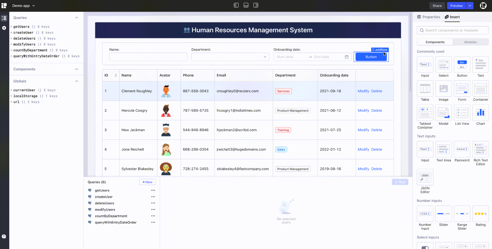

# Openblocks overview

## What is Openblocks?

Openblocks is a developer-friendly open-source low code platform to build internal apps within minutes.

Traditionally, building an internal app requires complex frontend and backend interactions with hundreds and thousands lines of code, not to mention work on packaging, integration and deployment. Openblocks significantly reduces the work you need to do to build an app.

In Openblocks, all you need to do is drag and drop pre-built or self-customized components onto the What-You-See-Is-What-You-Get (WYSIWYG) canvas, along with ready-to-connect databases and APIs, Openblocks helps you build an app quickly and focus on business logic.

<figure><figcaption></figcaption></figure>

## Why choose Openblocks?

* **Open source**: Makes your ideas more feasible.
* **All-in-one platform**: Connection to all kinds of data sources and APIs such as MySQL, PostgreSQL, SQL Server, MongoDB, Redis, and Elasticsearch, and ensures your data security.
* **High scalability**: Allows to execute JavaScript almost anywhere you would like to customize your business processes and UI components.
* **Clean design**: Follows the principles of Ant Design and supports display on screens of different sizes. We have a number of templates and UI components, based on which you can freely build dashboard, admin panel, and content management system (CMS).
* **Built-in features**: Provide cloud and self-hosted deployment, multi-tenant management, fine-grained access control, and audit logs.

## How to build an app in Openblocks?

Building an internal app basically takes 5 steps:

1. Quickly connect to your data sources, including PostgreSQL, MongoDB and online APIs.
2. Write a few lines of SQL or set up request parameters to build queries.
3. Use pre-built or user-customized UI components to build your app UI, bind and display queries' data with UI components.
4. Set up [event handlers](build-apps/event-handlers.md) to trigger queries, control components or other actions in reaction to user interactions.
5. Preview and share your app with others.
