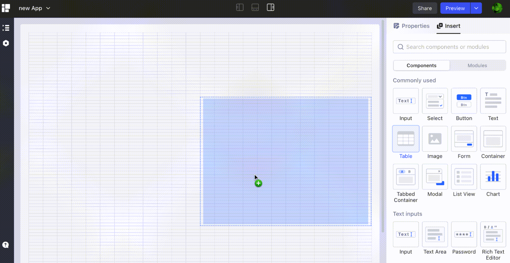
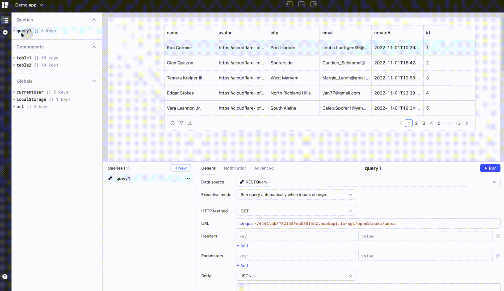

# App editor

In Openblocks, the app editor is where you assemble components, create queries to interact with data, and publish your apps. It consists of five areas:

1. Toolbar
2. Canvas
3. Data browser
4. Query editor
5. Component and property pane

<figure><figcaption></figcaption></figure>

## Toolbar

The Toolbar is made up of a topbar and a left sidebar.

<figure><figcaption></figcaption></figure>

On the topbar, you can configure your app as follows:

* Change the app name
* Export to a JSON file
* Control the visibility of other areas
* Share your app
* Preview and deploy your app
* Check the history versions

On the left sidebar, some options are available as follows:

* Show or hide the **Data browser**
* Set canvas size and app theme
* Manage scripts and CSS style
* Start tutorial for app editor
* Show keyboard shortcuts

## Canvas

The canvas at the center of the editor is where you design and see the overall UI. Drag and drop components onto the canvas, bind them with data and event handlers, and assemble them to build a pleasing and powerful app.

<figure><figcaption></figcaption></figure>

Check out Design app UI for UI layout practices.

## Data browser

The data browser on the left pane contains **Queries**, **Components** and **Globals** sections. Here you can inspect the data in a tree structure. For example, to check the returned data of a specific query or component, find its node in belonging section and clickto expand.

<figure><figcaption></figcaption></figure>

## Query editor

The query editor lay at the bottom consists of two sections: query list (with **Queries** and **Metadata** tabs) on the left, and query settings ( with **General**, **Notification** and **Advanced** tabs) on the right. Create queries to interact with data sources here.

<figure><figcaption></figcaption></figure>

Queries link data sources to your apps and perform CRUD (create, read, update, and delete) operations on data sources.

## Component and property pane

The component and property pane is located on the right of the window. Drag components onto the canvas from the **Insert** tab and edit the properties of the components in the **Properties** tab.

 (1).png>)

When a component is selected on the canvas, the **Properties** tab will be activated automatically and display properties of that component.
