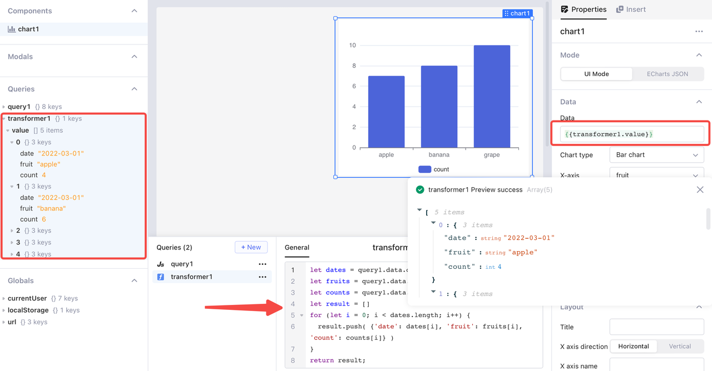
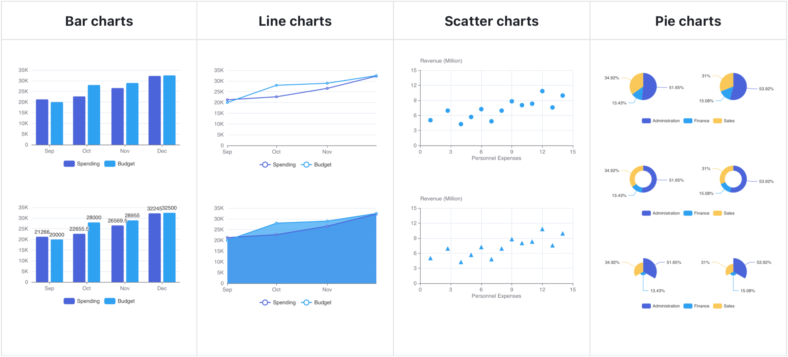
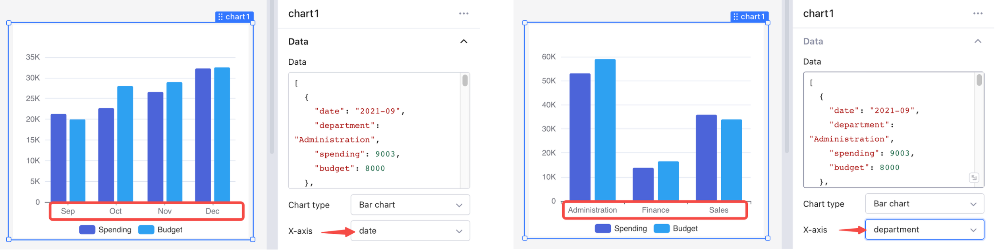
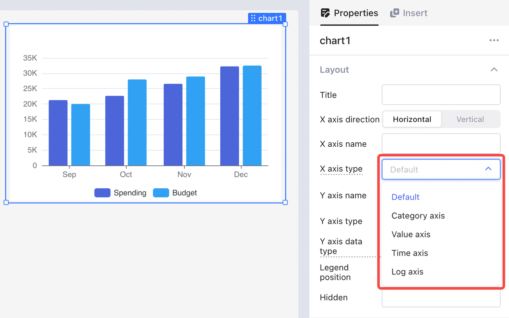
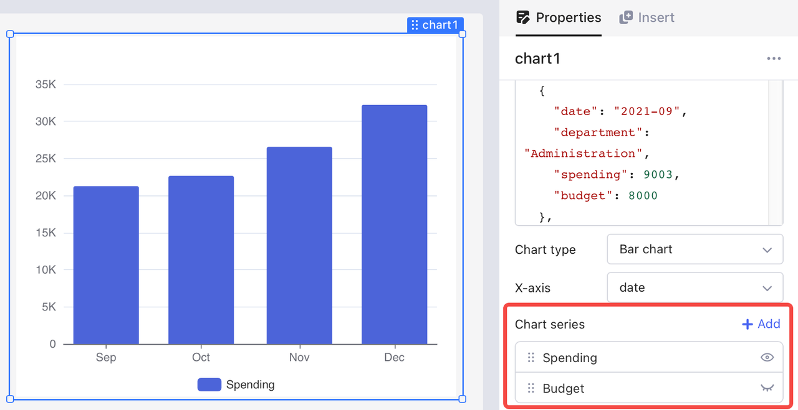
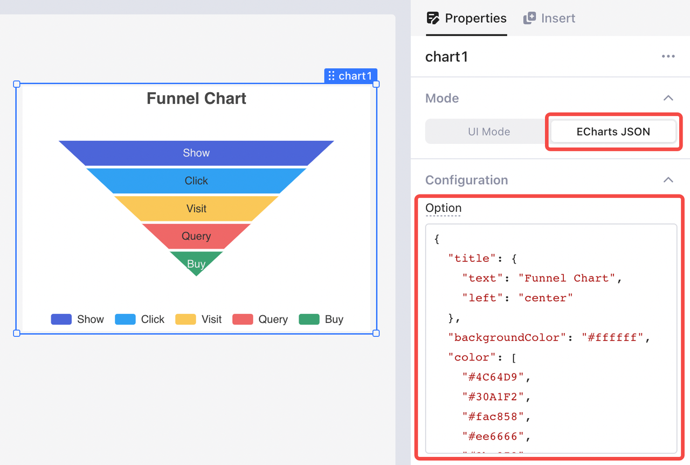

# Charts and graphs

Charts and graphs are visual representations of data that are used to simplify complex information and make it easier to understand. They can help highlight key insights and provide a quick summary of data that would otherwise be difficult to interpret. Charts and graphs come in different forms, such as bar graphs, line graphs, pie charts, scatter plots, and more, each suited for different types of data and analytical purposes.&#x20;

Openblocks allows you to insert multiple forms of charts and graphs into your apps to satisfy your needs in different use cases.

<figure><figcaption></figcaption></figure>

## UI mode

### Data format

In UI mode, the **Chart** component supports presenting data stored as an array of JS objects. Each object field corresponds to a column in tabular format. The objects in the following array contain three fields: `date`, `fruit`, and `count`.

```json
[
  { "date": "2022-03-01", "fruit": "apple", "count": 4 },
  { "date": "2022-03-01", "fruit": "banana", "count": 6 },
  { "date": "2022-04-01", "fruit": "grape", "count": 10 },
  { "date": "2022-04-01", "fruit": "apple", "count": 3 },
  { "date": "2022-04-01", "fruit": "banana", "count": 2 }
]
```

You can also use JS code in `{{}}` to reference data from other components or queries, or to transform data to meet specific needs.

For example, the query result of `query1` is as follows.

```json
{
  "date": [
    "2022-03-01",
    "2022-03-01",
    "2022-04-01",
    "2022-04-01",
    "2022-04-01"
  ],
  "fruit": ["apple", "banana", "grape", "apple", "banana"],
  "count": [4, 6, 10, 3, 2]
}
```

You can transform it using transformer `transformer1` with the following JS code.

```javascript
let dates = query1.data.date
let fruits = query1.data.fruit
let counts = query1.data.count
let result = []
for (let i = 0; i < dates.length; i++) {
  result.push( {'date': dates[i], 'fruit': fruits[i], 'count': counts[i]} )
}
return result;
```

Then reference the value of the transformer `{{transformer1.value}}` as the data for the chart.

<figure><figcaption></figcaption></figure>

### Chart type

Openblocks supports four types of charts: bar chart, line chart, scatter chart, and pie chart. You can select the chart type in **Properties** > **Data** > **Chart type**. You can also customize the layout and style of your chart in **Properties** tab.

<figure><figcaption></figcaption></figure>

### X-axis

Bar charts, line charts, and pie charts map values to categorical variables. Thus, in such charts, the X-axis usually shows non-numeric data—for example, date or department.

<figure><figcaption></figcaption></figure>

By default, Openblocks automatically detects the X-axis data and its type. You can also manually select one among "Category axis", "Value axis", "Time axis", or "Log axis". For detailed information, see [X axis type](https://echarts.apache.org/en/option.html#xAxis.type).

<figure><figcaption></figcaption></figure>

### Chart series

In most types of charts, the **Chart series** (Y-axis) presents numeric values for the categories on X-axis. By default, Openblocks populates all numeric fields to Y-axis. You can hide unnecessary fields in **Properties** > **Chart series**.

<figure><figcaption></figcaption></figure>

## Echarts JSON

Apart from the built-in charts and graphs, you can also plot your data with [Apache ECharts](https://echarts.apache.org/en/index.html), an open-source JS visualization library. You only need to complete the **Configuration** > **Option** field in JSON format. For detailed information, see [ECharts docs](https://echarts.apache.org/en/option.html#title) and [ECharts examples](https://echarts.apache.org/examples/en/index.html).

For an instance of using Echarts, see [Stacked Area Chart](https://cloud.openblocks.dev/apps/63779dd6c54c5224c70ea537/view).

<figure><figcaption></figcaption></figure>

If you need more configuration options for charts, contact our customer service on the homepage.
