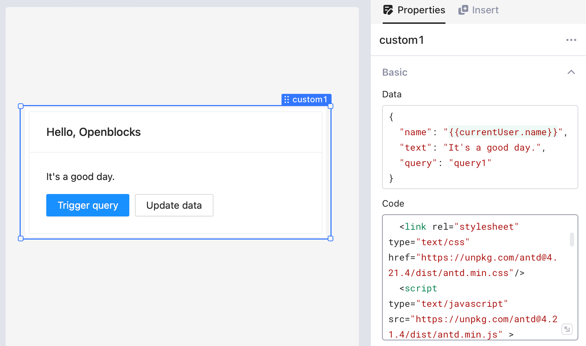
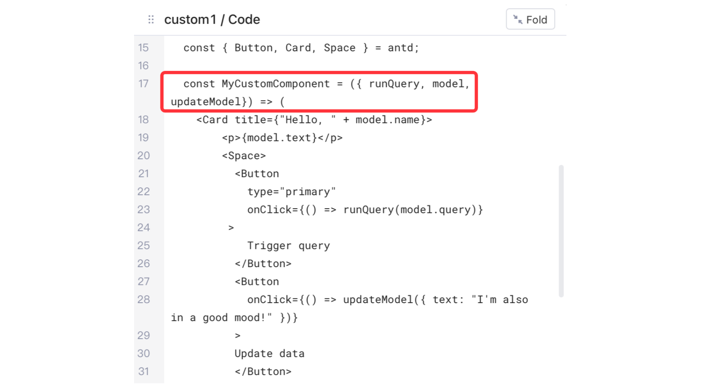
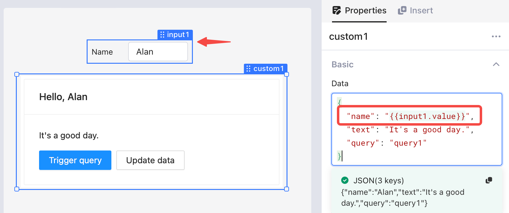
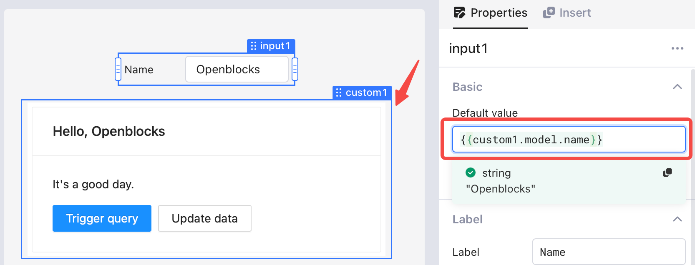
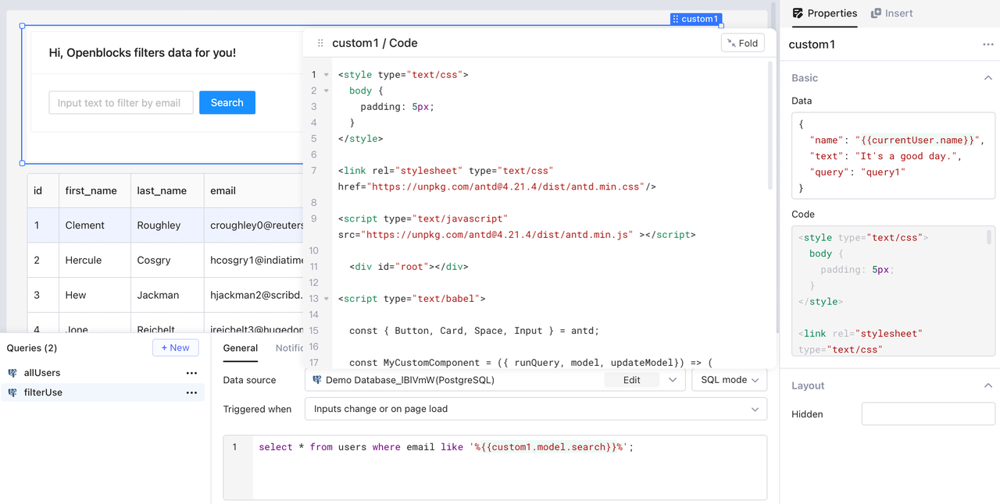
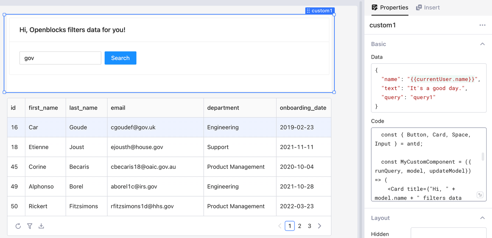

# Custom component

In Openblocks, you can design custom components using React.js library to satisfy specific needs when building your app. The custom component can be static or dynamic, but either requires coding.


If you consider the custom component you are crafting suits general use cases, contact us and we are happy to do coding.


## Prerequisites

* Good understanding of how to build an app in Openblocks.
* Familiar with HTML/CSS/JS and the React.js library.

## Basics

Drag a **Custom component** onto the canvas. By default, Openblocks adds a title box, a text box, and two buttons into it, as shown below. You can modify **Data** and **Code** in the **Properties** pane to tailor it according to your requirements.


Click the border instead of the inside area to select a **Custom component** and display its property settings.


<figure><figcaption></figcaption></figure>

### Data

**Data** stores information in key-value pairs, providing an interface for the **Custom component** to interact with data outside it. For instance, you can reference data of the **Custom component** in other components in your app via `customComponentName.model`, or pass data from other components to the **Custom component**.

<figure><figcaption></figcaption></figure>

### Code

By default, Openblocks defines the object `model`, and two functions `runQuery` and `updateModel`.

<figure><figcaption></figcaption></figure>

* `runQuery` is a function that accepts a query name in string format. For example, `runQuery(model.query)`.
* `updateModel` is a function that accepts a single argument of object type. The argument passed to `updateModel` will be merged with data of the **Custom component**.

## Implementation

All code of your **Custom component**, including HTML, CSS, and JavaScript, stores in the **Code** box in the **Properties** pane. When your app runs, the custom component will be embedded into an [iframe](https://developer.mozilla.org/en-US/docs/Web/HTML/Element/iframe) element.To facilitate the interaction between the **Custom component** and other components in your app, Openblocks offers an API for you through global objects. The type definition and description of the objects are as follows.

```javascript
interface Openblocks {
    // Subscribe to data change
    // When data changes, handler will be triggered
    // The returned value is the unsubscribe function
    subscribe(handler: SubscribeHandler): () => void;
    // React HOC component function that accepts a React component
    // Return a new component that contains properties: runQuery, model, updateModel
    connect(Component: ComponentType<any>): ComponentType;
    // Run the specified query
    runQuery(queryName: string): Promise<void>;
    // Update data
    updateModel(patch: any): Promise<any>;
}

interface SubscribeHandler {
    (data: IDataPayload): void;
}

interface IDataPayload {
    model: any;
}
```

The following example is the least code that a custom component requires to work.

```javascript
<div id="react"></div>
<script type="text/babel">
    const MyCustomComponent = ({ runQuery, model, updateModel }) => (
        <p>Hello, world!</p>
    );
    const ConnectedComponent = Openblocks.connect(MyCustomComponent);
    ReactDOM.render(<ConnectedComponent />, 
document.getElementById("react"));
</script>
```

## Data interaction

### Pass data from app to custom component

For instance, to pass the text in an input box to a custom component, you can use the `{{}}` syntax to reference data from this **Text** component. Note that you can also reference data from queries in the same way.

<figure><figcaption></figcaption></figure>

Below is the code for this example.

```javascript
<div id="root"></div>
  
<script type="text/babel">
  
  const { Button, Card, Space } = antd;
  
  const MyCustomComponent = ({ runQuery, model, updateModel}) => (
    <Card title={"Hello, " + model.name}>
        <p>{model.text}</p>
        <Space>
          <Button
            type="primary"
            onClick={() => runQuery(model.query)}
         >
            Trigger query
          </Button>
          <Button
            onClick={() => updateModel({ text: "I'm also in a good mood!" })}
          >
          Update data
          </Button>
      </Space>
    </Card>
  );
  
  const ConnectedComponent = Openblocks.connect(MyCustomComponent);
  
  const root = ReactDOM.createRoot(document.getElementById("root"));
  root.render(<ConnectedComponent />);
  
  </script>
```

### Pass data from custom component to app

For instance, to display certain text from the **Custom component** in an **Input** component in the app, you can set the value of `custom1.model.name` as the default value of `input1`. The dot notation `custom1.model.name` accesses the name of the **Custom component**.

<figure><figcaption></figcaption></figure>

### Trigger query from custom component

For instance, given table `users` which displays information of all users, you want to filter data based on the inputted text in a **Custom component**. Besides, the filter operation is triggered by clicking a button inside the same **Custom component**.

<figure><figcaption></figcaption></figure>

According to the requirement, the **Custom component** contains an **Input** component and a **Button** component. You can also add a **Text** component to provide context to the users of your app. When a user inputs into the text box, for example "gov", and then clicks the search button, the table only presents the entries in which the "email" field contains "gov".

<figure><figcaption></figcaption></figure>

To implement such a **Custom component**, first you create query `filterUser` to access data from the custom component and set it to run by manual invoke.

```SQL
select * from users where email like '%{{custom1.model.search}}%';
```

Then, you import the "antd" library and use the components **Button**, **Input**, **Card**, and **Space**. Finally, one more setting for each component inside the **Custom component**:

* Configure the `updateModel` method to run and update the data of the **Custom component** when the text in the **Input** component changes.
* Trigger the query `filterUser` by the `runQuery` method when the **Search** button is clicked.

```javascript
<style type="text/css">
  body {
    padding: 5px;
  }
</style>
  
<link rel="stylesheet" type="text/css" href="https://unpkg.com/antd@4.21.4/dist/antd.min.css"/>

<script type="text/javascript" src="https://unpkg.com/antd@4.21.4/dist/antd.min.js" ></script>
  
  <div id="root"></div>
  
<script type="text/babel">
  
  const { Button, Card, Input, Space } = antd;
  
  const MyCustomComponent = ({ runQuery, model, updateModel}) => (
    <Card title={"Hello, " + model.name + " filters data for you!"}>

        <Space>
      <Input
          value={model.search}
          onChange={e => updateModel({ search: e.target.value})}
          placeholder="Input a name"
        />
          <Button
            type="primary"
            onClick={() => runQuery(filterUser)}
         >
            Search
          </Button>
          
      </Space>
    </Card>
  );
  
  const ConnectedComponent = Openblocks.connect(MyCustomComponent);
  
  const root = ReactDOM.createRoot(document.getElementById("root"));
  root.render(<ConnectedComponent />);
  
</script>
```
