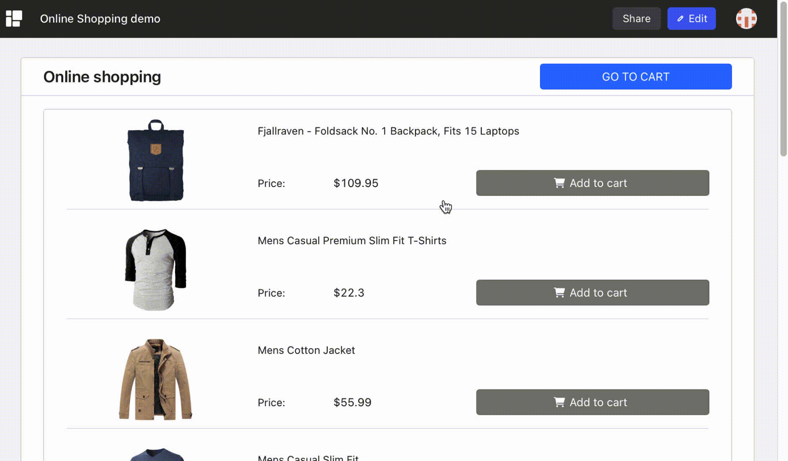
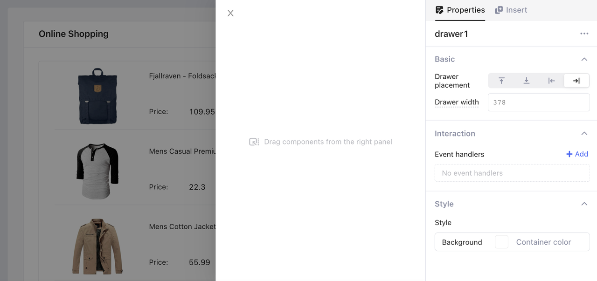
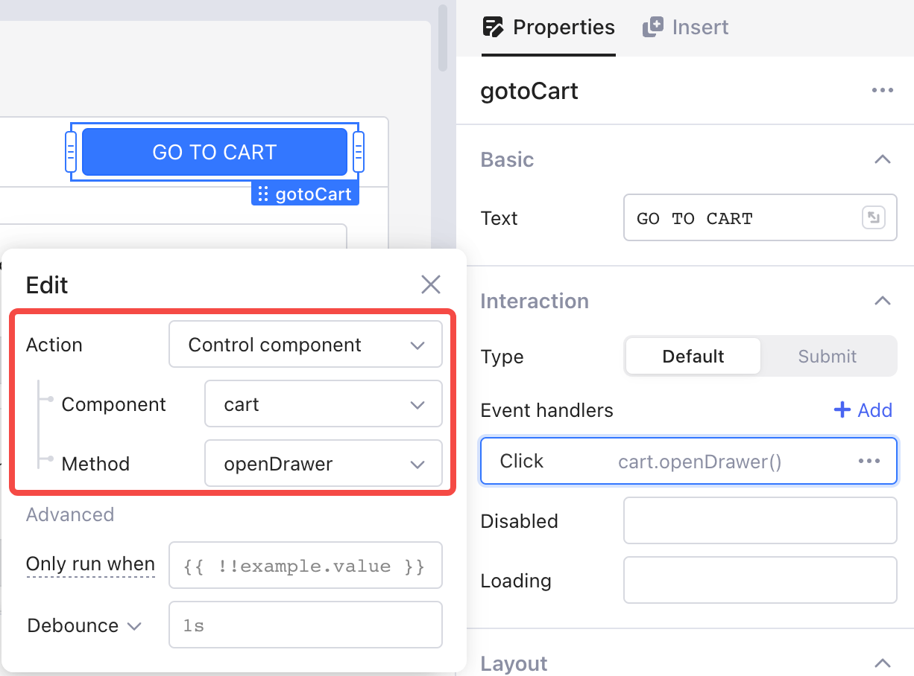
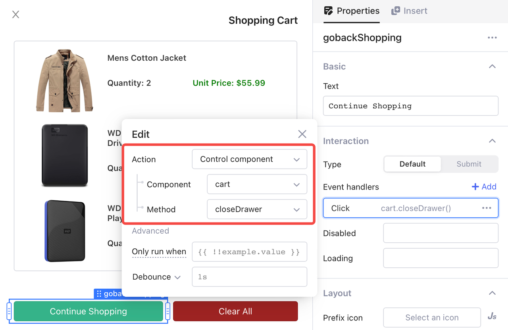

# Drawer

In Openblocks, **Drawer** is an overlay sidebar to display information or perform operations, without interrupting the workflow on the main window.

The following example builds a shopping cart using a drawer.

<figure><figcaption></figcaption></figure>

## Layout

When inserted by drag-and-drop operation, a **Drawer** floats on the right side (by default) of the main window. Then, you can add components onto the **Drawer** according to your needs. In the editing mode of a **Drawer**, other components on the canvas are not editable.

<figure><figcaption></figcaption></figure>


When a drawer is closed, you can re-open it by clicking the corresponding label in the **Modals** tab in the left pane.


### Position

In the **Properties** tab, you can set the position of the drawer. The default position is the right side of the main window.

<figure><figcaption></figcaption></figure>

### Resize

In **Properties** tab, you can set the width of the drawer by pixels or percentage. Note that the height of a drawer is the same as the main window and is not customizable.

<figure><figcaption></figcaption></figure>

## Events

You can reference a drawer in JS code anywhere in your app or call it through a "control component" action in **Properties** > **Interaction** > **Event handlers**.

The following sections guide you through how to open and close a drawer by clicking a button in an online shopping app.

### Trigger openDrawer

Usually, in an app, you trigger opening a drawer by an event such as clicking a button. For example, in the [Online Shopping demo](https://cloud.openblocks.dev/apps/63a422a344075b798fe3ae06/view), opening a drawer to display the shopping cart is implemented in the following steps.

1. Add a button and rename it as `gotoCart`.
2.  Set the event handler of the button. Select "Control component" as the **Action** and select the component "cart" and method "openDrawer". All these settings are auto-saved.&#x20;

    <figure><figcaption></figcaption></figure>
3. Click the button `gotoCart` and the binded drawer "cart" is open.

### Trigger closeDrawer

Triggerring "closeDrawer" is similar to triggering "openDrawer". When setting up the event handler, select the method "closeDrawer". For example, in the [Online Shopping demo](https://cloud.openblocks.dev/apps/63a422a344075b798fe3ae06/view), closing a drawer that displays the shopping cart is implemented in the following steps.

1. Add a button and rename it as `gobackShopping`.
2.  Set the event handler of the button. Select "Control component" as the **Action** and select the component "cart" and method "closeDrawer". All these settings are auto-saved.&#x20;

    <figure><figcaption></figcaption></figure>
3. Click the "Continue Shopping" button and the binded drawer "cart" is closed.
