# File upload

## Basics

You can customize the properties of the file upload components in the right panel, such as the displayed text, file types, upload type.

<figure>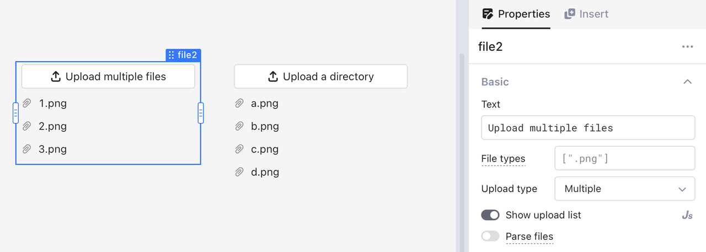<figcaption></figcaption></figure>

### File type

You can input an array of strings to restrict the types of the files to be uploaded. The default value of file type is empty, meaning that no limitation is pre-defined. Each string value in a specified file type array should be a [unique file type specifier](https://developer.mozilla.org/en-US/docs/Web/HTML/Element/input/file#unique\_file\_type\_specifiers) in one of the following formats.

* A valid case-insensitive filename extension, starting with a period character ("."), such as `.png`, `.txt`, and `.pdf`.
* A valid string in [MIME format](https://developer.mozilla.org/en-US/docs/Web/HTTP/Basics\_of\_HTTP/MIME\_types) without an extension.
* String `audio/*` indicating "any audio file".
* String `video/*` indicating "any video file".
* String `image/*` indicating "any image file".

For example, when the value of file type is `[".pdf", ".mp4", "image/*"]`, you can upload PDF files, MP4 files, and any type of image files.

### Upload type

You can decide whether to upload a single file, multiple files, or a directory.

<figure>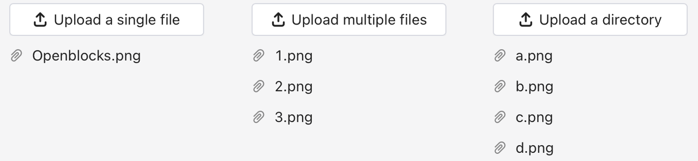<figcaption></figcaption></figure>

### Display uploaded files

Switch on or off **Show upload list** to display or hide the list of the uploaded files. You can also set this property via JS code. By default, its value is "true".

The upload list presents the file names of all uploaded files in chronological order. You can also access the name of the uploaded files via the property `files[index].name`. When hovering your mouse over a file, the 🗑️ icon appears and you can click it to delete the corresponding file.

<figure><figcaption></figcaption></figure>

### Parse files

Toggle **Parse files** and Openblocks will try to parse the uploaded file data structure into objects, arrays, or strings. You can access the parsed result via the property `parsedValue`. Openblocks supports parsing Excel, JSON, and CSV files. The parsing result of other types of files is `null`.

<figure>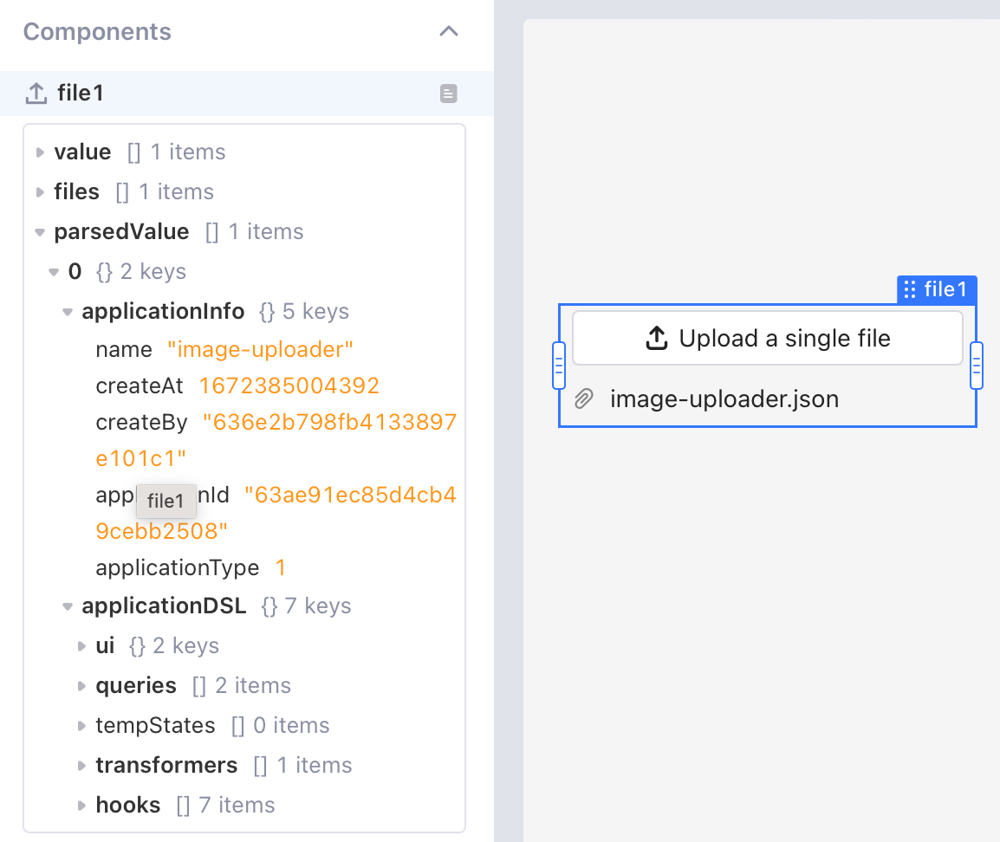<figcaption></figcaption></figure>

## Validation

Under the validation tab, you can configure how many files are allowed to be uploaded, as well as the minimum and maximum size of a single file to be uploaded.

<figure>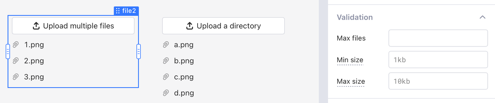<figcaption></figcaption></figure>

### Max files

When the upload type is "Multiple" or "Directory", you can set **Max files** to limit the maximum number of files to upload. If the number of files to be uploaded exceeds this threshold, the latest uploaded files will replace the oldest ones.

### File size

You can set the minimum and maximum size of the files to upload, using KB, MB, GB, or TB units. The default unit for file size is byte.When the size of the uploaded file exceeds the limit, you will see a global alert.

<figure><figcaption></figcaption></figure>

### Access uploaded files

Files uploaded via the file upload component are stored in browser cache memory in **base64-encoded** string format. To store these files in data sources, you need to build queries to connect to databases or APIs.You can view the properties of the uploaded files in the data browser in the left pane, or access property names in `{{}}` or JS queries via JS code. Commonly used properties are as follows.

* `value`: A list of the content of the uploaded files, encoded in base64.
* `files`: A list of metadata of the uploaded files, including `uid`, `name`, `type`, `size`, and `lastModified`.
* `parsedValue`: A list of the value of the parsed files.

<figure><figcaption></figcaption></figure>

## Use case: Upload images to Postman Echo API

This example uploads images to Postman [Echo API](https://learning.postman.com/docs/developer/echo-api/), and inspects the query result whether the files are sent successfully to the remote server. For more details, see [Image uploader](https://cloud.openblocks.dev/apps/63a2651e660ad97d59eb4a51/view).

<figure>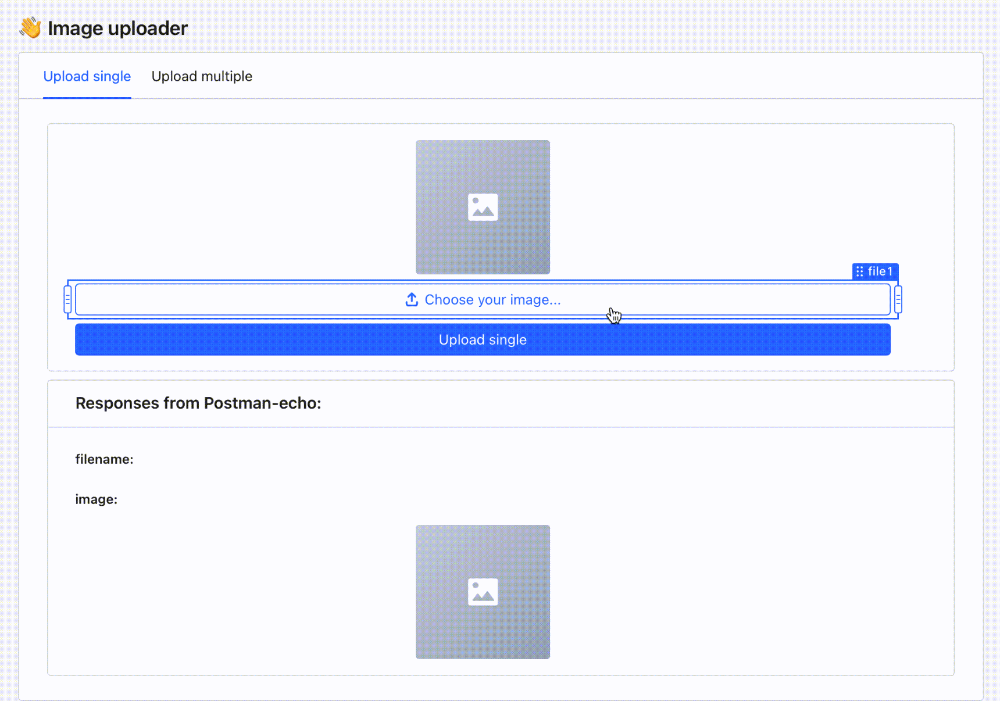<figcaption></figcaption></figure>

### Upload a single file

1.  Insert **File upload** component `file1`, and set **File types** and **Upload type**.&#x20;

    <figure>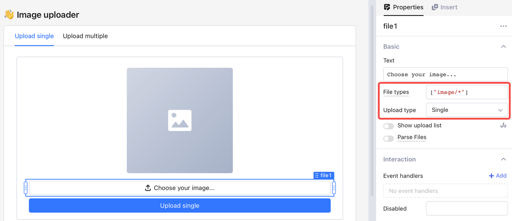<figcaption></figcaption></figure>
2.  Insert an **Image** component, and set the image source as `data:image;base64,{{file1.value[0]}}` to preview the image cached in the browser.&#x20;

    <figure>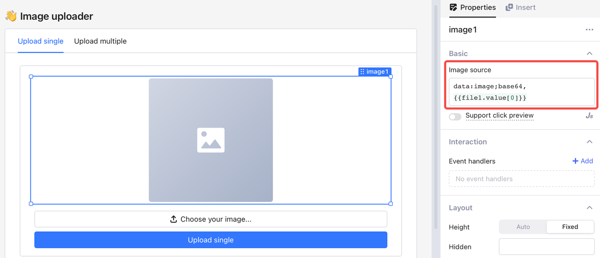<figcaption></figcaption></figure>
3.  Create a new query `uploadSingle` to send single images to Echo API. You can add a button, and bind its click event to the query. Select "POST" as the **HTTP Method**, and complete the **Body** in format **** `{data: base64 string, name: string}`, for example–`{data: {{file1.value[0]}}, name: {{file1.files[0].name}}}`.&#x20;

    <figure>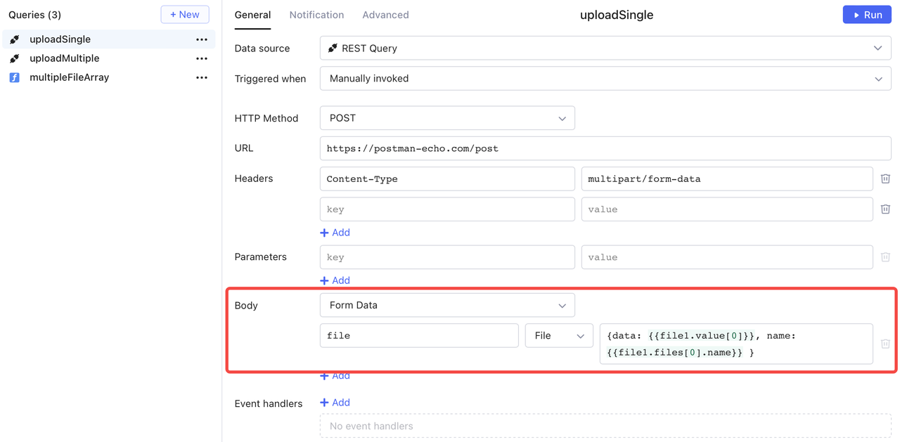<figcaption></figcaption></figure>
4.  Run query `uploadSingle`. Create a new text component to display the file name of the returned value of the query by `{{Object.keys(uploadSingle.data?.files??[])[0]}}`. Add a new image component to view the returned image by `{{Object.values(uploadSingle.data?.files??[])[0]}}`.&#x20;

    <figure>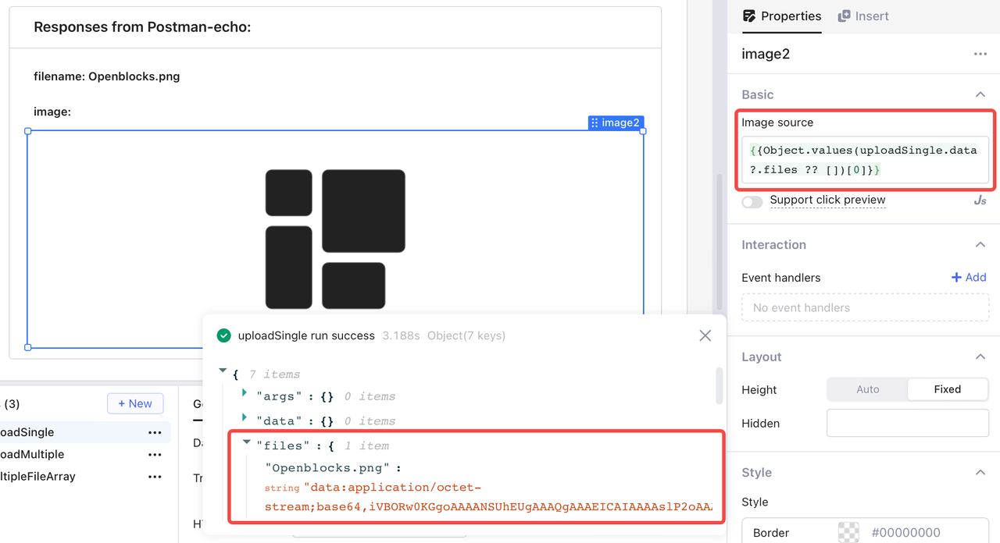<figcaption></figcaption></figure>

### Upload multiple files

When uploading multiple files, you send an object of array to Echo API. Each item in the array should use the format `{data: base64 string, name: string}`. You can create a transformer `multipleFileArray` to convert all files to be uploaded to the target format, as shown in the following figure.

<figure>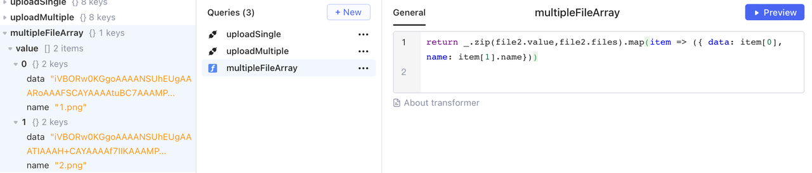<figcaption></figcaption></figure>

Then, create a new query `uploadMultiple` to upload the images to Echo API. In **Body** field, you can use the returned value of query `multipleFileArray` directly.

<figure>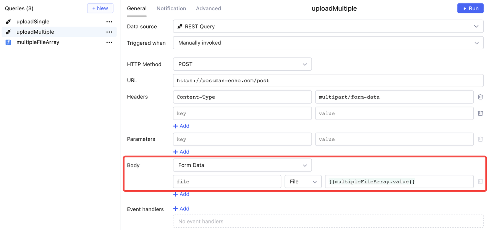<figcaption></figcaption></figure>

Run this query and check the result. The file names and the encoded content are properly accessed.

<figure>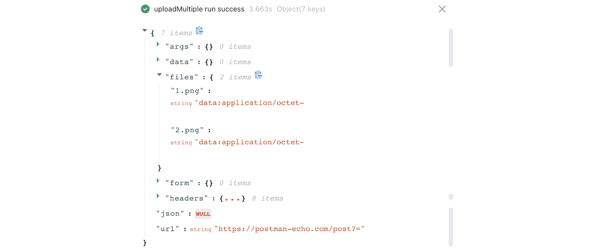<figcaption></figcaption></figure>

You can present the query result using a [**List View**](list-view.md) **** component.

* Access the number of rows by the value of the field`files` in the query result: `{{Object.keys(uploadMultiple.data?.files?? []).length}}`.
* Access the file names by `{{Object.keys(uploadMultiple.data.files)[i]}}`.
* Access the file content by `{{Object.values(uploadMultiple.data.files)[i]}}`.

<figure>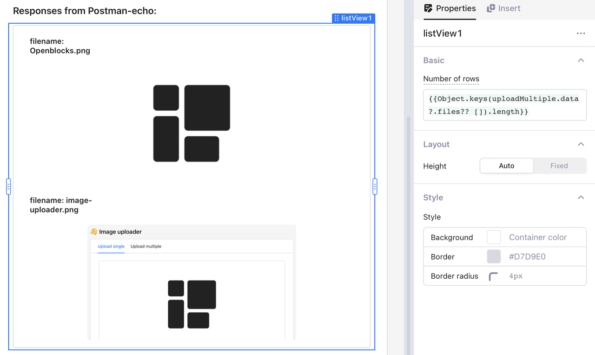<figcaption></figcaption></figure>
