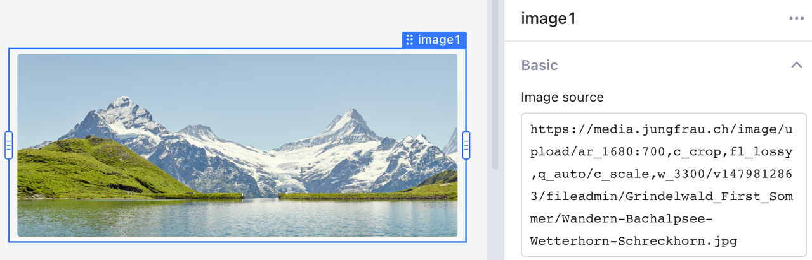
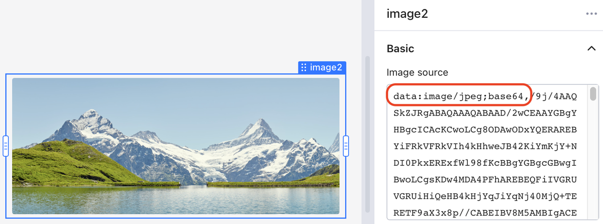
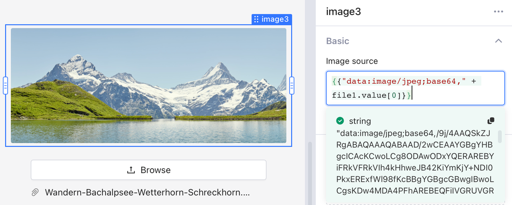
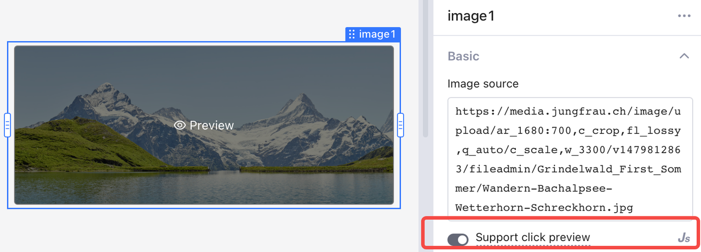
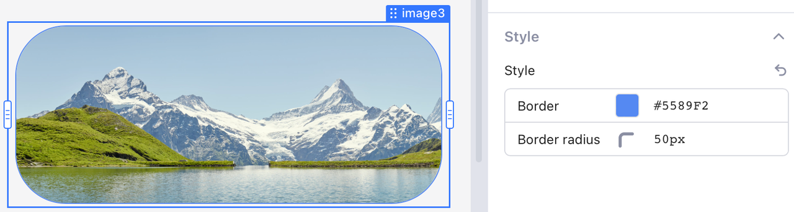

# Image

Use the **Image** component to present information in your apps in a vivic way. Openblocks supports you adding an image via URL and base64 encoded data.

## URL

Drag the **Image** component onto the canvas or into a **Container**. Click the **Image** component, and the **Properties** tab is displayed on the right. You can set the URL to display an image.

<figure><figcaption></figcaption></figure>

## Base64 encoded data

You can also insert an image via base64 encoded data. Ensure that the encoded image source starts with `data:image/PICTURE_FORMAT;base64,` or simply`data:image;base64,`.


Don't miss the comma at the end of the prefix:

<mark style="background-color:yellow;">`data:image/PICTURE_FORMAT;base64`</mark><mark style="background-color:yellow;">**`,`**</mark><mark style="background-color:yellow;">`YOUR_BASE64_ENCODED_IMAGE_DATA`</mark>

<mark style="background-color:yellow;">`data:image;base64`</mark><mark style="background-color:yellow;">**`,`**</mark><mark style="background-color:yellow;">`YOUR_BASE64_ENCODED_IMAGE_DATA`</mark>


<figure><figcaption></figcaption></figure>

### Demo: upload and display an image

One common use case for base64 image display would be combining a **File Upload** component with an **Image** component.

<figure><figcaption></figcaption></figure>

Here is JS code that concatenates the prefix with the encoded base64 data of the uploaded file via `file1.value[0]`.

```javascript
{{"data:image/jpeg;base64," + file1.value[0]}} 
```

## Set click preview for an image

Toggle **Support click preview** in the **Properties** tab to allow users to preview the image in its full size. Hover your mouse over the image, and you see **👁 Preview**. Then, you can click to preview.

<figure><figcaption></figcaption></figure>

## Set the style of an image

In **Properties** > **Style**, change border color and set **Border radius** in pixels or by percentage.

<figure><figcaption></figcaption></figure>
