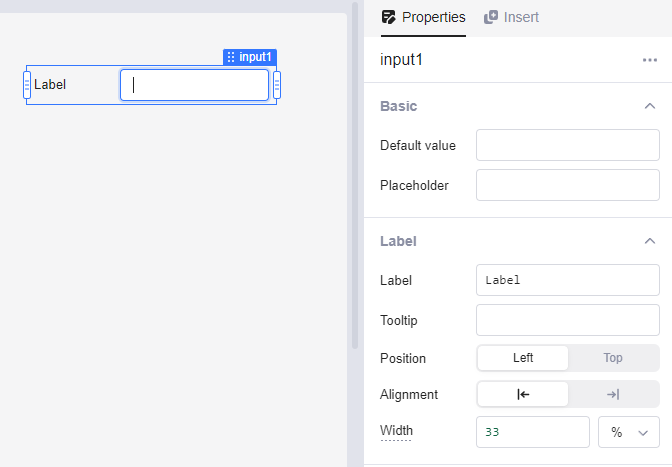

# Input

A text input field with an integrated label.

<figure><figcaption></figcaption></figure>

## Access

-   **Value**: `input.value`

## Properties

### Basics

-   **Default value**: the default value that gets filled in on page load
-   **Placeholder**: the placeholder value when no value in inside the field

### Label

-   **Label**: the label describing the usage of the input
-   **Tooltip**: a tooltip when hovering over the label
-   **Position**: whenever to place the label at the `left` or `top`
-   **Alignment**: align the label to the `left` or `right`
-   **Width**: the width of the label in `%` or `px`

## Interaction

-   **Change**: run an action when the input of the input changes

## Advanced

-   **Show count**: display a number inside the input (equal to: `input.value.length`)
-   **Show clear button**: show a clear button that clears the field input
-   **Read only**: make it read-only, so the user can't change the value

## Validation

-   **Required field**: show the user that the input is required with a red star ( \* )
-   **Text type**: validate the field input against: **Text**, **Email**, **URL**, **Regex**. If validation fails, the user gets the corresponding error message.
-   **Min length**: the minimal length of the user's input
-   **Max length**: the maximal length of the user's input
-   **Custom rule**: if the result is non-empty string, it is an error message. if empty or null, the validation passes. example: `{{Number(input1.value) < 0 ? 'error' : ''}}`
