# List View

The component **List View** displays rows of data. Similar to Form, Modal, and Drawer, it is also a container-like component that can hold other components or modules. For list viewing data, you first bind the data to a **List View** component and configure the naming rules for the items. Then, you design the display of the first row by dragging and dropping components, and this layout will be applied to all items within this component.

The following is a demo of **List View**, displaying part of BEST BOOKS OF 2021 from [Goodreads](https://www.goodreads.com/choiceawards/best-books-2021):

<figure><figcaption></figcaption></figure>

Drag and drop **List View** onto the canvas. Each item contains an **Image**, a **Text** and a **Rating** component. You can update the exhibition of the whole **List View** component by configuring the layout of the first entry.

Click the **Image** component, you see the defaulted image source.

<figure>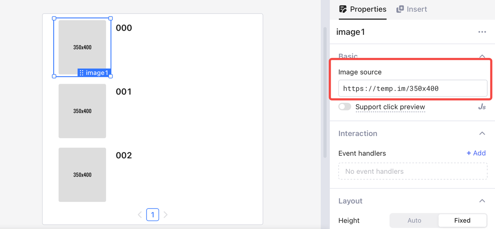<figcaption></figcaption></figure>

The **List View** component retrieves data from a JSON array of objects and displays an **Image**, a **Text** and a **Rating** component for each entry. You can also pass query results to a **List View**.

<figure>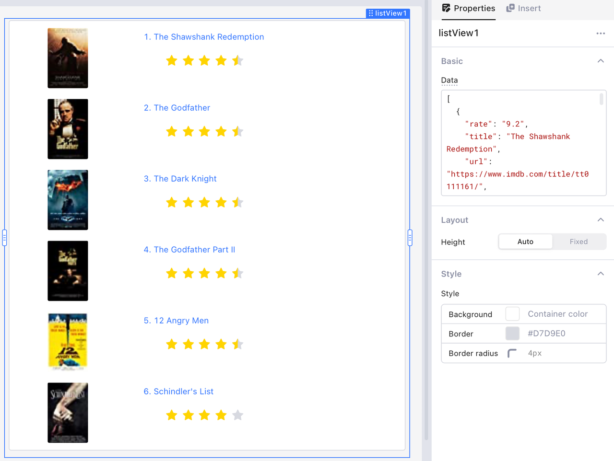<figcaption></figcaption></figure>

## Bind data

The data of a **List View** component accepts two types of values: number and array.

* Number: Numbers are processed as row count and no valid data is passed into the **List View** component.
* Array: The length of an array is passed as row count and each entry in the array is processed as a JS object in JSON format, corresponding to a row in the **List View** component. For example, the following data contains two rows of data, each containing four fields: `rate`, `title`, `url`, and `cover`.&#x20;

```json
[
    {
        "rate": "9.2",
        "title": "The Shawshank Redemption",
        "url": "https://www.imdb.com/title/tt0111161/",
        "cover": "https://m.media-amazon.com/images/M/MV5BMDFkYTc0MGEtZmNhMC00ZDIzLWFmNTEtODM1ZmRlYWMwMWFmXkEyXkFqcGdeQXVyMTMxODk2OTU@._V1_UY67_CR0,0,45,67_AL_.jpg"
    },
    {
        "rate": "9.2",
        "title": "The Godfather",
        "url": "https://www.imdb.com/title/tt0068646/",
        "cover": "https://m.media-amazon.com/images/M/MV5BM2MyNjYxNmUtYTAwNi00MTYxLWJmNWYtYzZlODY3ZTk3OTFlXkEyXkFqcGdeQXVyNzkwMjQ5NzM@._V1_UY67_CR1,0,45,67_AL_.jpg"
    }
]
```

You can view the detailed data about the **List View** component, its items, the properties, etc., in the data browser.

<figure>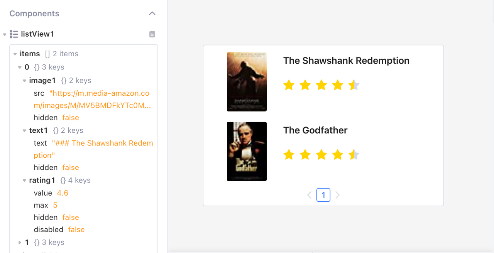<figcaption></figcaption></figure>

<figure>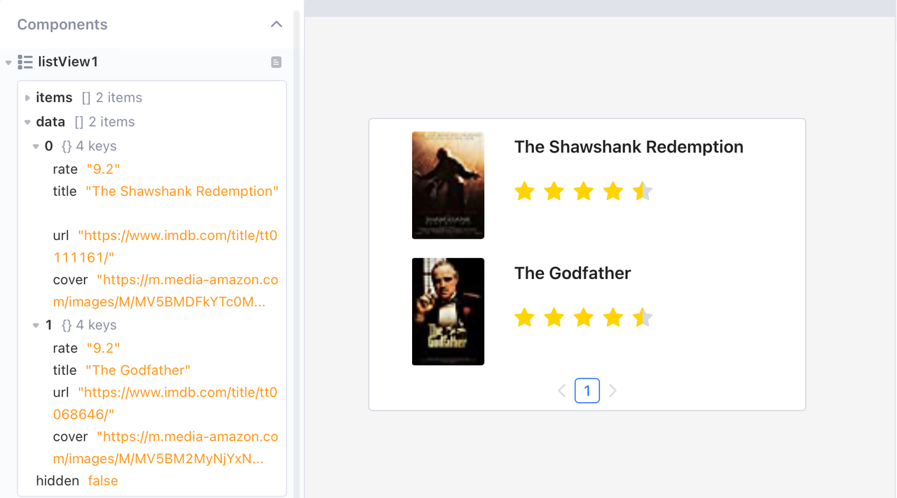<figcaption></figcaption></figure>

## Display data in inside components

After binding valid data to **List View** component and designing its inside components, you can add data to these components. **List View** supports local variables `currentItem` and `i`. Notice that you only need to change data of the first row, and the same settings are applied to the other rows automatically.


You can bind a static URL address to the **Image** component for image display; and because that URL address is static, the same image shows up in all rows.


<figure>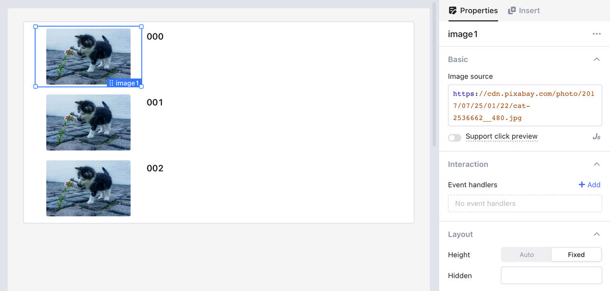<figcaption></figcaption></figure>

## Name items

You can set the item index names and item data names. This is useful when embedding a list in another list. For example, you can set the index of one list as `i`, and the inner nested `j` to avoid naming conflict.

<figure>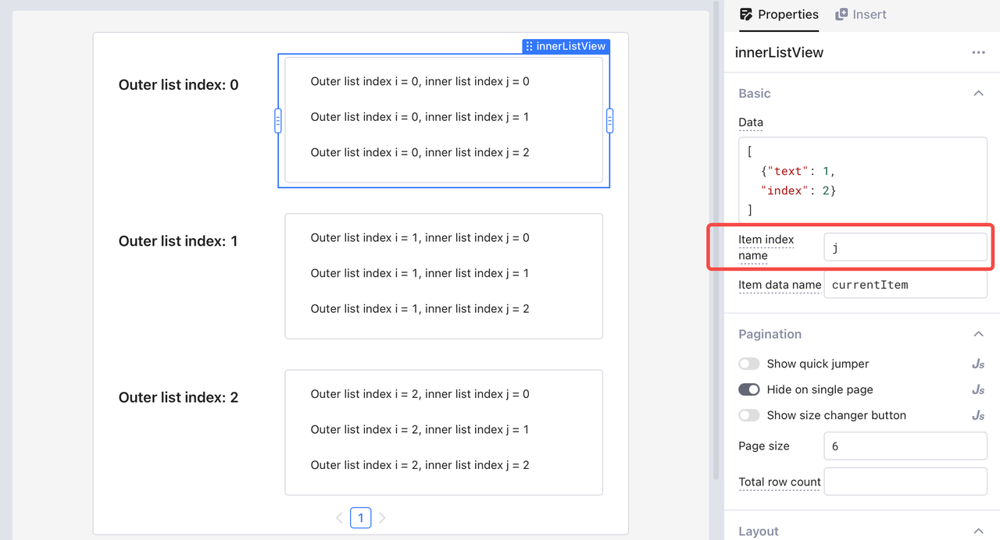<figcaption></figcaption></figure>

### Item index name

By default, item index is named as`i`, referring to the index of list data and starting from zero. Besides using `i` as numbers, you can also use `i` to dynamically access data from query results.

For example, to access the `book_name` field from table `fiction` in the **Text** component, write the following code.

```javascript
{{getAllFictions.data[i].book_name}}
```

Then you can see the fiction book names displayed in **List View** by index order.

<figure>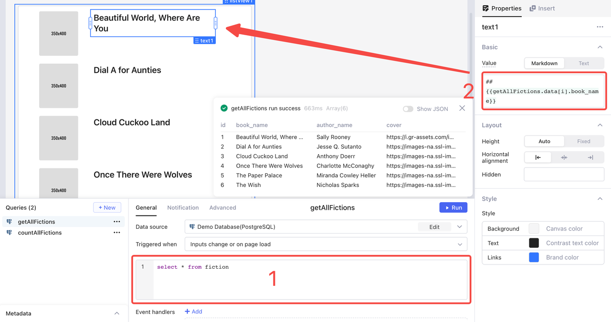<figcaption></figcaption></figure>

### Item data name

By default, you can reference the value of each item within a list using variable `currentItem`. For example, to display a serial number plus book name, write the following code in `text1` value.

```javascript
{{i+1}}. {{currentItem.book_name}}
```

<figure>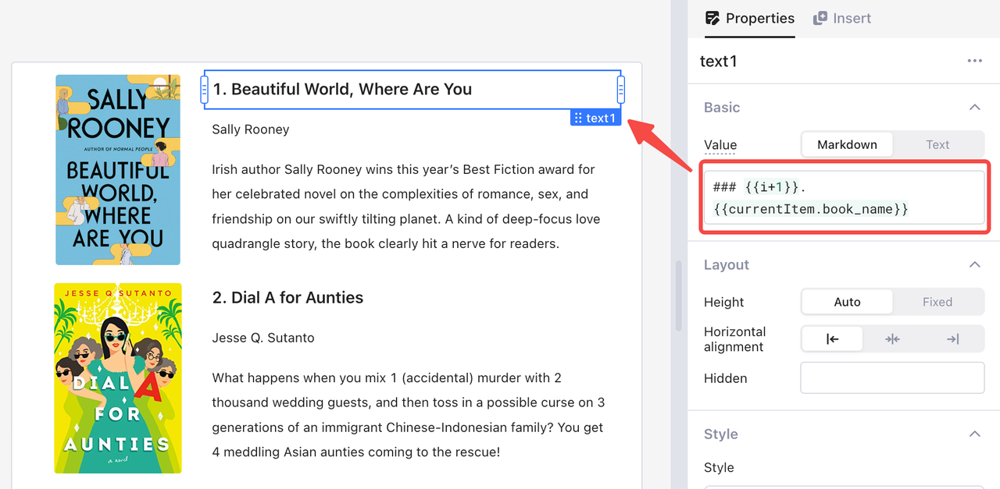<figcaption></figcaption></figure>


Circular dependency errors occur when you reference the data of a row by `listView.items[i]` from a component inside a **List View** component. It is recommended to use such reference only outside the list.


## Pagination

### Quick jumper

Toggle "Show quick jumper" or set its value to `true` to allow your users quickly jump to the specified page.

<figure>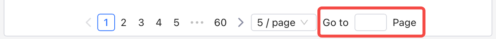<figcaption></figcaption></figure>

### Page size

You can configure whether to allow your users to customize how many items to be displayed on a single page by enabling or disabling the "Show size changer button" or set its value in JS. When disabled, you can set the default page size.

<figure>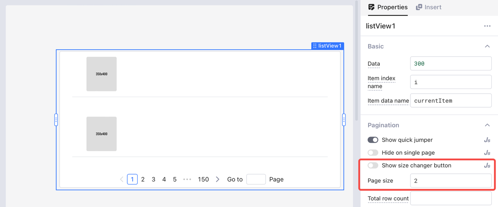<figcaption></figcaption></figure>

If enabled, you can configure several page sizes for your users to select.

<figure>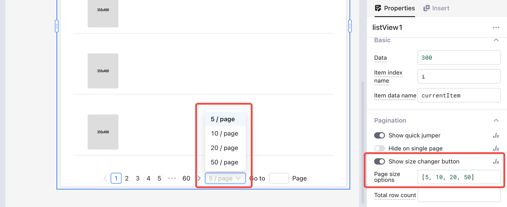<figcaption></figcaption></figure>

### Total row count

By default, the total row count of a **List View** component is the number of current data items. You can also insert a value from a query. For example, `{{query1.data[0].count}}`.

## Reference List View items outside

**List View** supports exposing data of inside components with **Items** field. You can inspect the **Data Browser** in the left pane.

<figure>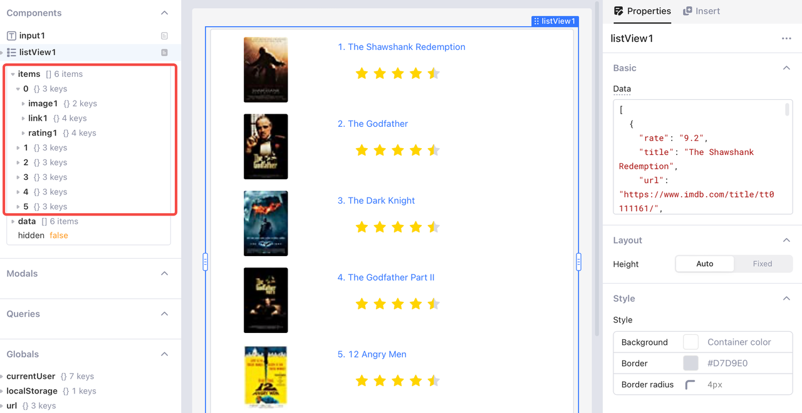<figcaption></figcaption></figure>

For example, drag an **Input** component into **List View**, and then you can reference the value of the **Rating** component in components outside the **List View** by the following code.

```javascript
{{listView1.items[0].rating1.value}}
```

<figure>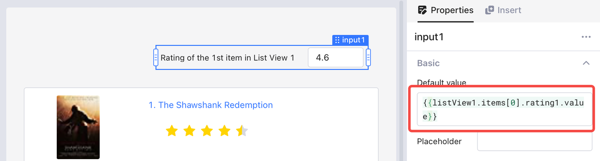<figcaption></figcaption></figure>
