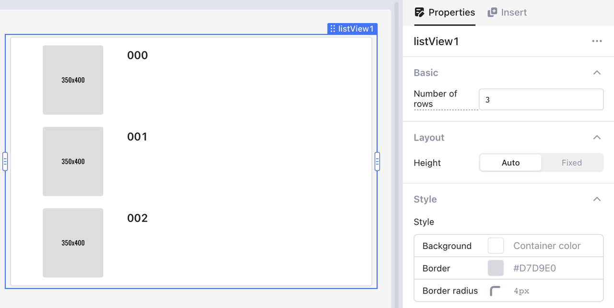
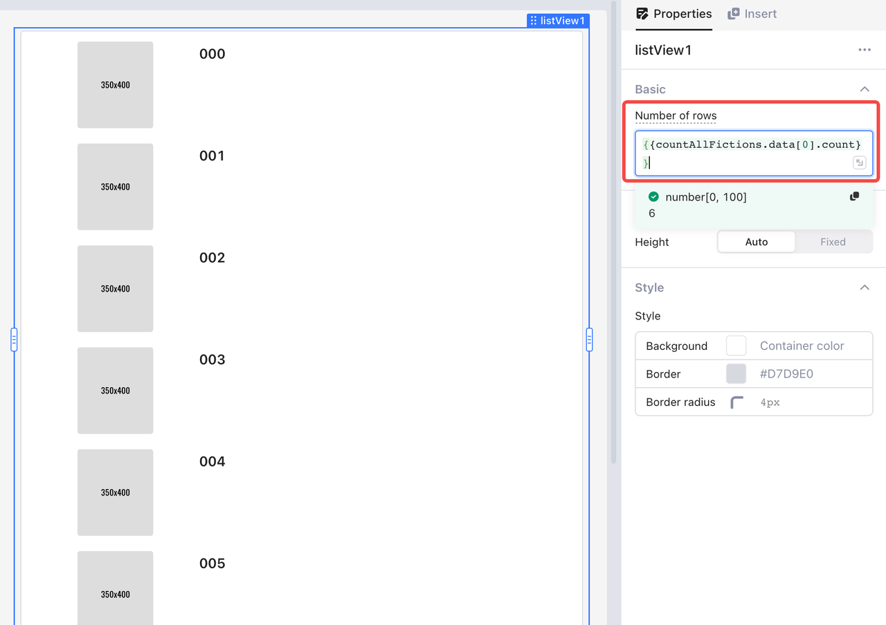
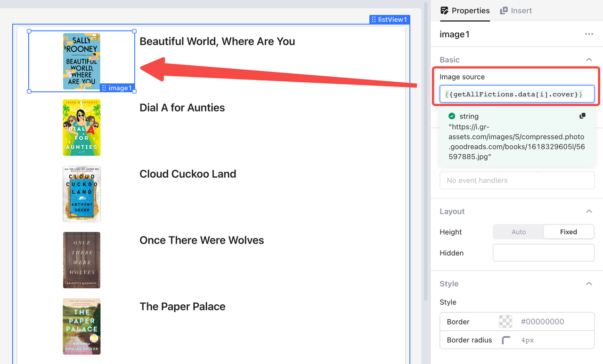
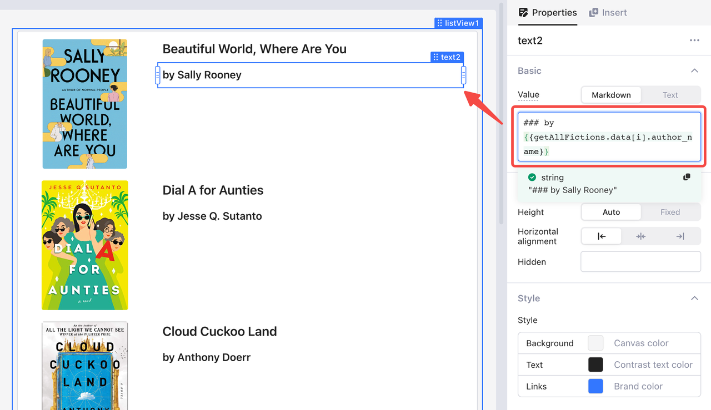
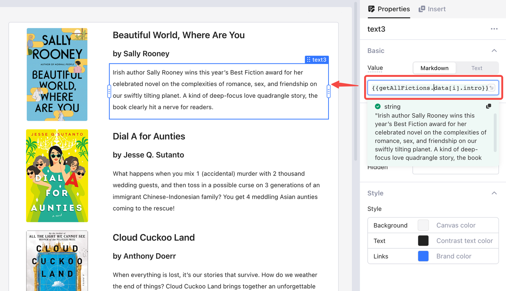

# List View

The following is a demo of **List View**, which displays part of BEST BOOKS OF 2021 from [Goodreads](https://www.goodreads.com/choiceawards/best-books-2021):

<figure><figcaption></figcaption></figure>

Drag and drop **List View** onto the canvas. The list has three rows by default, and in each row there is an **Image** and a **Text** component. You only need to change properties of the first row, and the same settings are applied to the other rows automatically.

<figure><figcaption></figcaption></figure>

For example, you can bind a static URL address to the **Image** component for image display; and because that URL address is static, the same image shows up in all rows.

<figure><figcaption></figcaption></figure>

To display data or images in a dynamic way, [#use-dynamic-variable-i](list-view.md#use-dynamic-variable-i "mention").

## Set the number of list rows

You can set the number of list rows in a static way by inputting a number, or bind it to dynamic query result.

<figure><figcaption></figcaption></figure>

For example, to display all the fictions from the table `fiction` in **List View**, set the number of rows in the following steps:

1. Create a query to count the items of your data—for example, `countAllFictions`.
2. Write the following code for the query:&#x20;

```sql
select count(*) from fiction
```

&#x20; 3\.  Reference the query result in **Number of rows** via the code:&#x20;

```javascript
{{countAllFictions.data[0].count}}
```

## Use dynamic variable i

To bind the display data in a dynamic way, use the dynamic variable `i`. For example, if you want to display fiction book names in **Text** components, then you bind the value of `book_name` to `text1` in the following steps:

1. Create a query to get all the needed data—for example, `getAllFictions`:

```sql
select * from fiction
```

&#x20; 2\.  Reference the query result in the value of `text1`:

```javascript
{{getAllFictions.data[i].book_name}}
```

Then you can see the fiction book names displayed in **List View** by index order.

<figure><figcaption></figcaption></figure>

Similarly, to display book covers, reference the query result in the value of `image1`:

```javascript
{{getAllFictions.data[i].cover}}
```

<figure><figcaption></figcaption></figure>

To display more data such as author names and book introductions, drag in **Text** components and then reference the query result:

```javascript
{{getAllFictions.data[i].author_name}}
{{getAllFictions.data[i].intro}}
```

<figure><figcaption></figcaption></figure>

<figure><figcaption></figcaption></figure>
