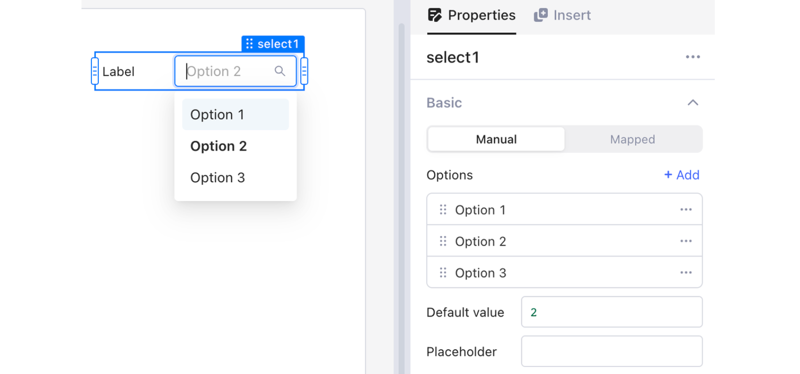
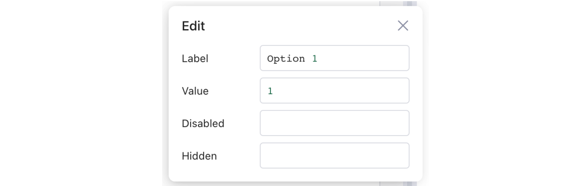
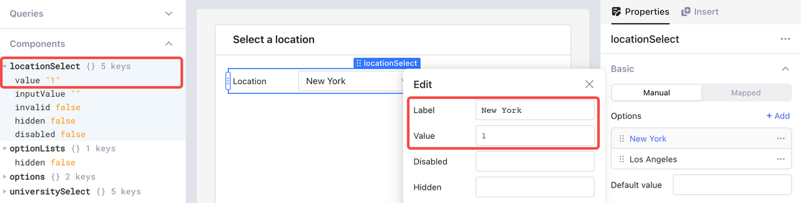
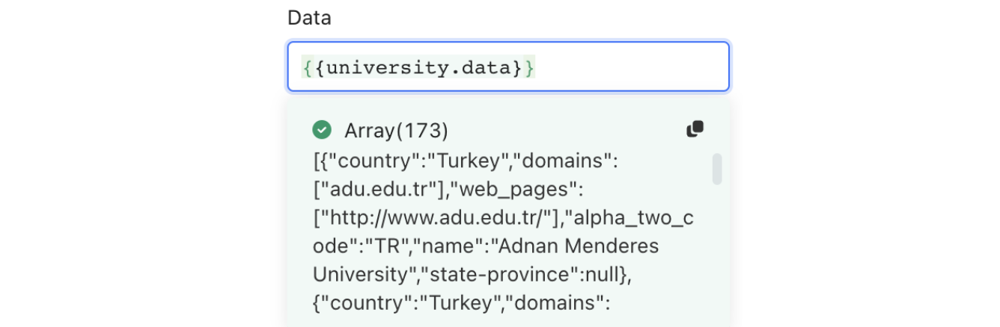
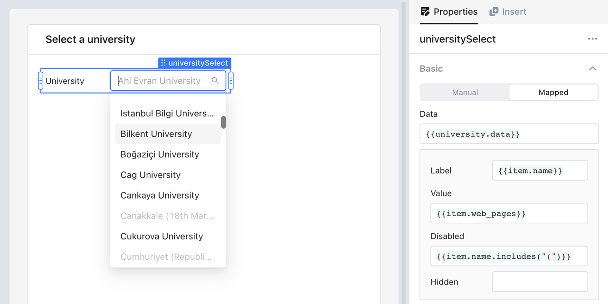
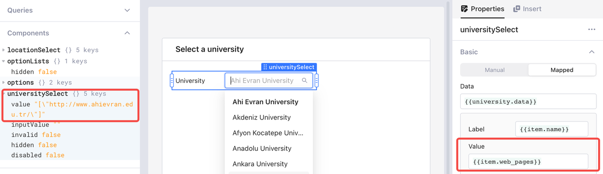

# Option lists

A drop menu ensures easy and error-free user input by offering a list of possible options. Openblocks supports implementing option lists using components such as **Select** and **Multiselect**. You can configure an option list either manually or by mapping data from your data sources.

<figure><figcaption></figcaption></figure>

## Properties

Each option list has four properties.

* **Label**: the displayed text of the option to users
* **Value**: the unique identifier of the option
* **Disabled**: disable the option (the default value is `false`)
* **Hidden**: hide the option (the default value is `false`)

<figure><figcaption></figcaption></figure>


When more than one option in one list uses the same value, only the first option is valid and thus displayed.


## Manual mode

Under **Basic** > **Manual**, click **+ Add** to create a new option. Select an option to manually configure it. You can click `···` to **Duplicate** or **Delete** an option and drag `⋮⋮` to arrange its position.

<figure><figcaption></figcaption></figure>

Check the value of the selected option under **Components** in the data browser. For example, when **New York** is selected, you can find the string value `"1"` for **locationSelect**.

<figure><figcaption></figcaption></figure>

Manual mode is recommended for these scenarios:

* Manually manageable and enumerable.
* Used by only one component.
* Data doesn't come from data sources.

## Mapped mode

When you have option list data that comes from data sources, transformers or temporary state, you can use **Mapped Mode**. Under **Basic** > **Mapped**, input your data source array in **Data** box using JavaScript (JS) code. A list of options will be automatically mapped from this array. For example, access university information via `{{university.data}}`. Each item in the result array contains `country`, `web_pages`, `alpha_two_code`, and `name`.

<figure><figcaption></figcaption></figure>

You can reference the value of any filed of an option through `item` and its index `i`, starting from 0. In the following example, the **Label** of each option is the `name` of the university, the **Value** is the `web_page`, and those containing an opening parenthesis `(` in their names are disabled. The default value is set to the `web_pages` of the first item using `{{university.data[0].web_pages}}`. Note that the default value of an option list should be an element from the **Value** array but not the **Label** array.

<figure><figcaption></figcaption></figure>

Check the value of the selected option under **Components** in the data browser. For example, when "Ahi Evran University" is selected, its string value `[\"http://www.ahievran.edu.tr/\"]` is displayed.

<figure><figcaption></figcaption></figure>
