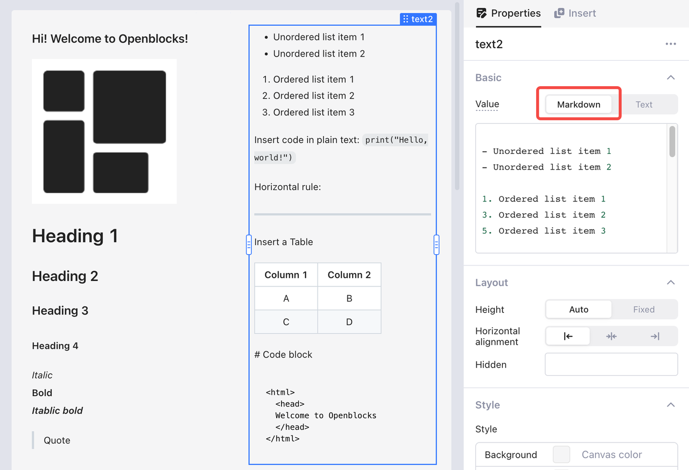
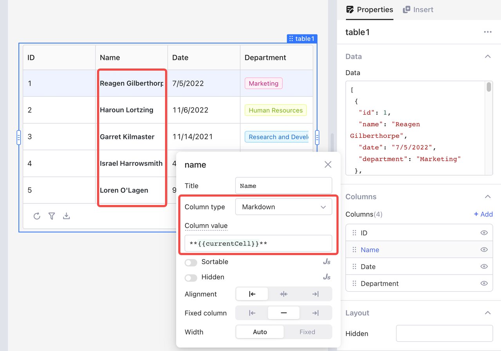

# Use Markdown

Openblocks supports you using the lightweight markup language Markdown to format texts in your app, such as changing the font size, inserting code, and adding a list. You can also embed HTML-formatted text in Markdown for more styling options.

Use Markdown in **Text** and **Table** components.

*   **Text**: Use Markdown for the input text.

    <figure><figcaption></figcaption></figure>
*   **Table**: Use Markdown for column type.

    <figure><figcaption></figcaption></figure>

## Markdown basics

All Markdown syntax is valid in Openblocks.

* **Headings**: Use hashtag (#) before heading. More hashtags, lower heading level.
* **Paragraphs**: Use a blank line to separate texts into paragraphs.
* **Line breaks**: Add at least two whitespaces at the end of a line and press **Enter** to start a new line.
* **Emphasis**: Use single asterisk (∗) before and after text to convert it to _italic_ text, double asterisks (∗∗) for **bold** text, and triple asterisks (∗∗∗) for _**italic bold**_ text.
* **Blockquotes**: Use the closing angle bracket (>) to create a blockquote.
* **Lists**: Use hyphen (-), asterisk (∗), or plus sign (+) followed by a whitespace to create an unordered list, and use numbers followed by a period (.) to create an ordered list.
* **Code**: Use backticks (\`) before and after code to denote `` `code` `` in plain text, and three backticks (\`\`\`) to present ` ```code block``` `.
* **Horizontal rules**: Use at least three asterisks (∗∗∗), hyphens (---), or underscores (\_ \_ \_) at the beginning of a line to create a horizontal rule.
* **Links**: Use square brackets (\[]) for the display text and parenthesis (()) for the link address. Note that no space should be inbetween. For example, `[Openblocks](https://docs.openblocks.dev)`.
* **Images**: Use an exclamation mark (!) to start an image shiinsertion, and then use square bracket (\[]) for the alternative text and parenthesis (()) for the link address or source path. The caption can follow the parentheses or start at a new line.
* **Escaping characters**: Use backslash (\\) to display the special symbols that Markdown uses. For instance, to print ` `` ` in plain text, you should use `` \`\` `` in Markdown.&#x20;

For more information, see [Markdown guide](https://www.markdownguide.org/basic-syntax/).

## GFM extension

You can also use GitHub Flavored Markdown (GFM) extensions for additional syntax.

* **Footnotes**: Use caret (^) and number in square brackets (\[]) to insert footnotes. For more information, see [Footnotes](https://docs.github.com/en/get-started/writing-on-github/getting-started-with-writing-and-formatting-on-github/basic-writing-and-formatting-syntax#footnotes).
* **Strikethrough lines**: Use double tilde (\~\~) before and after text to add strikethrough lines. For more information, see [Styling text](https://docs.github.com/en/get-started/writing-on-github/getting-started-with-writing-and-formatting-on-github/basic-writing-and-formatting-syntax#styling-text).
* **Tables**: Use hyphens (-) separated by the vertical bar (|) to create the header row of a table, and continue using the vertical bar to separate content in cells. For more information, see [Tables (extension)](https://github.github.com/gfm/#tables-extension-).
* **Task lists**: Use a whitespace in square brackets (\[ ]) within the list format to create task lists. To mark a task completed, replace the whitespace with the letter _x_. For more information, see [Task lists](https://docs.github.com/en/get-started/writing-on-github/getting-started-with-writing-and-formatting-on-github/basic-writing-and-formatting-syntax#task-lists).

## HTML support

In Openblocks, you can use most HTML tags and properties. For more information, see [Embed HTML in Markdown](https://www.markdownguide.org/basic-syntax/#html).


For security reasons, a few HTML tags including **iframe** and **script** are not permitted in Openblocks.


### Appendix: Supported HTML tags

```html
<h1>
<h2>
<h3>
<h4>
<h5>
<h6>
<br>
<b>
<i>
<strong>
<em>
<a>
<pre>
<code>

<tt>
<div>
<ins>
<del>
<sup>
<sub>
<p>
<ol>
<ul>
<table>
<thead>
<tbody>
<tfoot>
<blockquote>
<dl>
<dt>
<dd>
<kbd>
<q>
<samp>
<var>
<hr>
<ruby>
<rt>
<rp>
<li>
<tr>
<td>
<th>
<s>
<strike>
<summary>
<details>
<caption>
<figure>
<figcaption>
<abbr>
<bdo>
<cite>
<dfn>
<mark>
<small>
<span>
<time>
<wbr>
<input>
```
