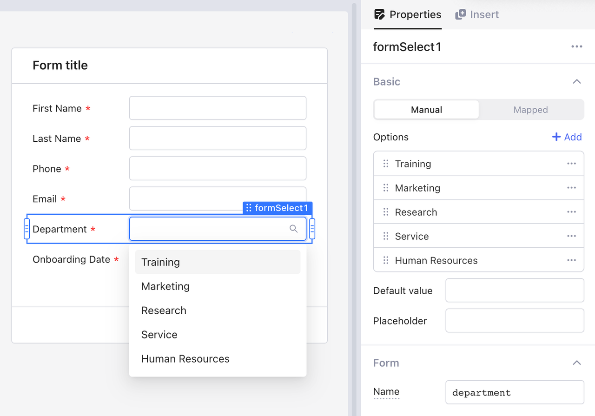
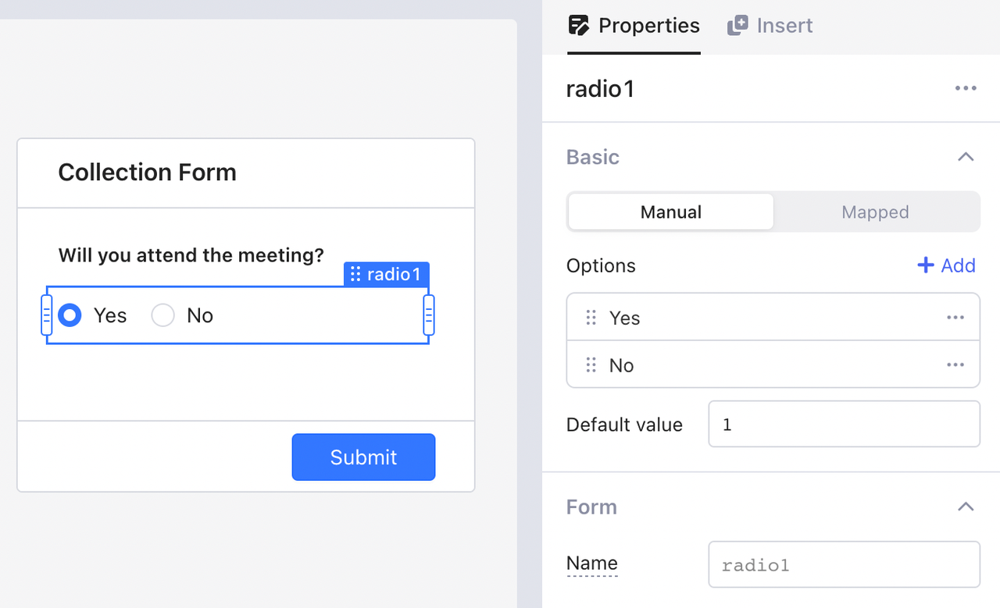
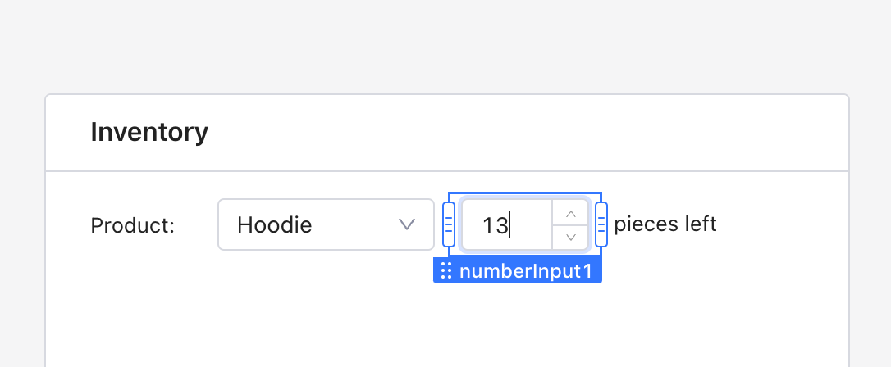
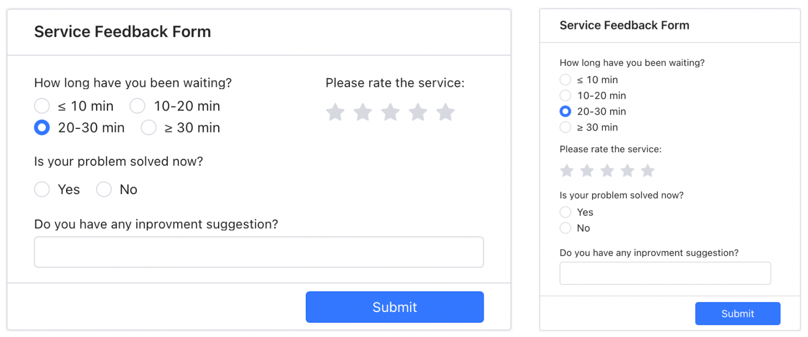
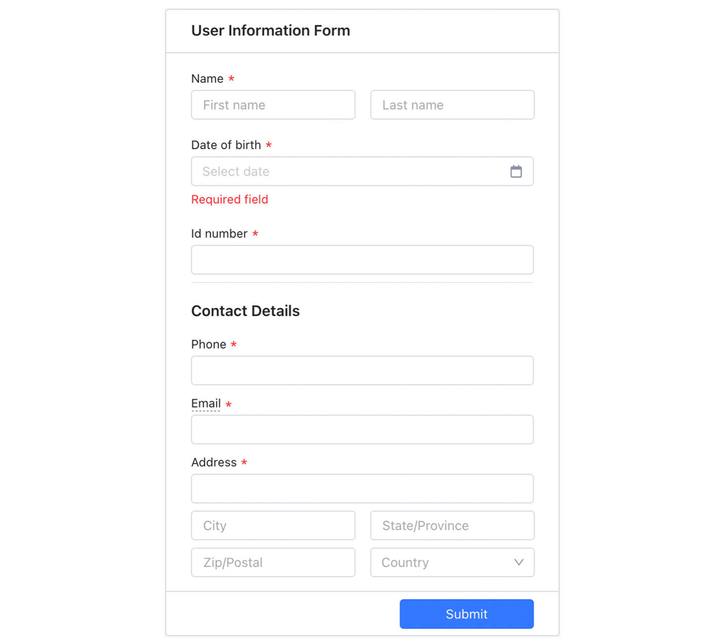
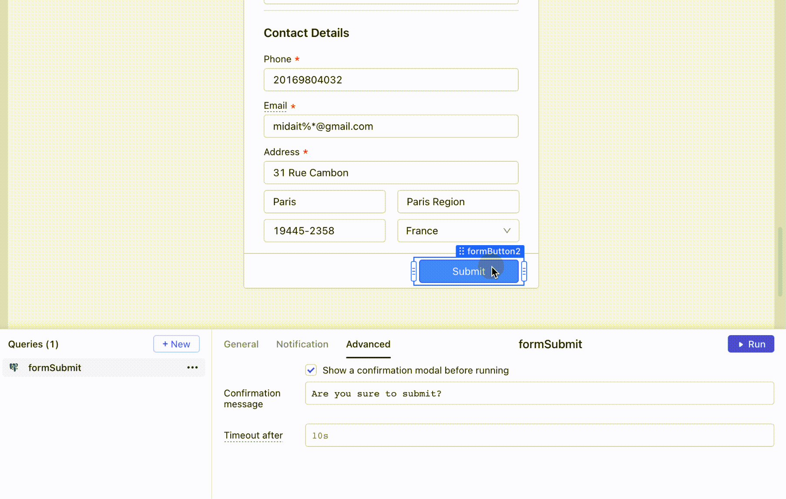

# Design an efficient and user-friendly form

### Select proper input components

The UX design of input components in a form is crucial to the form's efficiency. Properly chosen components can save users effort and lead to better results. Openblocks offers a variety of input components, including text input, number input, option list, and radio buttons, each of which works for different scenarios.

For example, when the input is generated from data, use the option list to let users quickly fill in the input.

<figure><figcaption></figcaption></figure>

Other input components, such as radio, are really helpful when the users need to directly choose between two options, for example, to indicate whether they would like to sign up for a particular activity, like a conference.

<figure><figcaption></figcaption></figure>

Number input is also a commonly used component type—for example, in an order management system.

<figure><figcaption></figcaption></figure>

### Keep layout clear and consistent

Keep all input field lengths the same to make the form visually neat, and put all input fields into a single column to achieve better readability.

<figure><figcaption></figcaption></figure>

### Group content with Openblocks divider

Use the Openblocks **Divider** component to group relevant input fields to help users process information in an organized way.

<figure><figcaption></figcaption></figure>

### Add user feedback

Form component is quite often used for CRUD operations, which sometimes can be risky due to human errors. To avoid harmful CRUD operations, you can add a confirmation modal before the users submit the form.

<figure><figcaption></figcaption></figure>

Similarly, a notification after users' submission gives users timely feedback. You can add a global notication to the Submit button. In Openblocks, you can add global notifications in three ways. See [global notification](style-theme-and-usability.md#global-notifications) for details.

### Clear input fields on submission

Clearing input fields in a form upon submission helps users proceed with the subsequent submissions. You can set in **Properties** tab, and toggle **Reset after successful submit**.

<figure><figcaption></figcaption></figure>

However, sometimes it is better to leave the form uncleared—for example, when much of the values stay the same in subsequent submissions, or when the user continuously edits data. In such cases, you can insert a button with an event handler to clear each input on click.

<figure><figcaption></figcaption></figure>

