# Style, theme, and usability

Good user interface (UI) improves user experience (UX) and increases user involvement. You can customize the style of each component in Openblocks and use the theme feature to design the interface on a per-app or workspace basis. Features such as icon configuration and hint messages make the app interaction more user-friendly.

## Component styles

You can modify the style of all components in the **Properties** tab.

<figure>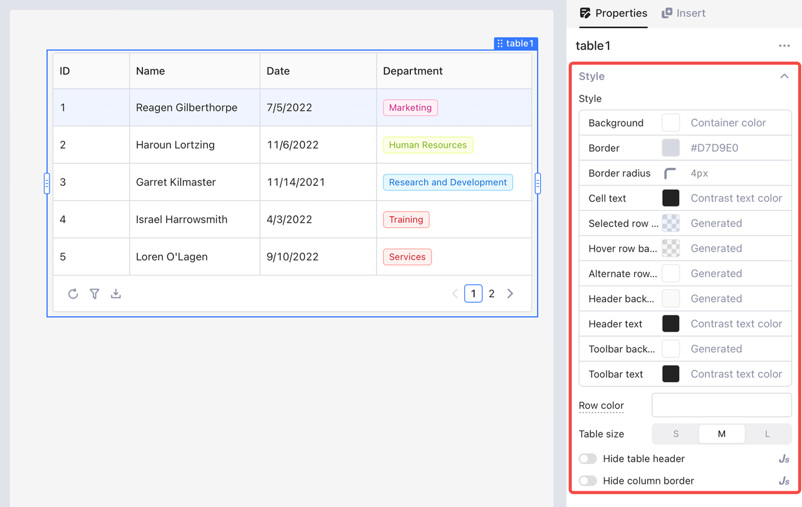<figcaption></figcaption></figure>

Click the color picker to select a color or write CSS color code in the text box.

<figure>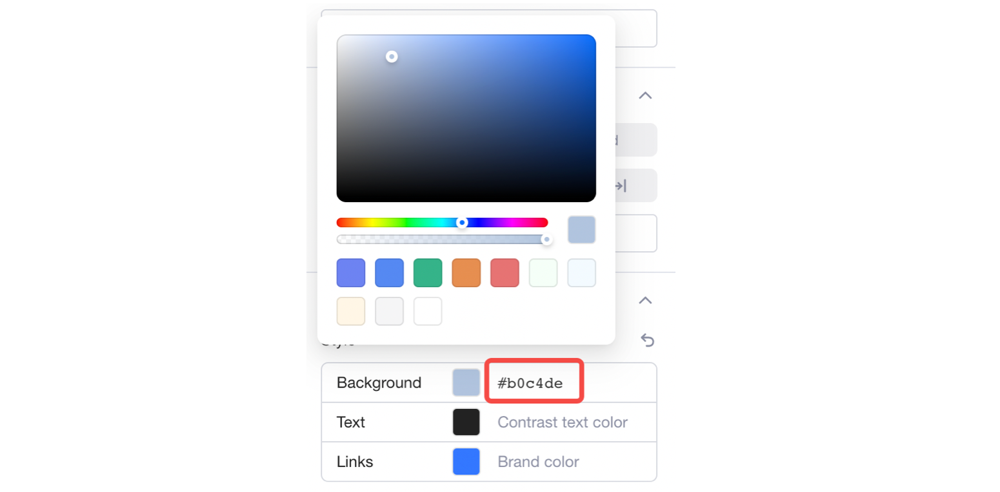<figcaption></figcaption></figure>

You can also write JavaScript in the text box to conditionally control the style setting of the component.

<figure>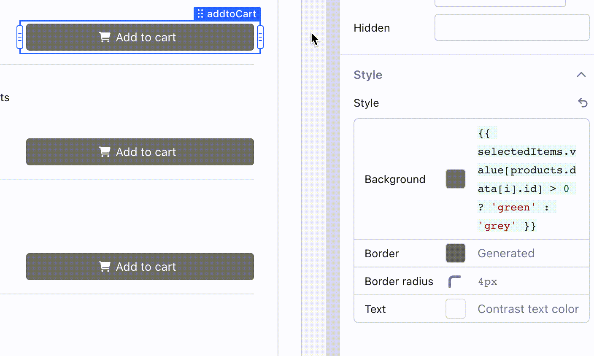<figcaption></figcaption></figure>

## Themes

The [theme feature](https://cloud.openblocks.dev/setting/theme) helps you quickly set the styles of all your apps within a workspace, such as the primary color of the apps and the default background color of containers.

<figure>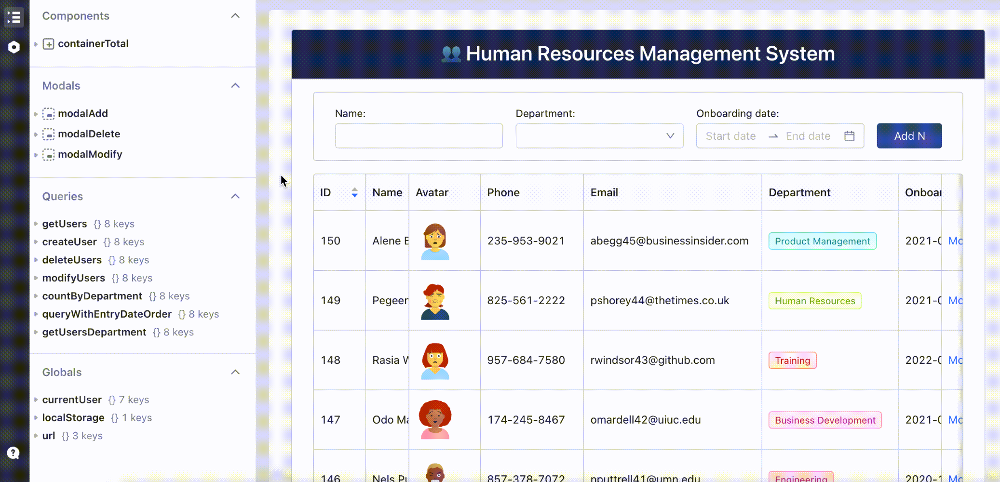<figcaption></figcaption></figure>

### Create a theme

Workspace admins have access to theme settings. On Openblocks homepage, go to **Settings** > **Themes**, and click **+ Create theme**. Enter the theme name, and select one of the preset default themes as the starting point.

<figure>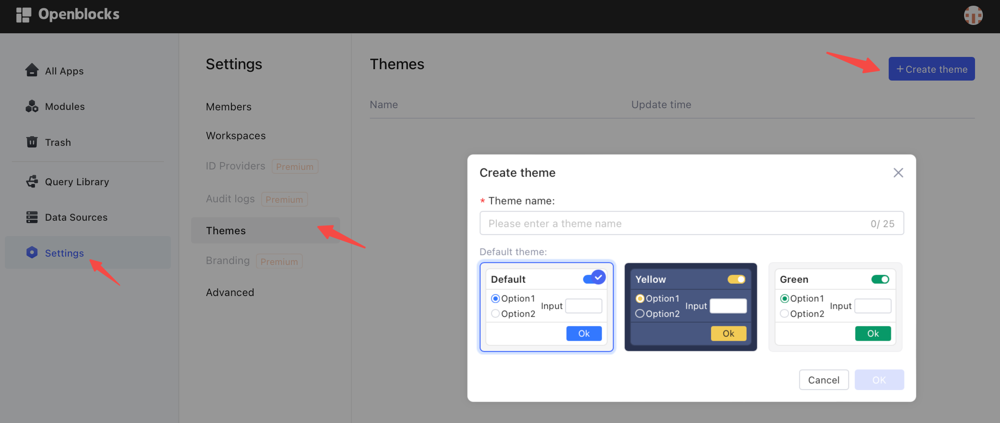<figcaption></figcaption></figure>

Preview the real-time theme effect on the right.

<figure><figcaption></figcaption></figure>

### Apply a theme

In the app editor, switch the theme by clicking ⚙️ on the left side-bar. Select a theme from **Theme setting**.

<figure>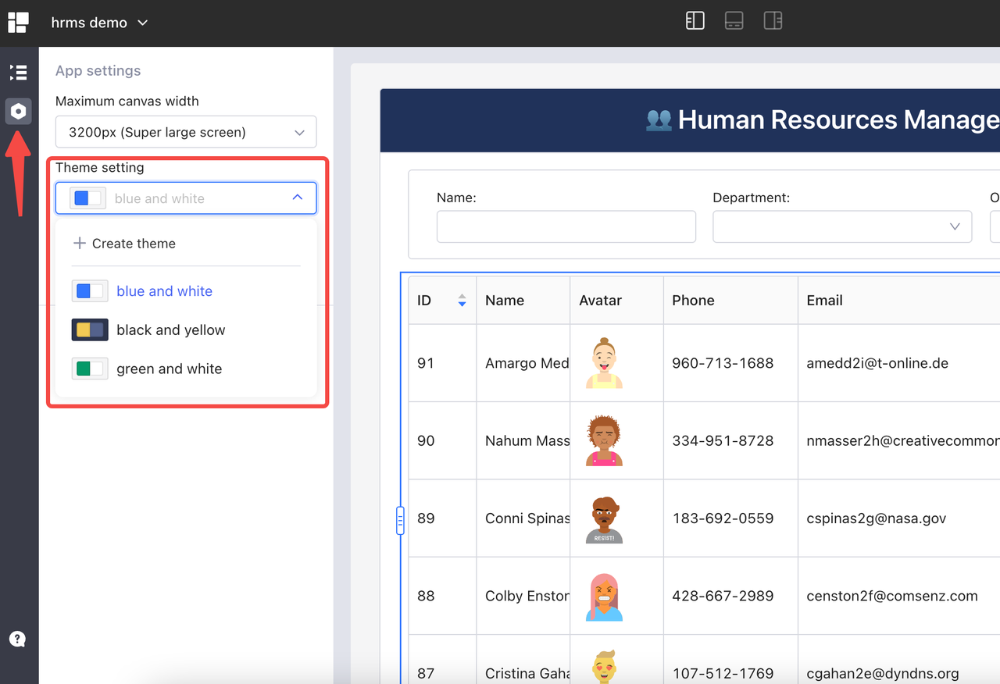<figcaption></figcaption></figure>

You can also set the default theme for all your apps within a workspace in **Settings** > **Themes** on Openblocks homepage.

<figure>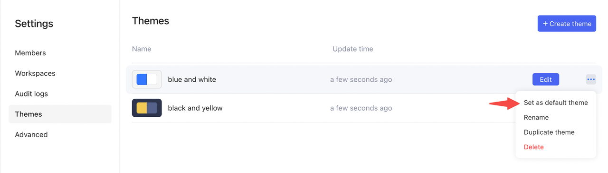<figcaption></figcaption></figure>

### Switching themes dynamically

You can access the global variable `theme` and call the method `theme.switchTo()` to allow the end users to switch the theme of the apps on their side using JavaScript.The global variable `theme` has three fields. You can view them in the data browser.

<figure>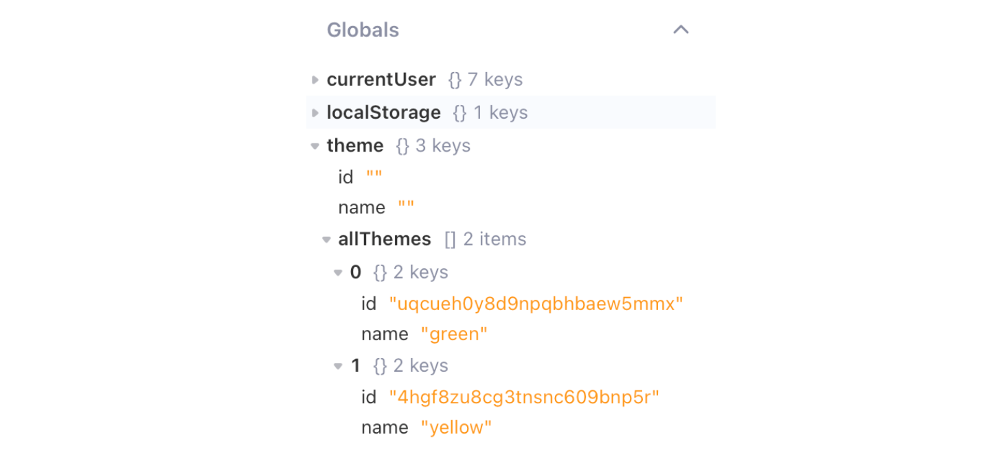<figcaption></figcaption></figure>

* `id` and `name` are strings, indicating the ID and name of the current theme. When their values are empty, then the default theme is applied.
* `allThemes` is an array, including all information of available themes in the current workspace.

`theme.switchTo()` method switches the theme at the end user's side, and requires only a theme ID. When the passed value is an empty string `""`, then the default theme is applied.Once the end user switches the theme, it will be saved to the user browser's local storage. And this theme will override the default theme and apply to all apps that are used in the same browser.

#### Demo

Combining Option lists and Events, end users can switch the theme within the app. For details, see [Change theme by code demo](https://cloud.openblocks.dev/apps/63f84ca9f5f6f66102fedf3b/view).

<figure>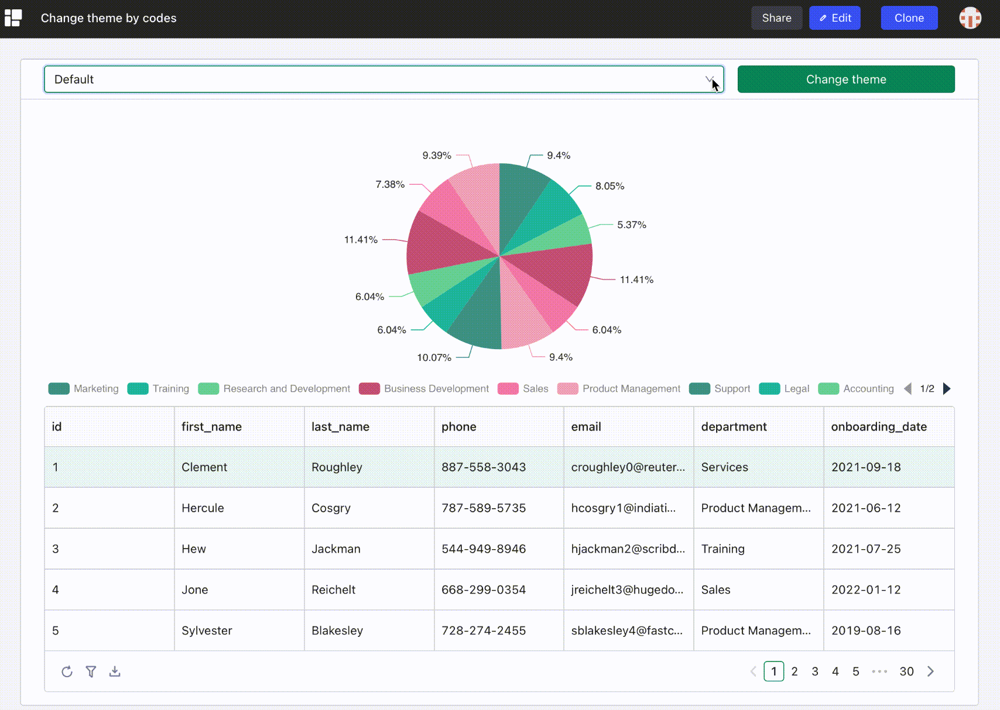<figcaption></figcaption></figure>

Follow the steps below to include this function in your app.

1. Drag and drop a **Select** component onto your canvas. Set the data value as follows.

<pre class="language-Plain"><code class="lang-Plain"><strong>{{[{ id: "", name: "Default" }, ...theme.allThemes]}}
</strong></code></pre>

2. Set the labels and values as `{{item.name}}` and `{{item.id}}` respectively. Then, you can view the default theme and all other available themes in the current workspace.

<figure>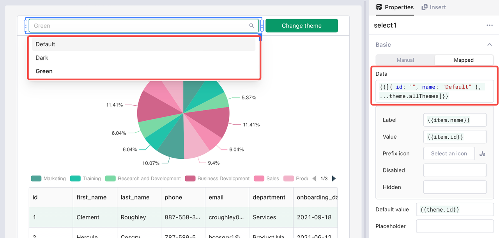<figcaption></figcaption></figure>

3. Insert a **Button** component onto your canvas to switch theme. Add an event to the button, select "Run JavaScript" as the action, and run `theme.switchTo()` method which takes the value of the **Select** component.&#x20;

<figure>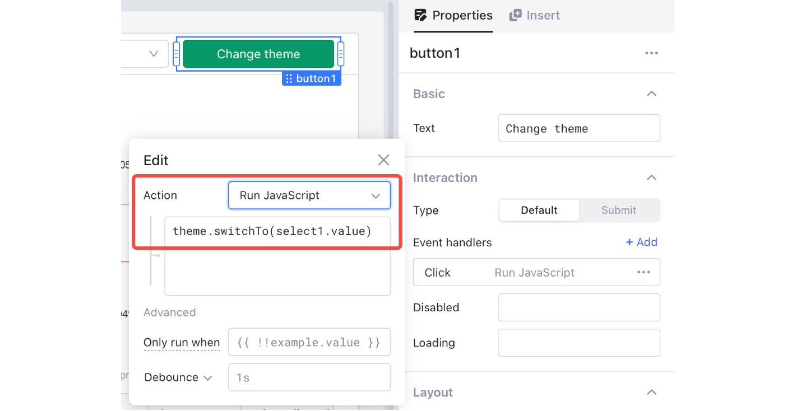<figcaption></figcaption></figure>

## Custom CSS

Openblocks provides a custom CSS feature for more flexible and customized UI styling.

### App-level CSS

In the app editor, click ⚙️ on the left side-bar, select **Scripts and style** > **CSS**, and then write CSS code for the current app.

<figure>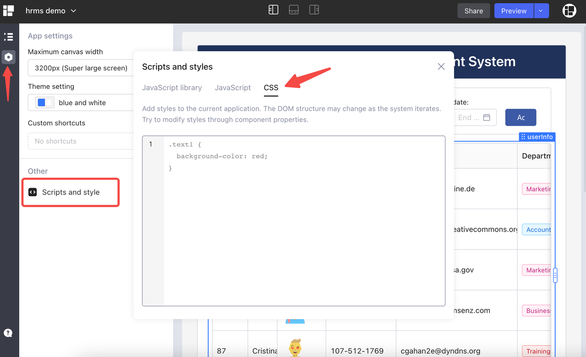<figcaption></figcaption></figure>

For example, insert text component `text1`. Then use `.text1` as the element name and modify its CSS style.

<figure>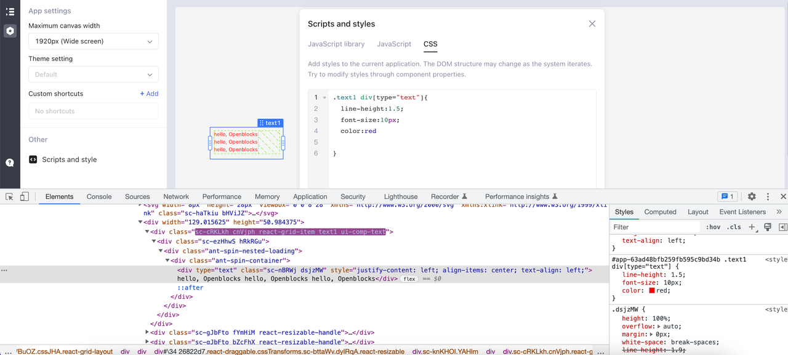<figcaption></figcaption></figure>


It is recommended to modify the component styles in **Properties** > **Style** because the DOM of an adjusted CSS style may change as the system iterates.


### Preload CSS

In Openblocks, workspace admins can also set pre-loaded CSS styles for all apps within the workspace. Open the **Settings**, and click **Advanced** > **Preload CSS**.

<figure>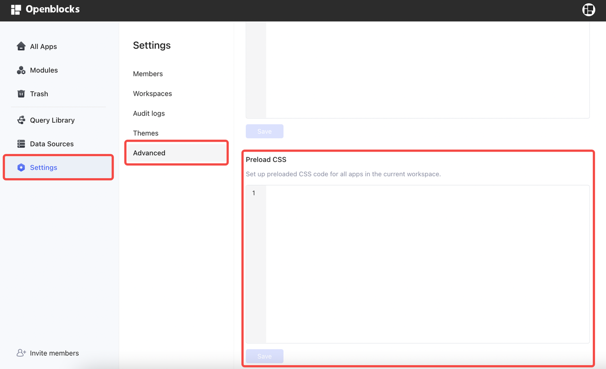<figcaption></figcaption></figure>

It is highly recommended to use CSS selectors as follows:

| Class name     | Description               |
| -------------- | ------------------------- |
| top-header     | Top navigation bar        |
| root-container | Root container of the app |

The name of each component functions as the class name. For example, for the `text1` component, you can use `.text1` as its class name and write CSS code for it. And the class names share the same form: `ui-comp-{COMP_TYPE}`—for example, you can use `.ui-comp-select` to define CSS style of all select components. All the components' class names are listed as follows.

```Plain
input
textArea
password
richTextEditor
numberInput
slider
rangeSlider
rating
switch
select
multiSelect
cascader
checkbox
radio
segmentedControl
file
date
dateRange
time
timeRange
button
link
dropdown
toggleButton
text
table
image
progress
progressCircle
fileViewer
divider
qrCode
form
jsonSchemaForm
container
tabbedContainer
modal
listView
navigation
iframe
custom
module
jsonExplorer
jsonEditor
tree
treeSelect
audio
video
drawer
carousel
collapsibleContainer
chart
imageEditor
scanner
```

Avoid using class names that may change with iterations, such as `sc-dkiQaF bfTYCO`.Openblocks supports [CSS pre-processor](https://stylis.js.org/), you can use CSS nesting to improve efficiency, for example:

```css
.text1 {
    span {
        color: red;
        font-weight: bold;
    }
}
```

All the custom CSS for apps is saved into the space named `#app-{APP_ID}`, and the CSS for modules is saved into the space named `#module-{MODULE_ID}`.If your preload CSS does not work properly, it might be overridden by the theme or component styles with higher priority. Open the browser **Inspect** to check.

### Demo 1: Line break in table header

To allow line break in table header, insert the following code in **Script and style** > **CSS**.

```css
.table1 {
  th div {
    white-space: pre-wrap;
    word-break: break-word;
    max-height: unset;
  } 
}
```

<figure>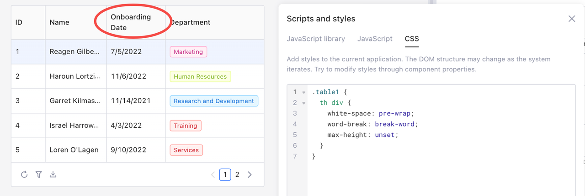<figcaption></figcaption></figure>

### Demo 2: Custom font family

To use custom font family, you need to define it first and then apply it. Insert the following code in **Script and style** > **CSS** to apply the font "Fredoka One" to all text components using Markdown mode within the app.

```css
@font-face {
  font-family: 'Fredoka One';
  font-style: normal;
  font-weight: 400;
  src: url(https://fonts.gstatic.com/s/fredokaone/v13/k3kUo8kEI-tA1RRcTZGmTlHGCaen8wf-.woff2) format('woff2');
}

.ui-comp-text .markdown-body {
  font-family: 'Fredoka One';
  font-size: 30px;
}
```

<figure>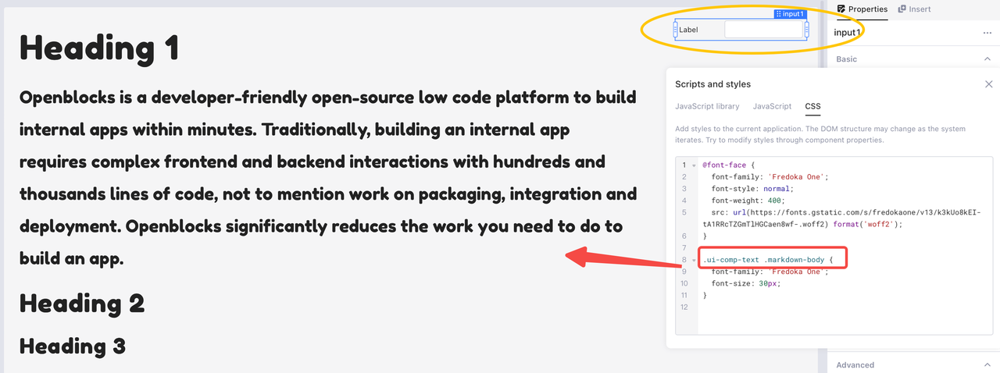<figcaption></figcaption></figure>

## User-friendly interaction

Openblocks always lives up to efficiency, security, and easy-to-use design.

### Hide UI components

Set the hidden properties of components when necessary to avoid information overload. For example, when creating a suggestion collection form, you can set the input box as visible or hidden depending on the user's selection. 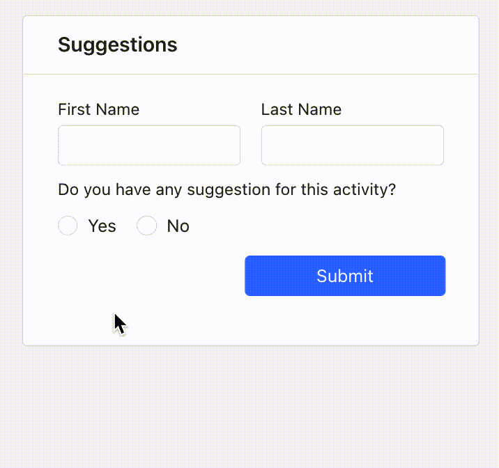

To achieve this effect, set the hidden property of the component `textArea1` with the code:

```JavaScript
{{Number(radio1.value) === 1 ? 'false' : 'true'}} 
```

When the value of the component `radio1` is "1", the value of the hidden property is "false"; otherwise, the value is "true". The component layout is automatically adjusted.

<figure>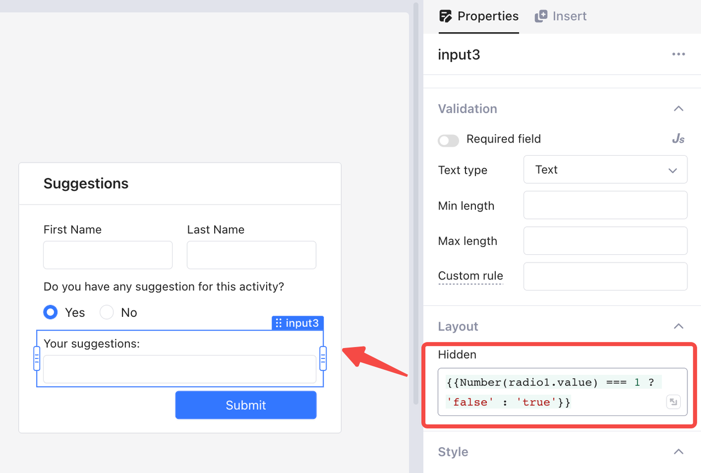<figcaption></figcaption></figure>

### Icon configuration

Icons are intuitive, and can be alternatives to text in some cases. The proper use of icons gives users a better visual experience, and helps them use the app more easily.

Prefix and suffix icons are available for some components, such as **Button**. Add icons in **Properties** > **Layout**.

<figure>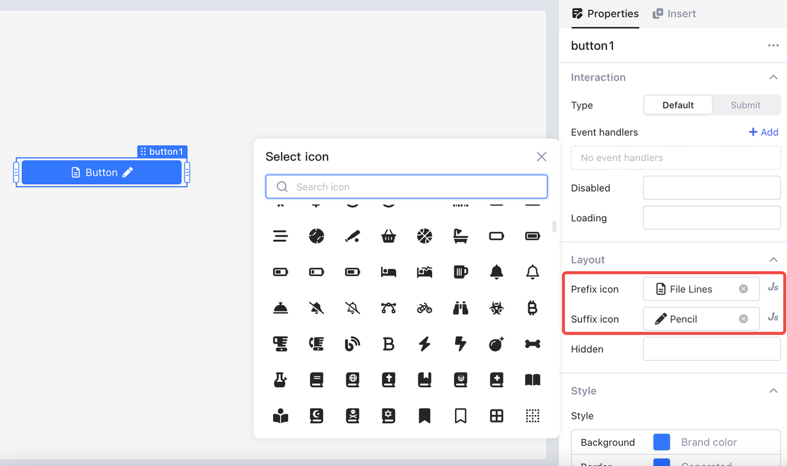<figcaption></figcaption></figure>

You can select from preset icons or write JS code to insert icons, for example, `{{ "/icon:solid/Users" }}`.

### Placeholder and tooltip

Tips improve app usability–for example, showing the tips for the input helps users better interact with the app.

* Placeholder: It displays in the empty input field to prompt the user what to type.
* Tooltip: It adds an underline to the label. Users can see the tooltip via a mouse hover.

<figure>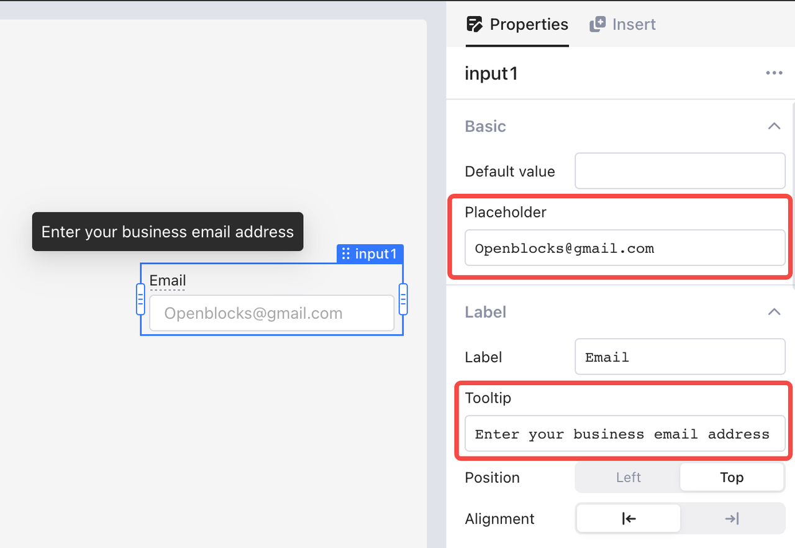<figcaption></figcaption></figure>

### Notifications

Notifications are messages directly sent to your users to remind them of the status of their operations, confirm their success, or help them to proceed.

#### Global notifications

Global notifications for certain user interactions give users timely feedback. Openblocks offers four types of global notificaitons: **Information**, **Success**, **Warning** and **Error**.

You can set global notifications in three ways:

1. Set in **Event handlers** > **Action** > **Show notification**. See [Show notification](../event-handlers.md#show-notification) (Event handlers).
2. Set in **JavaScript queries** with [built-in functions](../write-javascript/built-in-javascript-functions.md).
3. Set in **Notification** tab in query settings. See [Notification tab](../../queries/query-basics.md#notification-tab-and-advanced-tab).

### Loading effect

When a query takes time to run, you can set the loading effect to inform your users that the query is running and avoid them from performing frequent operations.

For example, the loading effect of the Submit button is `{{form1SubmitToHrmsEn1.isFetching}}`. Clicking the button triggers query `form1SubmitToHrmsEn1` to run, and during this process, the button is displayed with the loading effect.

<figure>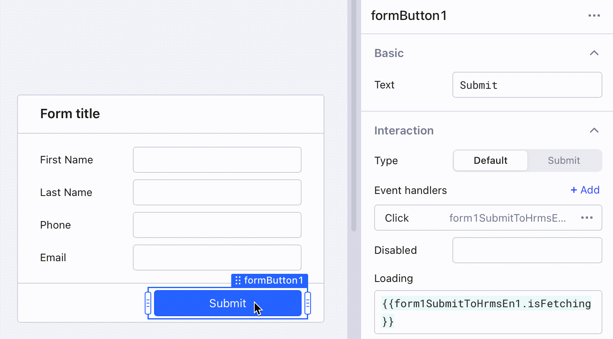<figcaption></figcaption></figure>

#### Confirmation modal

You can set a confirmation modal for a double check for your users when they perform operations such as adding, modifying or deleting data. In the **Advanced** tab of the query, toggle **Show a confirmation modal before running**, and enter a confirmation message.

<figure>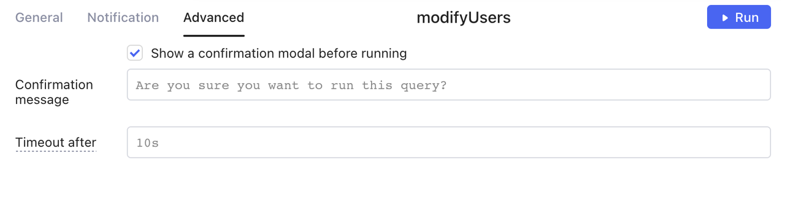<figcaption></figcaption></figure>

#### Form design

Forms are frequently used to collect information. For more details on building easy-to-follow and productive forms, see [Design an efficient and user-friendly form](design-an-efficient-and-user-friendly-form.md).
