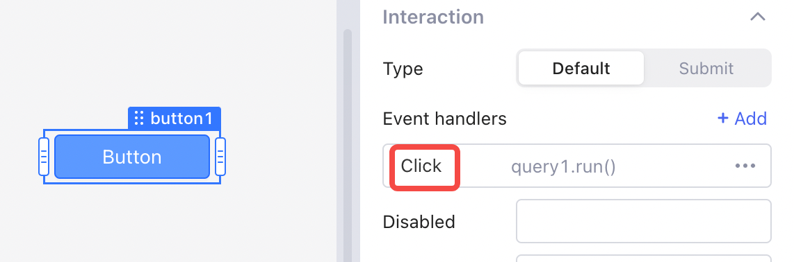
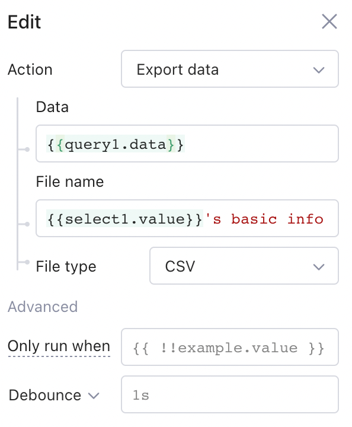

# Event handlers

In Openblocks, event handlers are responsible for collecting and processing events from components and queries, and executing subsequent actions. For example, for a **Button** component, you can add an event handler to trigger the **Run query** action **** in response to the button **Click** event.

<figure><figcaption></figcaption></figure>

Set event handlers wisely to provide a reactive and responsive user experience (UX). For example, triggering a **get-all** query after **insert-new-data** query finishes enables table automatically refresh.


You can add as many event handlers as you want for a single component or query, and these event handlers run concurrently.


## Events

### Component events

Different components have different events. For example, **Button** components only have a **Click** event.

<figure><figcaption></figcaption></figure>

**Input** components have **Change**, **Focus**, **Blur**, and **Submit** events.

<figure><figcaption></figcaption></figure>

### Query events

Running a query can result in success or failure, so queries have two events: **Success** or **Failure**. You can add event handlers to queries in Query editor.

<figure><figcaption></figcaption></figure>

## Actions

There are a number of event handler actions available in Openblocks for handling different scenarios. Set them in the **Action** dropdown list in an event handler.

 (1).png>)


See [advanced](event-handlers.md#advanced) on this page to know advanced settings.


### Run query

Trigger the selected query.

 (1).png>)

### Control components

To control a component, select a component in the **Component** dropdown list and call one of its methods in the **Method** dropdown list.

.png>)

### Set temporary state

Store data in a [temporary state](write-javascript/temporary-state.md).&#x20;

### Go to app

Navigate to an Openblocks app with optional query or hash parameters.

| Parameter            | Function                                                                                            |
| -------------------- | --------------------------------------------------------------------------------------------------- |
| 
URL Query 
 | 
Append <code>?key1=value1&#x26;key2=value2...</code> to the URL of the app to be opened. 
 |
| URL Hash             | Append `#key1=value1&key2=value2...` to the URL of the app to be opened.                            |

#### **Use case**

In the **User list** app, click **See info** to navigate to the **User info** app, and the detailed information of the user in the selected row will be displayed.

1.  The **User list** app passes `{{currentRow.id}}` in the table row as a URL Query parameter to the **User info** app.

    <figure><figcaption></figcaption></figure>
2.  The URL field of the **User info** app global variable will automatically resolve the URL requested by the app. In this case, the value of `url.query` is `{"id":3}`, so the query will retrieve the corresponding user info via `{{url.query.id}}`. See the figure below.

    <figure><figcaption></figcaption></figure>

### Go to URL

Navigate to an external URL.

 (1).png>)

### Show notification

Show a floating notification of informational, success, warning, or error message.

.png>)

### Copy to clipboard

Copy a value to the clipboard.

 (1).png>)

### Export data

Export data in a certain file type (TXT, JSON, CSV, and Excel).

## Advanced

### Only run when

The action can be triggered only under a specified condition. Configure the running condition of an event handler in **Only run when** option, and then the event handler runs only when this condition evaluates to `true`.

### Debounce and throttle

**Debounce** and **Throttle** reduce the frequency of triggering the action.

#### **Debounce**

Debounce delays an action. Once a debounce time is set, the action will not be executed immediately following the event until the debounce time passes. If the event occurs again before the time ends, the debounce time will be retimed. For example, an input component triggers a query once the user changes the text. If the query is expensive to run and you don't want to run it after every single character is typed, you can delay the execution of the query by setting the debounce time. Then the query will only run after the user finishes typing.

#### **Throttle**

Throttle lets an action happen only once during a specified period of time. By default, every single event triggers an action, but sometimes running an action can be costly. For example, you set an event handle to trigger **Run query** action **** to update data in response to the **Click** event, but you find that query too expensive to run, then you can set a throttle time to let the query run only once within a given time.
