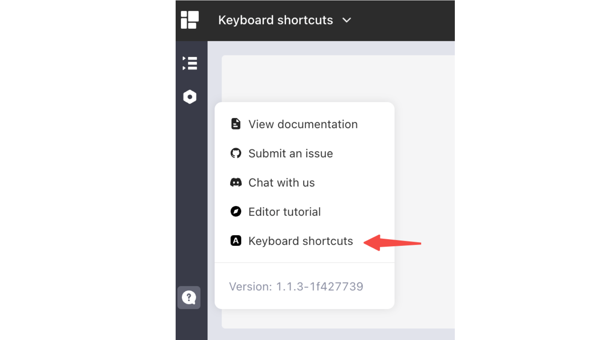

# Keyboard shortcuts

## Built-in keyboard shortcuts

Keyboard shortcuts are a powerful tool that can greatly improve productivity and efficiency when working on a computer. With the ability to assign custom keystrokes to frequently used commands, tasks can be completed quickly and with minimal effort. This is particularly useful for individuals who rely heavily on keyboard input, such as programmers, writers, or designers.

Keyboard shortcuts have been around for decades, and most software applications come with a set of default shortcuts. Openblocks offers built-in keyboard shortcuts to help you work on the interface faster and more efficiently with improved controlling precision.

<figure><figcaption></figcaption></figure>

### Global

Global keyboard shortcuts across Openblocks interfaces.

| Shortcut | Description               |
| -------- | ------------------------- |
| `?`      | Toggle keyboard shortcuts |

### App editor

Keyboard shortcuts in the [App editor](keyboard-shortcuts.md#app-editor).

| Shortcut      | Description        |
| ------------- | ------------------ |
| `⌘` + `B`     | Toggle left pane   |
| `⌘` + `J`     | Toggle bottom pane |
| `⌘` + `U`     | Toggle right pane  |
| `⌘` + `.`     | Toggle all panes   |
| `⌘` + ⇧ + `P` | Preview            |
| `⌘` + `Z`     | Undo               |
| `⌘` + ⇧ + `Z` | Redo               |
| `⌘`           | Show grid          |

### Component

Keyboard shortcuts to control components.

| Shortcut              | Description     |
| --------------------- | --------------- |
| `⌘` + Click           | Select multiple |
| `⌘` + `A`             | Select all      |
| `⌘` + `C`             | Copy            |
| `⌘` + `X`             | Cut             |
| `⌘` + `V`             | Paste           |
| `←` `↑` `→` `↓`       | Move            |
| `⌘` + `←` `↑` `→` `↓` | Resize          |
| `DEL`/`Backspace`     | Delete          |
| `ESC`                 | Deselect        |

### Query editor

Keyboard shortcuts in the Query editor.

| Shortcut  | Description       |
| --------- | ----------------- |
| `⌘` + `↵` | Run current query |

### Text editor

Keyboard shortcuts in the Text editor.

| Shortcut    | Description       |
| ----------- | ----------------- |
| `⌘` + `L`   | Format            |
| `⌘` + Click | Open in left pane |

## Custom keyboard shortcuts

You can define custom keyboard shortcuts at app-level. Go to ⚙️ on the left side-bar > **App settings** > **Custom shortcuts**. Click **+ Add** to add new shortcuts for specific actions. Then, you can click a custom shortcut to midify it or click the three dots `···` to delete it.

<figure><figcaption></figcaption></figure>


Openblocks keyboard shortcuts are better set to avoid conflicts with the browser's keyboard shortcuts, in case they can not be successfully triggered.

