# Module

When building an app, you want to reuse components and queries across different apps. Modules are what you need. A module comprises components and queries. You can insert a module into an app or other modules (referred to as _external apps_ in the rest of this document) and it functions just like a single component.&#x20;

<figure>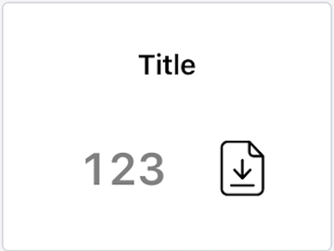<figcaption>
Build a <a href="module.md#demo-a-statistics-module">statistics module</a>
</figcaption></figure>

<figure><figcaption>
Reuse this module anywhere
</figcaption></figure>

## Module basics

### Create a new module

Select **New > Module** at the top right of homepage to enter the module editor.

<figure>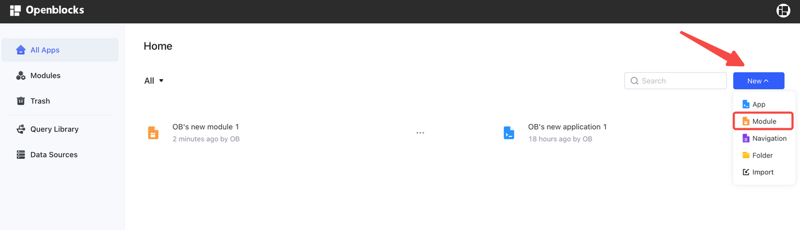<figcaption></figcaption></figure>

### Configure module settings

You can configure a module's settings in the **Settings** tab of data browser:

<figure>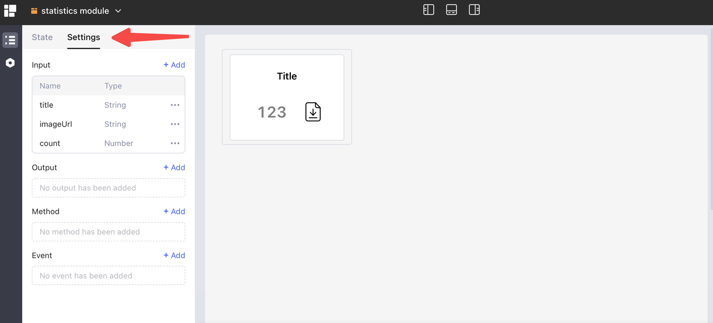<figcaption></figcaption></figure>

*   **Input**: parameters passed into the current module from external apps.&#x20;

    <figure>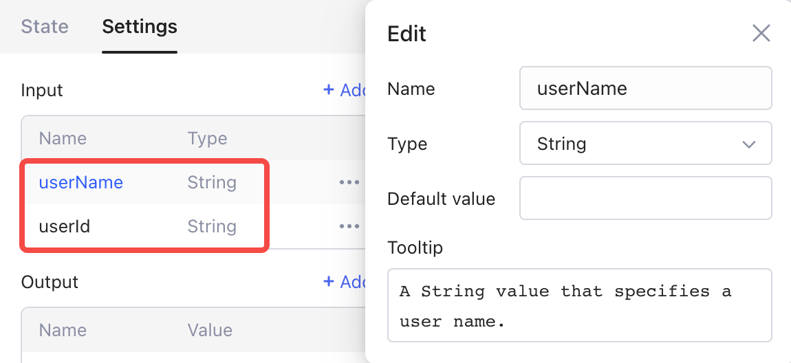<figcaption></figcaption></figure>
*   **Output**: data exposed to external apps.&#x20;

    <figure>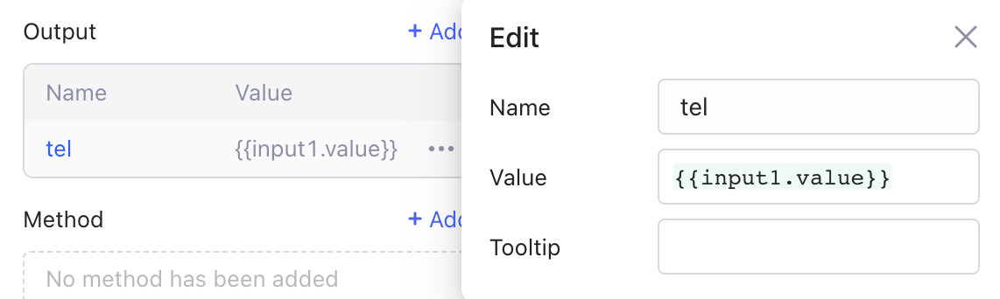<figcaption></figcaption></figure>
*   **Method**: methods exposed to external apps. For example, you can define a module with a `resetTitle` method, so that external apps can call it to reset the module's title.&#x20;

    <figure>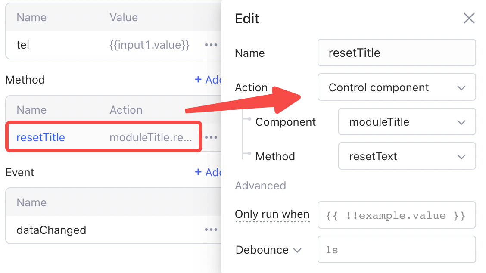<figcaption></figcaption></figure>
*   **Event**: module events can be handled by external apps. For example, you can define an event named `dataChanged`, so that external apps can add event handlers to it once the `dataChanged` event is fired by the module.&#x20;

    <figure><figcaption></figcaption></figure>

For more details, check out chapter [Module settings](module.md#module-settings).

### Design module UI

The other areas of the module editor are similar to those of the web app editor. Insert components and create queries the same way as your app-building process.In the module editor, you can resize a module by dragging the bottom-right corner to the desirable default size. Toggle the button in the **Properties** panel to control whether the **component height scales with the container**. **** This only works for the fixed-height components within the module.&#x20;

<figure><figcaption></figcaption></figure>

### Insert module to apps or other modules

When editing an app or module, select **Insert > Extensions > Modules** to display the modules that you have access to.&#x20;

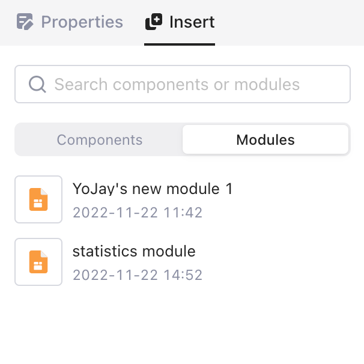

Then drag and drop the module onto the canvas, and set input parameters, change styles inside the module's **Properties** panel.

<figure>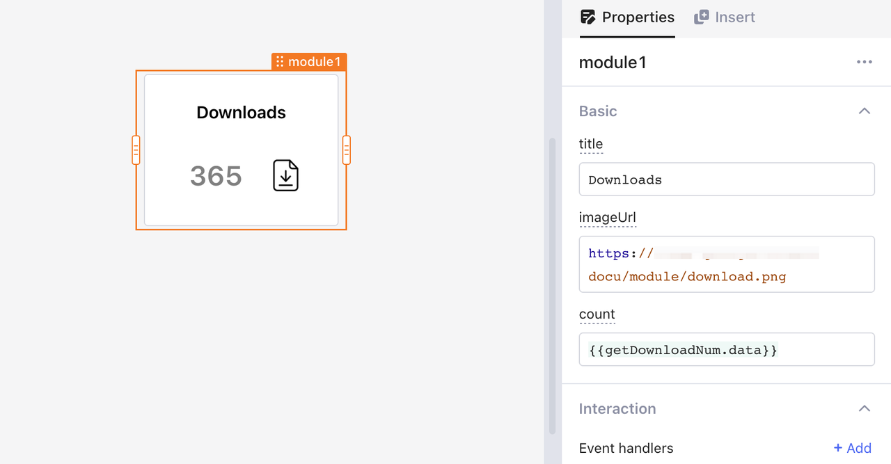<figcaption></figcaption></figure>

Inspect the data exposed by the module in the data browser.&#x20;

<figure>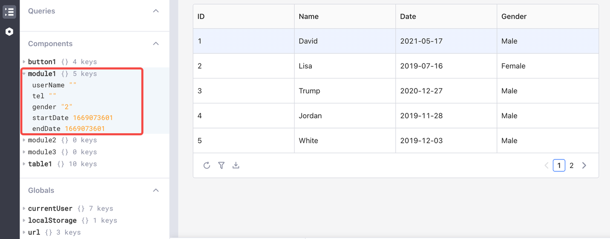<figcaption></figcaption></figure>

## Module settings

### Input

Module inputs are parameters passed to the module from external apps. The supported input types are **data**, **string**, **number**, **array**, **boolean**, **** and **query**. The first five are data types. Choose **data** to not restrict it to a specific data type. When choosing the type of **query**, you can pass in a query from external apps and trigger it inside the module.Then you can reference a module input parameter by its **name**.&#x20;

<figure>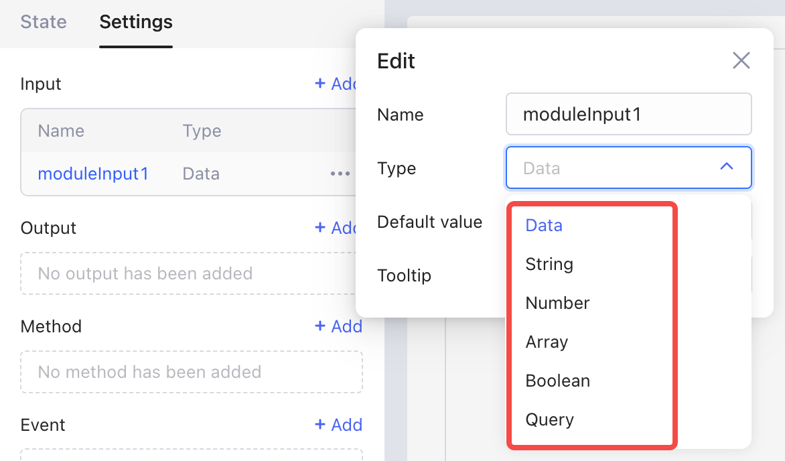<figcaption></figcaption></figure>

### Demo: A statistics module

This section guides you through the steps to build a statistics module and reuse it in an app. &#x20;

<figure><figcaption></figcaption></figure>

1.  Create module inputs:

    In the **Settings** tab, click **+** **Add** to create a new module input, and then set its **name**, **type**, **default value** (optional) and **tooltip** (optional).  In this example, three module inputs are added: two string inputs `title`, `imageUrl`, and a number input `count`:&#x20;

    <figure>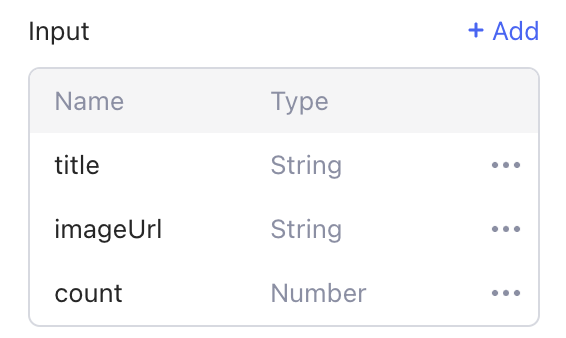<figcaption></figcaption></figure>
2. Design the module UI:
   1. Insert a **container** into the module.
   2. Add two **text** components and an **image** component to the container.
   3. Adjust their properties, such as the layout, height, and style.
3.  Bind the components' value to the module inputs. For example, the **Image source** of the image is bound to input parameter `imageUrl.value`.&#x20;

    <figure>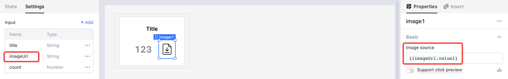<figcaption></figcaption></figure>
4.  Insert the newly built module into an external app or module, and you can pass in values to configure its properties.

    <figure>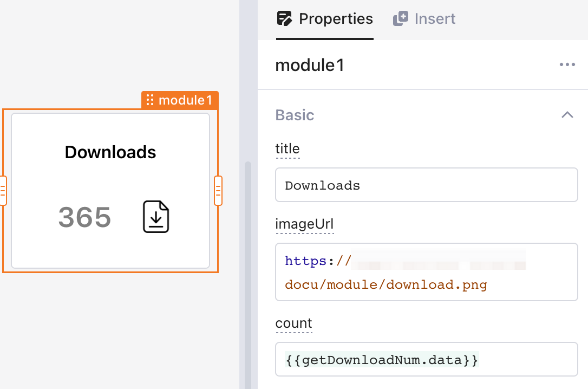<figcaption></figcaption></figure>
5.  Reuse the module multiple times by passing different input values.&#x20;

    <figure><figcaption></figcaption></figure>

#### Input Test

To quickly test the effectiveness of input parameters during editing a module, you can use the **Input Test** function.In the **module editor**, select the whole module to conduct tests with simulated input data in the **Properties** panel. In the example previously mentioned, you can set the test values for the three module inputs: `title`, `imageUrl`, and `count`, as shown below:&#x20;

<figure>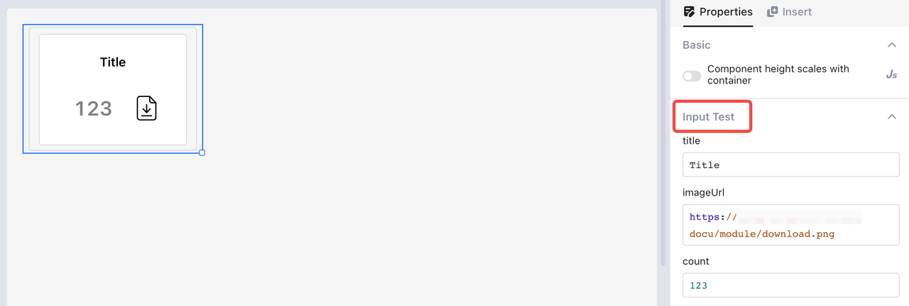<figcaption></figcaption></figure>

### Output

Module outputs are the data exposed to an app or other modules. You can inspect the outputs of a module in the data browser and access them via JavaScript code in `{{ }}`.The following example shows the outputs in a user-filtering module.&#x20;

<figure>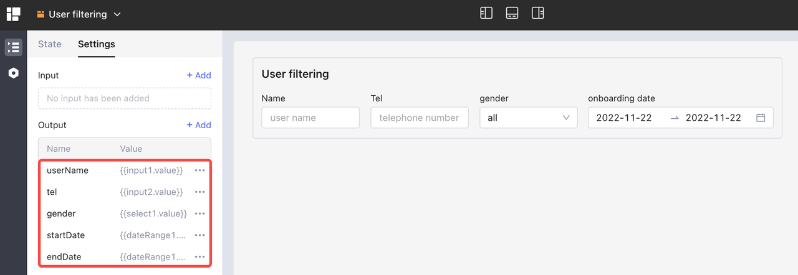<figcaption></figcaption></figure>

Then you can check out and reference the outputs of a module in apps or other modules using it.&#x20;

<figure>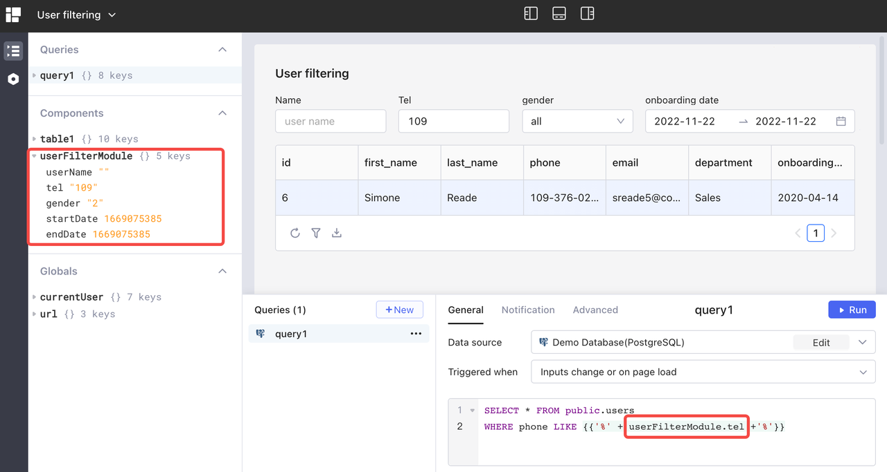<figcaption></figcaption></figure>

### Method

#### Add a new method

In the **Settings** tab, click **+** **Add** to create a new module method. Click the method to rename it and select an action. In the following example, the method `clearAll` is designed to clear the content in both input boxes. To achieve this, select **Run JavaScript** as the action, and write JS code to call the `clearValue` method of both two input components.&#x20;

<figure>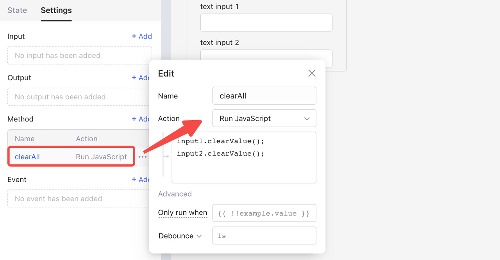<figcaption></figcaption></figure>


When creating a method for a module, you cannot create input parameters for the method and can only reference parameters within the scope of the current module.


#### Call a method

When using modules, you can call a module method in two ways:

*   In event handlers, select **Action** > **Control component**, and then select the **component** and **method**.&#x20;

    <figure>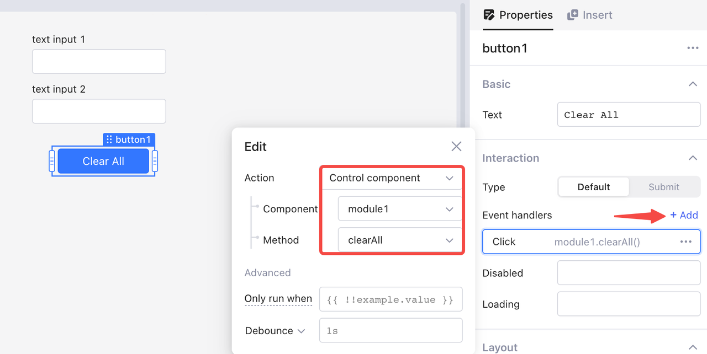<figcaption></figcaption></figure>
* Use dot notation in JavaScript queries. For example, `module1.clearAll()` calls the method `clearAll()` of `module1`.

#### Method Test

You can simulate testing method calling in the **Method Test** function.

<figure>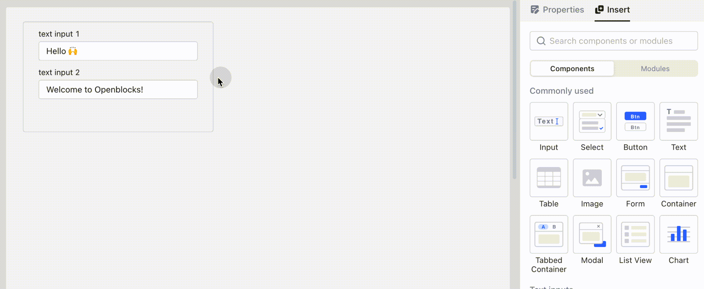<figcaption></figcaption></figure>

### Event

Events are used to transfer signals from a module to external apps, such as defining `orderPlaced` `OrderModified` events for an order management module. You can add and fire events within a module, and deal with them using [event-handlers.md](event-handlers.md "mention") externally.

#### Add a new event

In the **Settings** tab, click **+** **Add** to create a new module event. Click the event to set its name.&#x20;

<figure>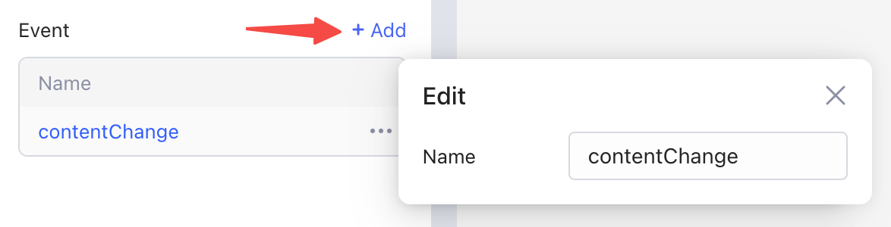<figcaption></figcaption></figure>

#### Trigger an event

In the following example, the event `contentChange` is triggered when the content in any input box changes. You can trigger it in two ways:

*   In **Event handlers** of both input components, click **+ Add**, select **Change** as the component event and **Trigger module event** as the action, and finally select the module event `contentChange`.&#x20;

    <figure>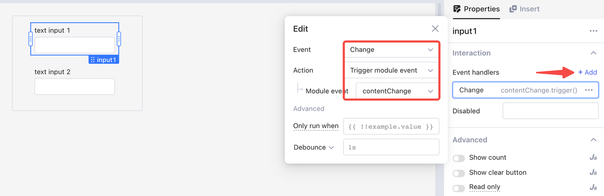<figcaption></figcaption></figure>
* Use dot notation in JavaScript queries: `contentChange.trigger()`.

#### Event handlers

When an app uses a module, you can configure how the current app reacts to the module's events. For example, in **Event handlers** of `module1`, click **+ Add**, and select the module event `contentChange`and the action **Show notification**.&#x20;

<figure>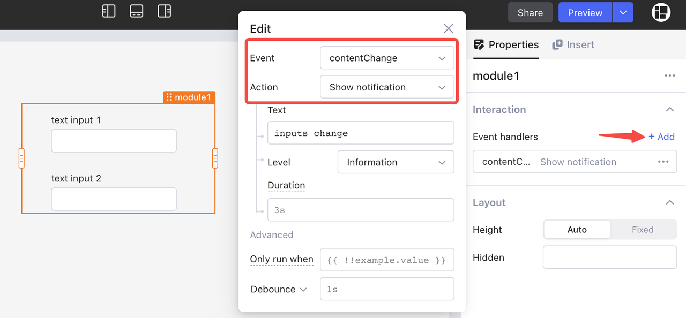<figcaption></figcaption></figure>

#### Event Test

The following example conducts event tests in the **Event Test** section.&#x20;

<figure>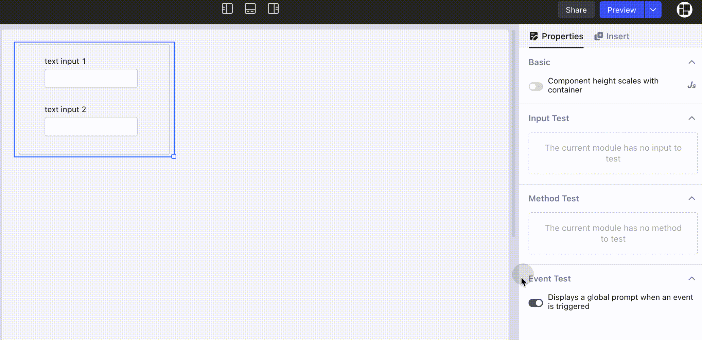<figcaption></figcaption></figure>

## Permissions

End users are automatically granted permissions to view modules in apps or other modules they have viewing permissions with.If you are an editor and wish to use a module in external apps, you should at least have the viewer's role of that module. For more information, see [permissions-for-resources.md](../workspace-management/permissions-for-resources.md "mention").

## Releases and versions

Openblocks stores the history versions of your modules for your references. Click **Preview > Publish** at the top right. The release management of a module is identical to that of an app. For detailed information, see [#release-management](version-and-release-management.md#release-management "mention").


For an unpublished module, the apps and modules use its latest version; while for a published one, you need to publish it again to sync your latest changes.

