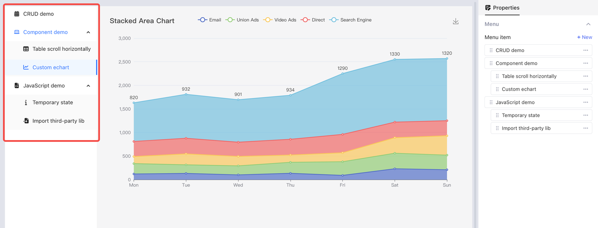
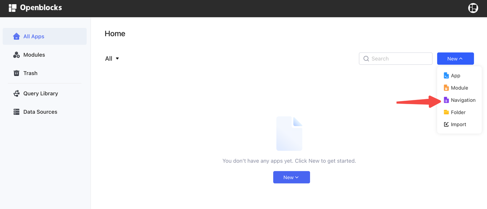
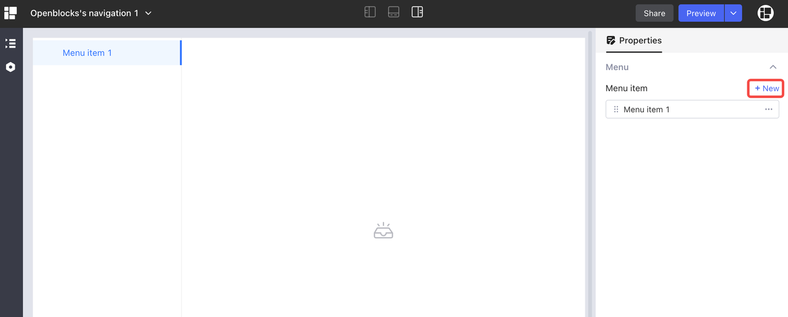
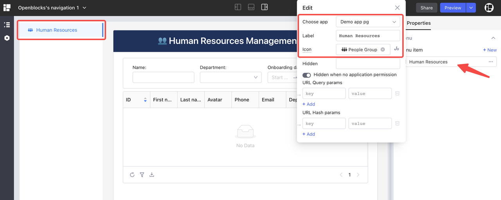
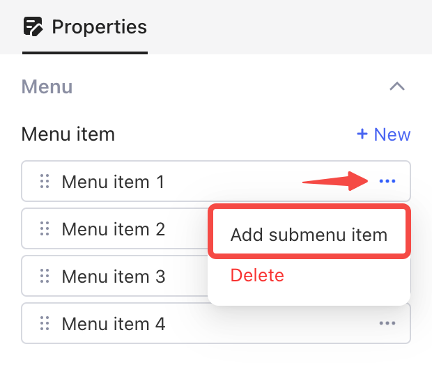
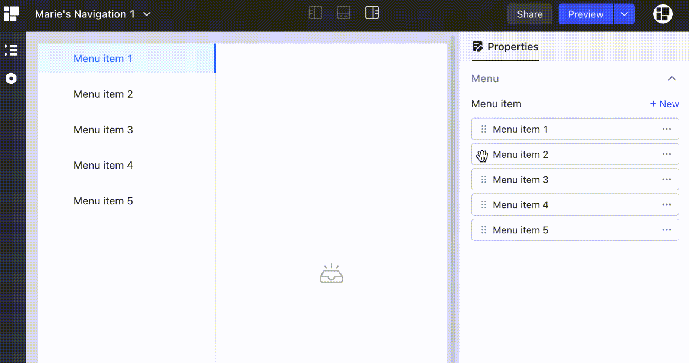
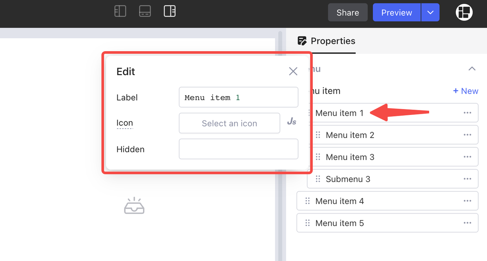
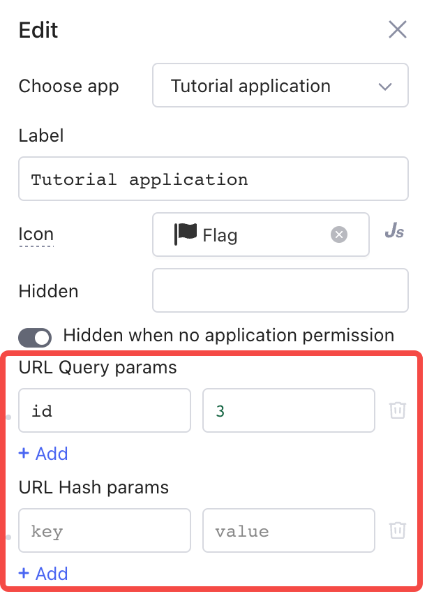
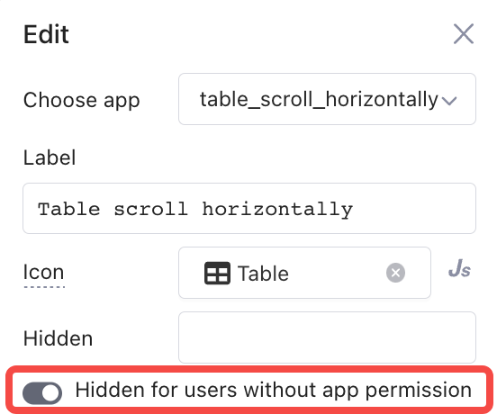

# Navigation

**Navigation** aggregates your apps onto the left sidebar and guides you to quickly find the needed app.

<figure><figcaption></figcaption></figure>

On Openblocks homepage, click **New** and select **Navigation** to create a navigation page.

<figure><figcaption></figcaption></figure>

## Menu items

In the **Navigation** editor, click **+ New** to add menu items.

<figure><figcaption></figcaption></figure>

Select a menu item, choose the app to navigate to, and change the label and icon if needed. The app is displayed on the canvas in real time.

<figure><figcaption></figcaption></figure>

### Add submenu items

To add submenu items, click `···` > **Add submenu item**, or drag `⋮⋮` to make one menu item subordinated to another.

<figure><figcaption></figcaption></figure>

<figure><figcaption></figcaption></figure>


A parent menu item can only expand or fold the submenu items. You cannot link an app to it.

When you delete a parent menu item, all submenu items under it are deleted at the same time.


<figure><figcaption></figcaption></figure>

### Add URL parameters

Add URL query parameters or hash parameters to a menu item with `key` and `value`.

Then click the menu item on the canvas, and the parameters are appended to the URL of the app to be opened. You can check in **Globals** tab in the left pane.


To reference the url parameters, use `{{url.query.key1}}` or `{{url.hash.key1}}` in your app.


For more information of URL parameters, see Go to app.

### Visability of menu items

By default, a menu item is hidden for users without app permission. When you toggle this option off, the users can see the menu item but can not view the app it references to.

## Permissions

The permissions for navigations are the same as those for modules and apps. See Permissions for resources.
