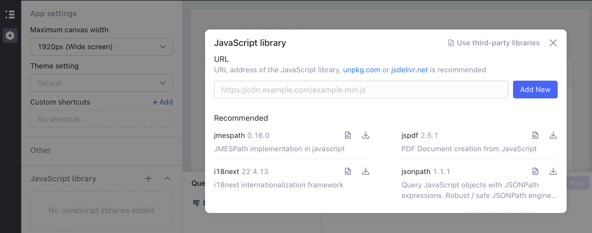
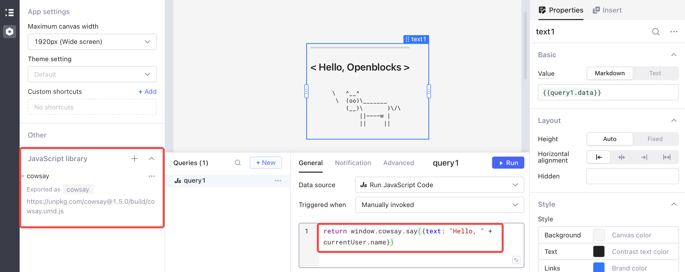
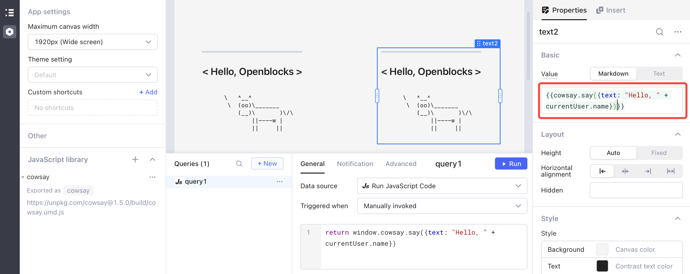
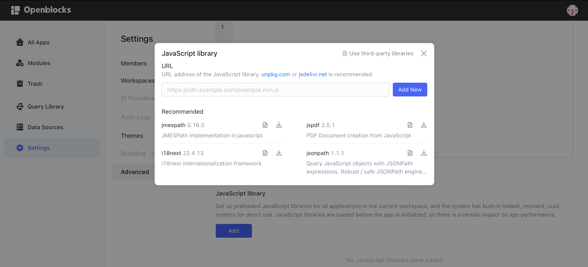

# Use third-party libraries

Every developer learns one of the most important principles of software engineering early in their career: DRY (Don’t Repeat Yourself). Using third-party libraries can save your time as you do not need to develop the functionality that the library provides. Openblocks provides some built-in third-party libraries for common uses, and you can manually import other libraries on demand.

## Built-in libraries

Openblocks provides some JavaScript built-in libraries for use.

| Library   | Docs                                                                 | Version                    |
| --------- | -------------------------------------------------------------------- | -------------------------- |
| lodash    | [https://lodash.com/docs/](https://lodash.com/docs/)                 | 4.17.21                    |
| moment    | [https://momentjs.com/docs/](https://momentjs.com/docs/)             | 2.29.3                     |
| uuid      | [https://github.com/uuidjs/uuid](https://github.com/uuidjs/uuid)     | 8.3.2（Support v1/v3/v4/v5） |
| numbro    | [https://numbrojs.com/format.html](https://numbrojs.com/format.html) | 2.3.6                      |
| papaparse | [https://www.papaparse.com/docs](https://www.papaparse.com/docs)     | 5.3.2                      |

## Manually import third-party libraries

Openblocks supports setting up preloaded JavaScript and libraries which can be at **app-level** or **workspace-level**.

* **App-level** libraries **** get loaded only in the app where defined. Plus, app A cannot use libraries that are set up for app B.
* **Workspace-level** libraries **** will be loaded when you open any application in your workspace. All the apps can access those libraries. There can be a certain impact on app performance, especially when you have complex JavaScript functions that aren't being used in every app.


**Tips you should know before setting up libraries:**

* External libraries are loaded and run in the browser.
* NodeJS-only libraries are not supported now.
* URLs of external libraries need to support cross-domain.
* The export of the library must be set directly on the window object, global variables like `var xxx = xxx` do not take effect.
*   The external libraries run in a restricted sandbox environment and the following global variables are not available:

    <mark style="background-color:yellow;">`parent`</mark>

    <mark style="background-color:yellow;">`document`</mark>

    <mark style="background-color:yellow;">`location`</mark>

    <mark style="background-color:yellow;">`chrome`</mark>

    <mark style="background-color:yellow;">`setTimeout`</mark>

    <mark style="background-color:yellow;">`fetch`</mark>

    <mark style="background-color:yellow;">`setInterval`</mark>

    <mark style="background-color:yellow;">`clearInterval`</mark>

    <mark style="background-color:yellow;">`setImmediate`</mark>

    <mark style="background-color:yellow;">`XMLHttpRequest`</mark>

    <mark style="background-color:yellow;">`importScripts`</mark>

    <mark style="background-color:yellow;">`Navigator`</mark>

    <mark style="background-color:yellow;">`MutationObserver`</mark>


Now let's take **cowsay** as an example and import it at app-level and workspace-level.

* GitHub page: [https://github.com/piuccio/cowsay](https://github.com/piuccio/cowsay)
* Library link: [https://unpkg.com/cowsay@1.5.0/build/cowsay.umd.js](https://unpkg.com/cowsay@1.5.0/build/cowsay.umd.js)

### At app-level

Navigate to the settings page and then click the plus sign **+** under the **JavaScript library** tab. Paste the **cowsay** link and click **Add New**. You can also click the download icon to quickly download any recommended JS library.

<figure><figcaption></figcaption></figure>

Create a JS query and insert code.

<figure><figcaption></figcaption></figure>

You can obtain the same result by calling the `cowsay.say()` method in the value of the text component.

<figure><figcaption></figcaption></figure>

Note that the cowsay library is imported at app-level and you can not use it in any other app within your workspace.

### At workspace-level

Go to [Opneblocks homepage](https://cloud.openblocks.dev/), select **Settings** > **Advanced**, and then click **Add** under the **JavaScript library** tab. Paste the link of the third-party JS library and click **Add New** to add it to your workspace. You can also click the download icon to quickly add any recommended JS library. The installed libraries are accessible from any app within your workspace.

<figure><figcaption></figcaption></figure>
