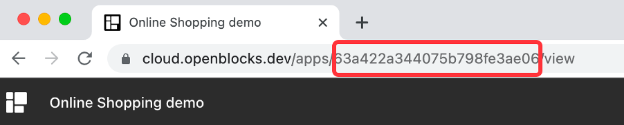
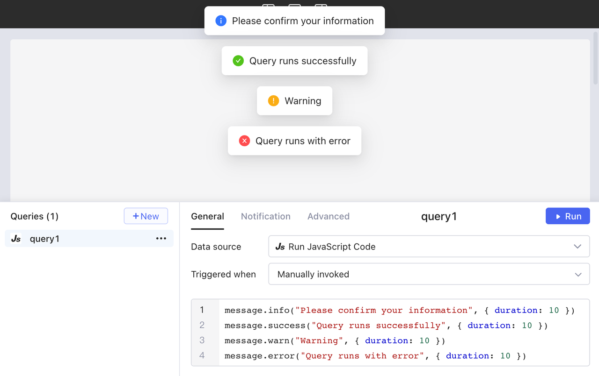
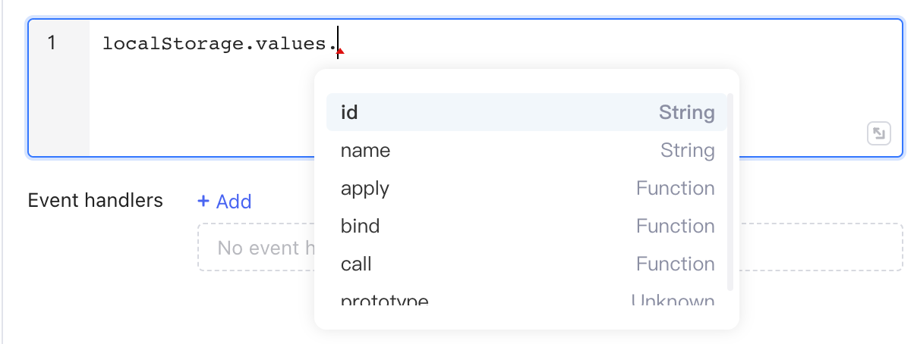

# Built-in JS functions

## utils - utility functions

### utils.openUrl()

Open a URL.

```javascript
// Syntax
utils.openUrl( url: string, options?: { newTab:  boolean = true } )
```

| Parameter      | Description                                                                                                                |
| -------------- | -------------------------------------------------------------------------------------------------------------------------- |
| <p>url<br></p> | Required. A **String** value that specifies the URL to open. It must start with _http://_ or _https://_.                   |
| newTab         | Optional. **Boolean** value that, when **True**, specifies the url is to open in a new tab. The default value is **True**. |

```javascript
// Example: Open google.com in a new tab.
utils.openUrl("https://www.google.com", { newTab: true })
```

### utils.openApp()

Open an Openblocks app.

```javascript
// Syntax
utils.openApp( applicationId: string, options?: { queryParams?: {"key":"value"}, hashParams?: {"key":"value"}, newTab: true } )
```

| Parameter                                                 | Description                                                                                                                                                                          |
| --------------------------------------------------------- | ------------------------------------------------------------------------------------------------------------------------------------------------------------------------------------ |
| <p>appId<br></p>                                          | <p>Required. A <strong>String</strong> value that specifies the ID of the app to open.</p><p> </p> |
| queryParams: {'key1':'value1',key2:'value2',...}          | Optional. An **Object** that specifies query parameters to pass into the app. The query parameters are added to the app URL in the form of ?_key1=value1\&key2=value2&..._           |
| <p>hashParams：{'key1':'value1',key2:'value2',...}<br></p> | Optional. An **Object** that specifies hash parameters to pass into the app. The hash parameters are added to the app URL in the form of _#key1=value1\&key2=value2&..._             |
| newTab                                                    | Optional. A **Boolean** value that, when **True**, specifies the url is to open in a new tab. The default value is **True**.                                                         |

```javascript
// Example: Open an Openblocks app in a new tab.
utils.openApp("632bddc33bb9722fb888f6c0", { newTab: true })

// Example: Open an Openblocks app and pass in "id" parameter.
utils.openApp("632bddc33bb9722fb888f6c0", {
  queryParams: { "id": table1.selectedRow.id },
} )
```

### utils.downloadFile()

Download a file containing the specified data.

```javascript
// Syntax
utils.downloadFile(data: any, fileName: string, options?: {
  fileType?: string, 
  dataType?: "url" | "base64"
} )
```

| Parameter | Description                                                                                                                                                                                                 |
| --------- | ----------------------------------------------------------------------------------------------------------------------------------------------------------------------------------------------------------- |
| data      | Required. A **String** or **Object** that specifies the data to download from queries, components, transformers, etc.                                                                                       |
| fileName  | Required. A **String** value that specifies the name of the file to download.                                                                                                                               |
| fileType  | Optional. A **String** value that specifies the type of the file to download. All [MIME types](https://developer.mozilla.org/en-US/docs/Web/HTTP/Basics\_of\_HTTP/MIME\_types/Common\_types) are supported. |
| dataType  | Optional. A **String** value that specifies the type of the data: "url" or "base64".                                                                                                                        |

```javascript
// Example: Download the base64 data from a file component as a PNG file named users-data.
utils.downloadFile(file1.value[0], "users-data", {
  fileType: "png",
  dataType: "base64",
})


// Example: Download the results of query1 as a XLXS file named users-data.
utils.downloadFile(query1.data, "users-data", { fileType: "xlsx" })
// or in this way:
utils.downloadFile(query1.data, "users-data.xlsx")

// Example: Download the results of query1 as a XLXS file named users-data.
utils.downloadFile(restApiQuery.data, "users-data", {
  fileType: "pdf",
  dataType: "base64",
})
```

### utils.copyToClipboard()

Copy a string to clipboard.

```javascript
// Syntax
utils.copyToClipboard( text: string )
```

| Parameter | Description                                                      |
| --------- | ---------------------------------------------------------------- |
| text      | Required. A **String** value that specifies the content to copy. |

```javascript
// Example: Copy the content of input component to clipboard.
utils.copyToClipboard( input1.value )
```

## message - global notification

Use `message` methods to send a global alert notification, which displays at the top of the screen and lasts for 3 seconds by default. Each of the following four methods supports a unique display style.

```javascript
// message.info( text: string, options?: {duration: number = 3 } )
message.info("Please confirm your information", { duration: 10 })
// message.success( text: string, options?: {duration: number = 3 } )
message.success("Query runs successfully", { duration: 10 })
// message.warn( text: string, options?: {duration: number = 3 } )
message.warn("Warning", { duration: 10 })
// message.error( text: string, options?: {duration: number = 3 } )
message.error("Query runs with error", { duration: 10 })
```

<figure><figcaption></figcaption></figure>

## localStorage

Use `localStorage` methods to store and manage key-value pair data locally, which is not reset when the app refreshes, and can be accessed in any app within the workspace using `localStorage.values`.

| Method                             | Description                     |
| ---------------------------------- | ------------------------------- |
| setItem(_key: string, value: any_) | Store a key-value pair.         |
| removeItem(_key: string_)          | Delete a key-value pair.        |
| clear()                            | Clear all data in localStorage. |

### localStorage.values

You can access any key-value pair in local storage using `localStorage.values.` in JavaScript queries.

<figure><figcaption></figcaption></figure>

Inspect the data in localStorage in **Globals** in the data browser.

<figure><figcaption></figcaption></figure>

### localStorage.setItem()

Store a key-value pair.

```javascript
// Syntax
localStorage.setItem(key: string, value: any)

// Example
localStorage.setItem("order", select1.value)
```

### localStorage.removeItem()

Delete a key-value pair.

```javascript
// Syntax
localStorage.removeItem(key: string)

// Example
localStorage.removeItem("order")
```

### localStorage.clear()

Clear all data in localStorage.
