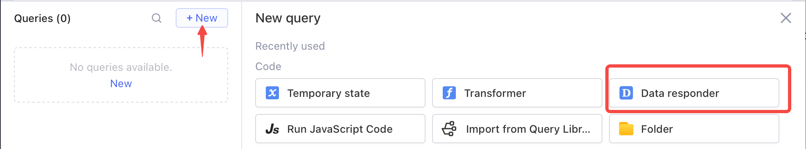
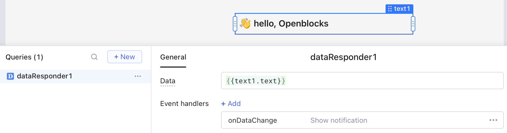
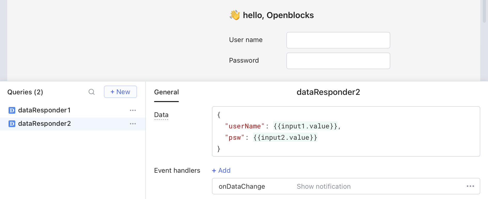

# Data responder

When building an app, you can set events for the components in order to listen to the changes of certain data. For example, for a **Table** component, the built-in events for the change of the `selectedRow` property include "Row select change", "Filter change", "Sort change", and "Page change".

However, there lacks similar events for some data changes, such as the changes of temporary states, transformers, or query results. Data responders are designed for these cases and allow you to listen and respond to any data change.


Events for data responders are more general than the events that listen to data changes such as content change, row select change, etc.


## Listen to data changes

In query editor, click **+ New**, and then select **Data responder** to create a new data responder.

<figure><figcaption></figcaption></figure>

You can set the data that data responder listens to. It supports all kinds of data formats, including number, string, array, and JS object. In the following example, any value change in the **Text** component triggers a global notification.

<figure><figcaption></figcaption></figure>

If the data is in array or JS object format, then data change from any sub-element will trigger the configured event. For example, the data of `dataResponder2` is a JS object, which listens to two **Input** components in the app. Data change of any component triggers the same global notification.

<figure><figcaption></figcaption></figure>

## Respond actions

For detailed information, go to [Event handlers](../event-handlers.md) > [Actions](../event-handlers.md#actions).
