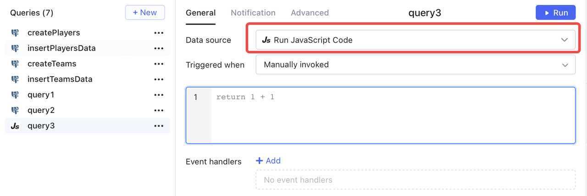
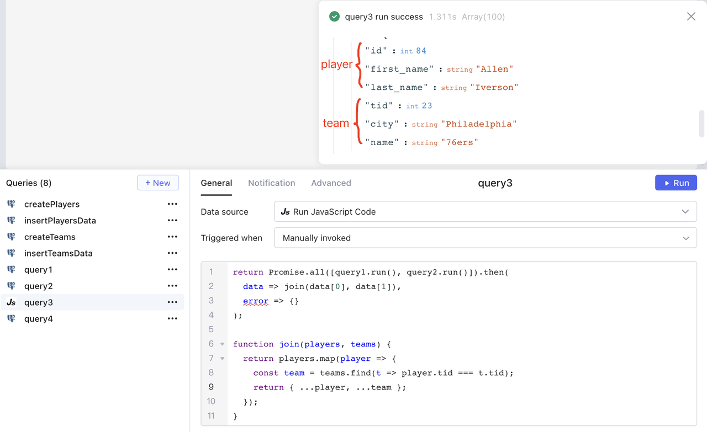
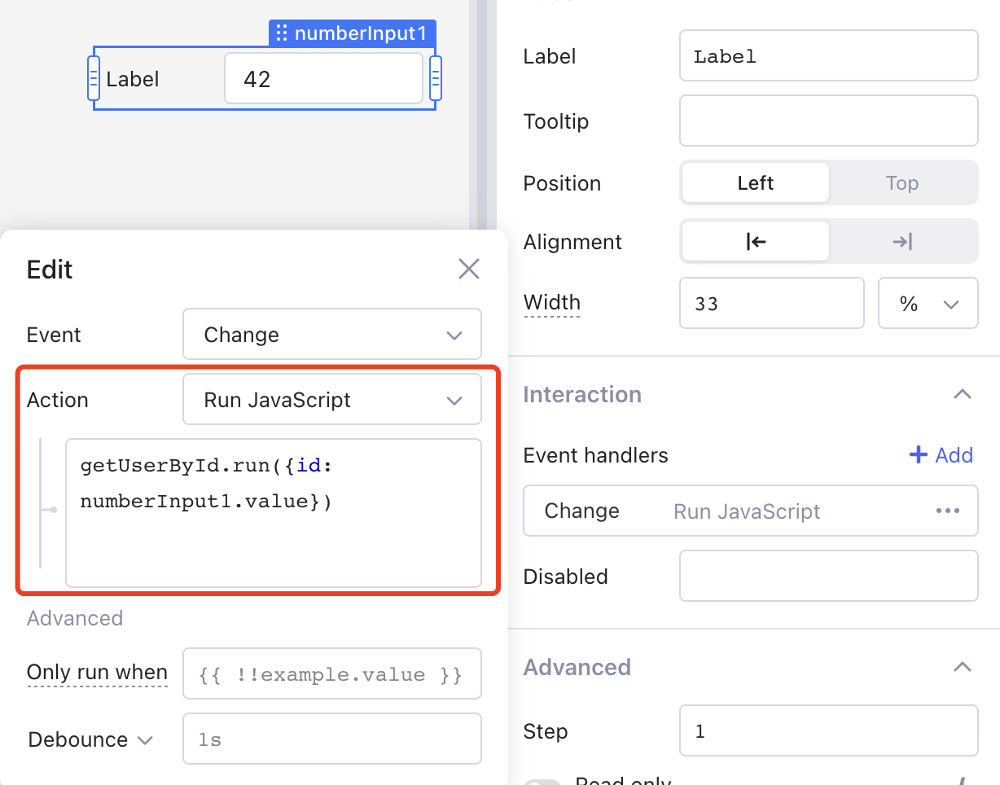
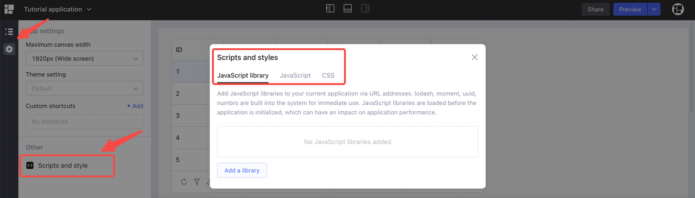
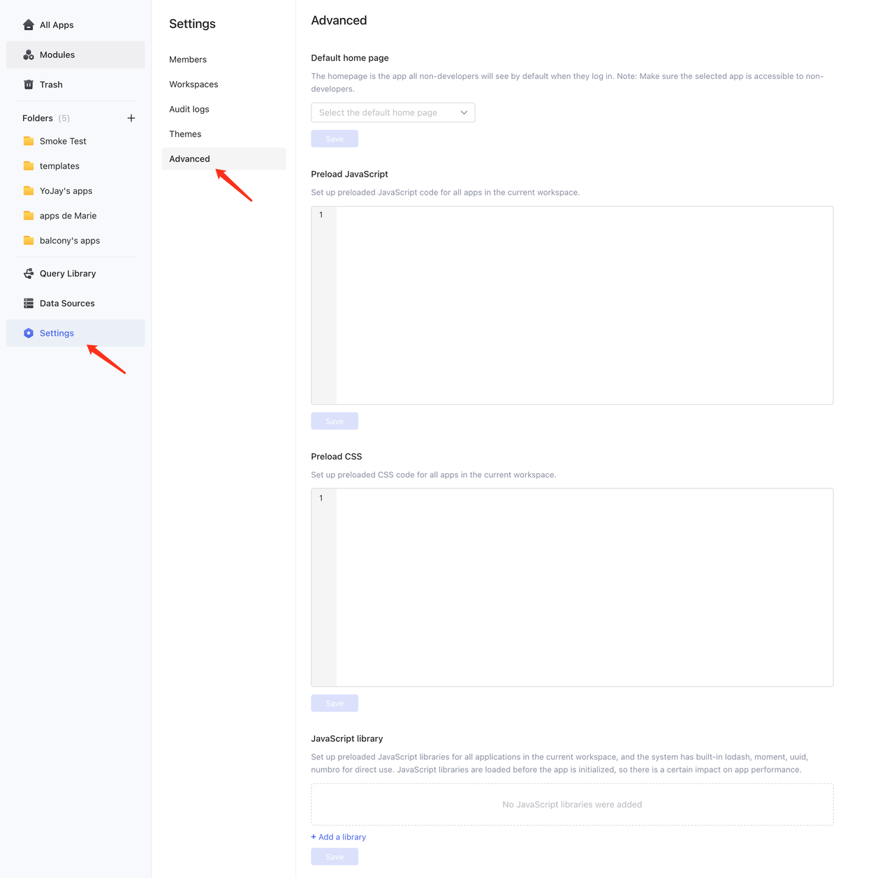
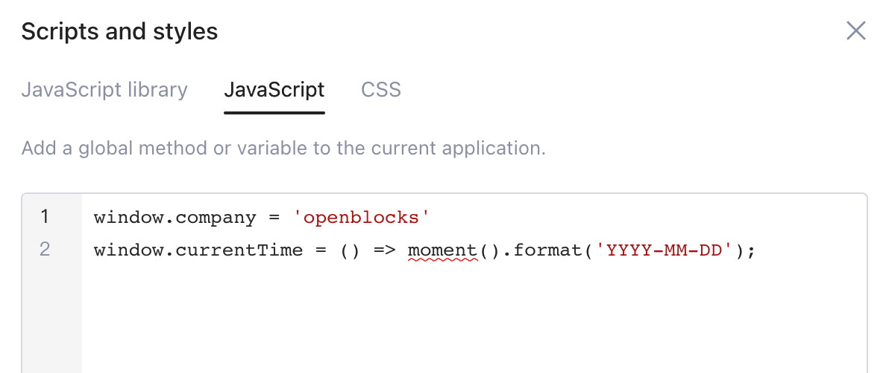
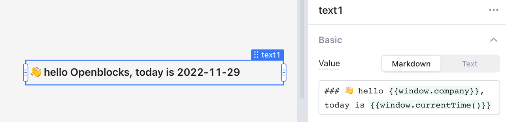

# JavaScript query

There are cases where you want to orchestrate operations, for instance, after triggering two queries, you want to combine and store their results to a temporary state, and then open a modal. This process can be complicated when chaining several event handlers, and certainly cannot be done in one line of code in `{{ }}`. That's where JavaScript (JS) query comes into play. It unleashes the ability to interact with components and queries by writing complex JS queries to achieve the following operations:

* Interact with UI components
* Trigger queries
* Access third-party JS libraries
* Customize functions

The following example is for you to quickly understand what JS query is and how it works.

## Use JS query to join query results

SQL query `query1` reads `id`, `first_name`, `last_name` and `tid` fields from table `players` in a PostgreSQL database.

```sql
select id, first_name, last_name, tid from players
```

SQL query `query2` reads `tid`, `city` and `name` fields from table `teams` in a PostgreSQL database.

```sql
select tid, city, name from teams
```

Use a JS query to left join `query1` and `query2` on the same `tid` in the following steps.

1.  Create `query3`, and choose **Run** **JavaScript Code**.


    <figure><figcaption></figcaption></figure>
2.  Insert the following code.

    ```javascript
    return Promise.all([query1.run(), query2.run()]).then(
      data => join(data[0], data[1]),
      error => {}
    );

    function join(players, teams) {
      return players.map(player => {
        const team = teams.find(t => player.tid === t.tid);
        return { ...player, ...team };
      });
    }
    ```

    \
    In this code snippet, the `Promise.all()` method receives the results of `query1` and `query2`, and the `join()` method joins their results after a successful run based on the values of `tid` field.\


    <figure><figcaption></figcaption></figure>

## Return data

Use `return` syntax to return result. For example, the following code returns `3`.

```javascript
return Math.floor(3.4)
```

The result returned can also be a [Promise](https://developer.mozilla.org/en-US/docs/Web/JavaScript/Reference/Global\_Objects/Promise) object. For example, `query2.run()` returns a Promise object.

```javascript
return query2.run()
```


The `return` statement is not necessary for scenarios where you want to omit results.


## Access data

Use JS queries to access data in your app. Notice that there's no need to use `{{ }}` notation.

```javascript
var data = [input1.value, query1.data, fileUpload.files[0].name];
```

## Control component

In JS queries, you can use methods exposed by components to interact with UI components in your app. Such operation is not supported by the inline JS code in `{{}}`.

```javascript
// set the value of input1 to "Hello"
input1.setValue("Hello");
```


The `input1.setValue()` method (or other component methods) is asynchronous and returns a [Promise](https://developer.mozilla.org/en-US/docs/Web/JavaScript/Reference/Global\_Objects/Promise) object. Accessing `input1.value` immediately after setting the value of `input1` does not return the updated value.


## Run query

### `run()` method and callbacks

Call `run()` method to run other queries, for example:

```javascript
return queryByName.run(); // run a query and it returns a Promise
```

The return value of `query.run()` is a Promise, so you can attach callbacks to handle the successful result or error.

```javascript
return queryByName.run().then(
  data => { // after query runs successfully
      return "hello, " + data.user_fullname; 
  },
  error => { // after query runs in failure
    // use built-in message function to pop up an error message
    message.error("An error occured when fetching user: " + error.message); 
  }
);
```

### Pass in parameters

You can pass parametes in the `run()` method to decouple query implementation from its parameters.

```javascript
query.run({
    param1: value1,
    param2: value2
    ...
});
```

For example, in SQL query `query1`, you can define `name` and `status` as parameters that need to be passed in for its execution.

```sql
select * from users 
   where 
     user_name = {{ name }} 
   and
    user_status = {{ status }}
```

Then you can pass in corresponding parameters to `query1`.

```javascript
query1.run({
  name: "Bob",
  status: 0 
}).then(
  data => { // after query1 runs successfully
    console.log("The result is" + JSON.stringify(data)); 
  },
  error => { // after query1 runs failed
    console.log("An error occured," + error.message);
  }
);
```

**Demo 1**

When you have several inputs in an app triggering the same query, passing parameters to this query allows you to reuse it anywhere.

```sql
-- query1: 
select id, name, gender, address from users where id={{numberInput1.value}}
-- query2: 
select id, name, gender, address from users where id={{table1.selectedRow.id}}
-- query3: 
select id, name, gender, address from users where id={{select1.value}}
...
```

Things might get fuzzy when you want to update SQL implementations, because you have to carefully check and update all duplicated queries. Now you can be relieved of this repeated SQL by introducing query parameters.

```sql
-- just write the SQL once, and extract its parameter {{id}}: 
select id, name, gender, address from users where id= {{id}}
```

Then trigger this query in **Run JavaScript** of event handlers in each of the inputs.

<figure><figcaption></figcaption></figure>

**Demo 2**

You can find another demo for using passed-in paramter queries [here](https://cloud.openblocks.dev/apps/637f38daa899fe1ffcb17f0b/view).

## Declare a function

You can declare functions inside a JS query for better readability.

```javascript
// Whether the first number is a multiple of the second number
function isMultiple(num1, num2) {
      return num1 % num2 === 0;
   }
   
// Call the moment library to return the current date
function getCurrentDate() {
      return moment().format("YYYY-MM-DD");
}
```

## Add preloaded scripts

Openblocks supports importing third-party JS libraries and adding predefined JS code, such as adding global methods or variables for reuse either at **app-level** or **workspace-level**. You can find the app-level settings in ⚙️ > **Other** > **Scripts and style**.

<figure><figcaption></figcaption></figure>

For workspace-level, go to ⚙️ **Settings** > **Advanced**.

<figure><figcaption></figcaption></figure>

In **JavaScript** tab, you can add preloaded JavaScript code to define global methods and variables and then reuse them in your app. For importing libraries, see [use-third-party-libraries.md](../use-third-party-libraries.md "mention").

<figure><figcaption></figcaption></figure>

<figure><figcaption></figcaption></figure>

## &#x20;Restrictions

For security reasons, several global variables and functions of **window** are disabled in Openblocks. Please report to our [GitHub](https://github.com/openblocks-dev/openblocks) or [Discord](https://discord.com/invite/z5W2YHXdtt) if you encounter any issues.
