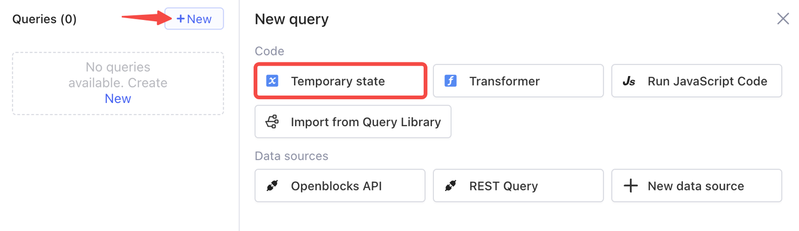
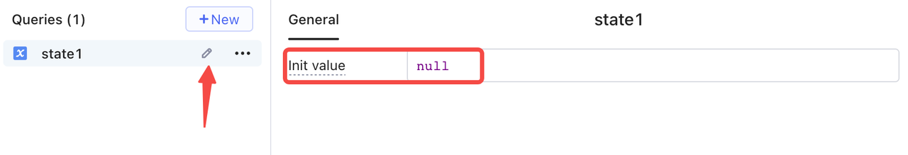
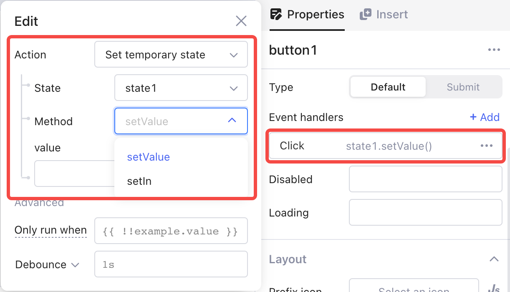
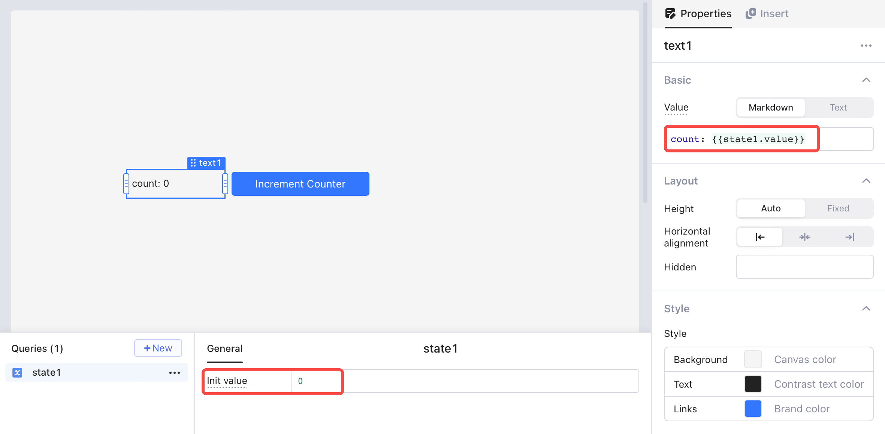
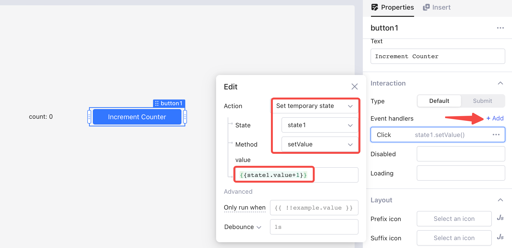
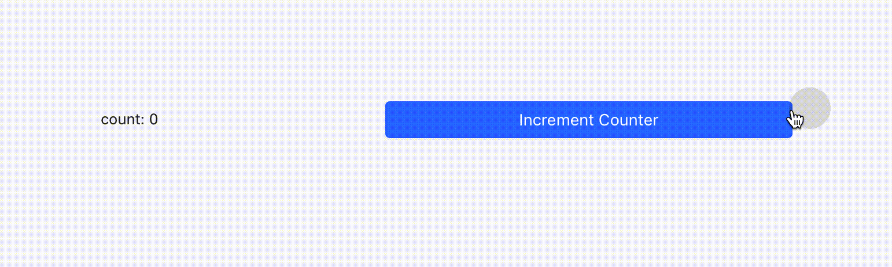
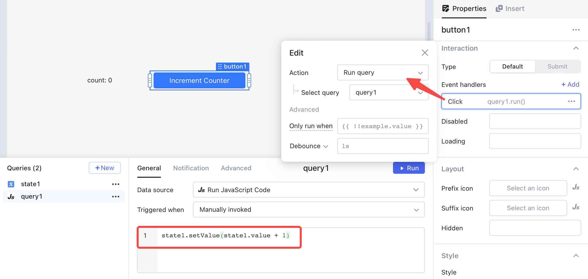

# Temporary state

You can use temporary state to store and reference local data within an app. Every time you load or refresh an app, the value of temporary state value is reset.

## Use case scenarios

Temporary states may help in the following scenarios:

* To track the temporary values of a variable when the user interacts with your app.
* To store your data only in operation without persisting to a database.
* To function as a temporary property when built-in properties in Openblocks (such as `{{table.selectedRow}}` and `{{select.value}}`) do not support your use case.


To store and access data across apps in your workspace, use localStorage instead.


## Create a temporary state

Click **+ New** and select **Temporary state** in query editor.

<figure><figcaption></figcaption></figure>

You can rename the temporary state and set an initial value.

<figure><figcaption></figcaption></figure>

## Set state values

Temporary state offers `setValue()` and `setIn()` methods to set or change its value, which can be called in JavaScript queries.

Use `setValue()` to change the value directly.

```javascript
//state.setValue(value: any)
state.setValue(3)
state.setValue(input1.value)
```

When the initial value of a temporary state is an object, use `setIn()` to change the value in a specified path.

```javascript
// initial value of state2 as follows：
{
    girl: {
        name: "Lucy",
        age: 18,
        city: {
            name: "New York"
        }
     }
     boy: {
         name: "Bob",
         age: 21,
         city: {
             name: "Los Angeles"
         }
     }
}
//To change the value in a specified path
//state.setIn(path, any value)
//path: an array of keys or indexes. Only the last item in the path will be changed.
state2.setIn(['girl','city'],{name:'Seatle'})
state2.setIn(['boy','age'],18)


// To set value array value, you can use 
// init value = ["hello", "world"]
state2.setIn([1],"foo") // this will result to ["hello", "foo"]
```

You can also call these two methods in [event handlers](../event-handlers.md). Select **Set temporary state** as the action and choose method on demand.

<figure><figcaption></figcaption></figure>

## Example: Increment counter

In this example, the counter tracks the number of button clicks. Every time the user clicks the button, the number in the text component increases by one.

<figure><figcaption></figcaption></figure>

Build an increment counter in following steps:

1. Add a button component `button1` and a text component `text1`.
2.  Create a temporary state `state1`, set its initial value as `0`. Bind `{{state1.value}}` as the display text of `text1`.

    <figure><figcaption></figcaption></figure>
3.  Add an event handler for `button1`. Select the action **Set temporary state** and the method **setValue**, and then set `{{state1.value+1}}` as the value.

    <figure><figcaption></figcaption></figure>
4.  Click the button, you can see the value of `text1` increases by one each time you click.

    <figure><figcaption></figcaption></figure>

You can also achieve the same result using JavaScript queries:

1. Add a new query, select **Run JavaScript code**.
2. Write JavaScript query with this code, and set it to be manually invoked:\
   `state1.setValue(state1.value + 1)`
3.  Add an event handler of `button1` to run `query1`.

    <figure><figcaption></figcaption></figure>

Now click the **Increment counter** button, you should see the same result as above.
