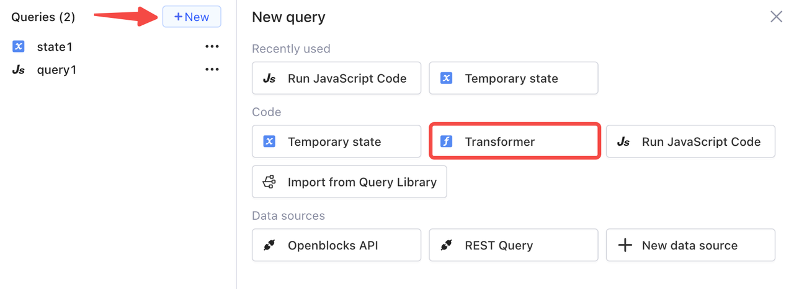
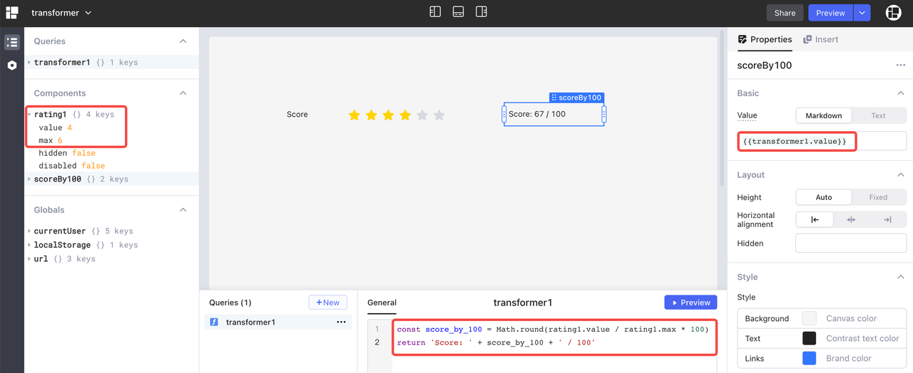
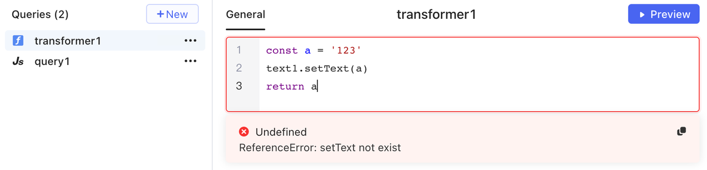
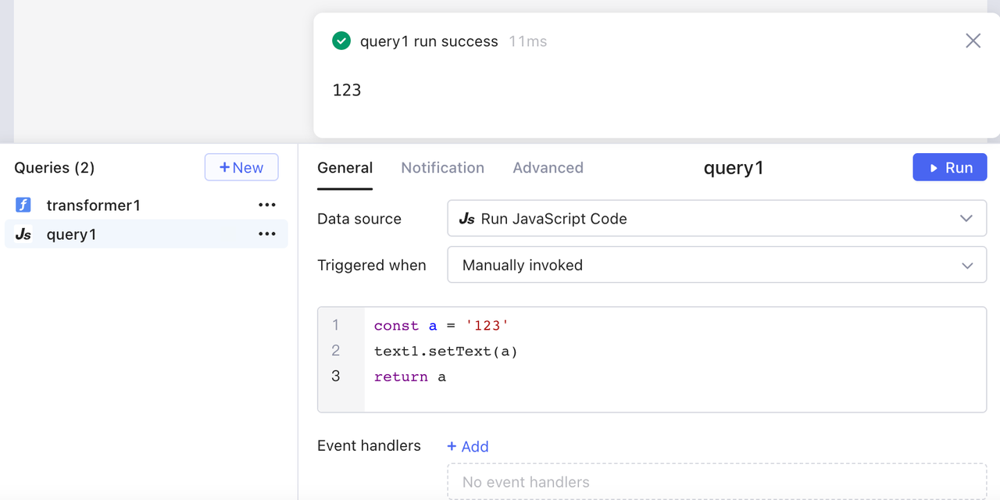
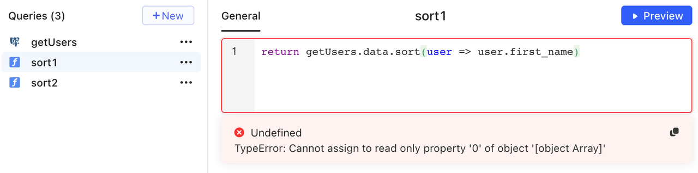
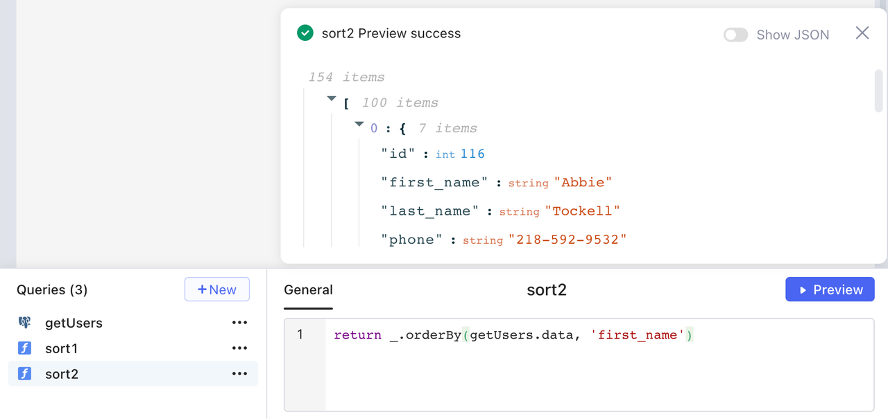

# Transformers

Transformers are designed for data transformation and reuse of your multi-line JavaScript code. Data from queries or components might not meet your needs in business scenarios. Also, you may use the same code block several times within an app. In such cases, a transformer is what you need.

Compared with inline code in `{{ }}`, transformer supports multi-line code blocks. And unlike JavaScript query, transformer is designed to do read-only operations, which means that you cannot trigger a query or update a temporary state inside a transformer.

## Quickstart

Click **+ New > Transfromer** in a query editor to create a transformer.

<figure><figcaption></figcaption></figure>

Then write your JS code in the transformer. You can click **Preview** to get the return value and access it by `transformerName.value` in your app.

In the following example, `transformer1` uses the data of star rating in `rating1` to calculate a score.

<figure><figcaption></figcaption></figure>


`{{ }}` is disallowed inside a transformer or JS query. `{{ }}` is only used for the purpose of single-line JS expression, whereas a transformer or JS query is for multiple lines of JS code.


## Use cases

### Transform timestamp

Use the `moment().format()` method to transform timestamp formats. The following example converts the timestamp value of `start_time` returned by `query1` to `YYYY-MM-DD` format.

```javascript
return query1.data.map(it => {
     return {
         ...it,
         start_time: moment(it.start_time).format('YYYY-MM-DD')
     };
})
```

### Sort query data

Use the `_.orderBy()` method provided by [lodash](https://lodash.com/) to sort data. The following example returns `query1.data` sorted by `amount` column in ascending order.

```javascript
return _.orderBy(query1.data, 'amount', 'asc')
```

### Join two queries

The example code below shows how to join query results of `getUsers` and `getOrders` on user id.

```javascript
const users = getUsers.data;
const userOrders = getOrders.data;
return users.map(user => ({
  ...user,
  orders : userOrders.find(order => order.customer_id === user.id),
}));
```

## Read-only operations

Only read-only operations are allowed inside a transformer. It means that you cannot set values of components or temporary states, or trigger queries. For those operations, use JavaScript queries instead.

For example, you cannot call the method `setText()` of a text component in a transformer.

<figure><figcaption></figcaption></figure>

Instead, calling the method `setText()` in a JavaScript query reports no error.

<figure><figcaption></figcaption></figure>

In another example, transformer`sort1` aims at sorting the data of `getUsers` by `first_name`, but the `sort()` method may change the original data, so an error occurs.

<figure><figcaption></figcaption></figure>

In this case, use the method `_.orderBy()` provided by [lodash](https://lodash.com/) instead.

<figure><figcaption></figcaption></figure>
