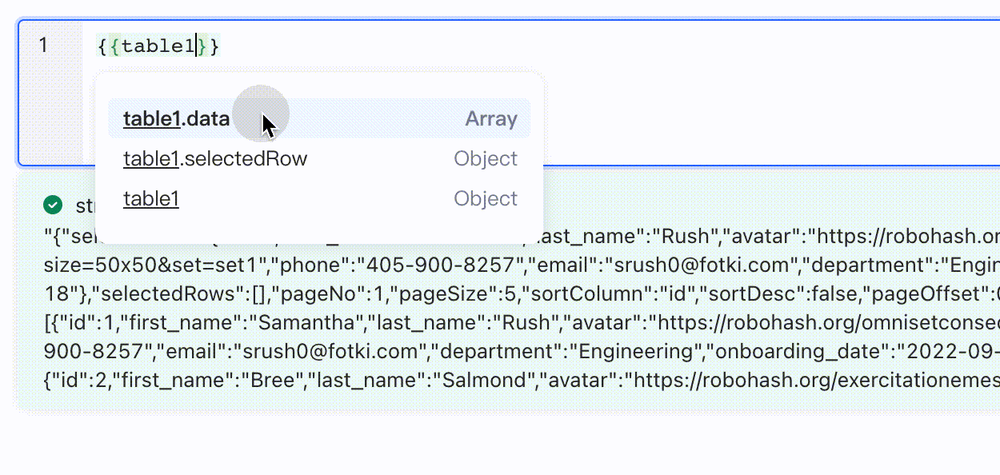
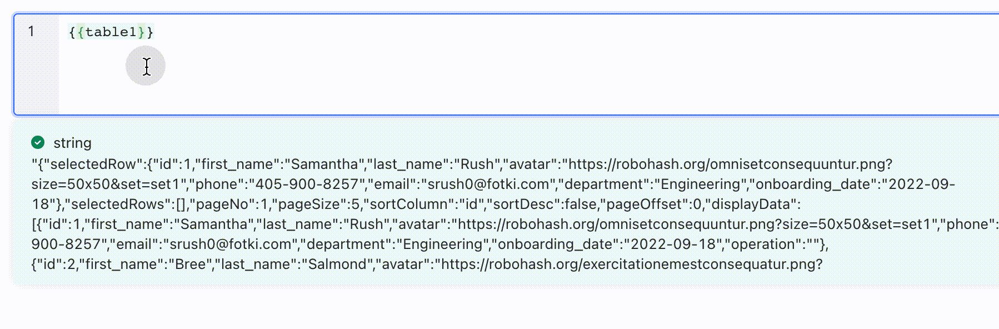
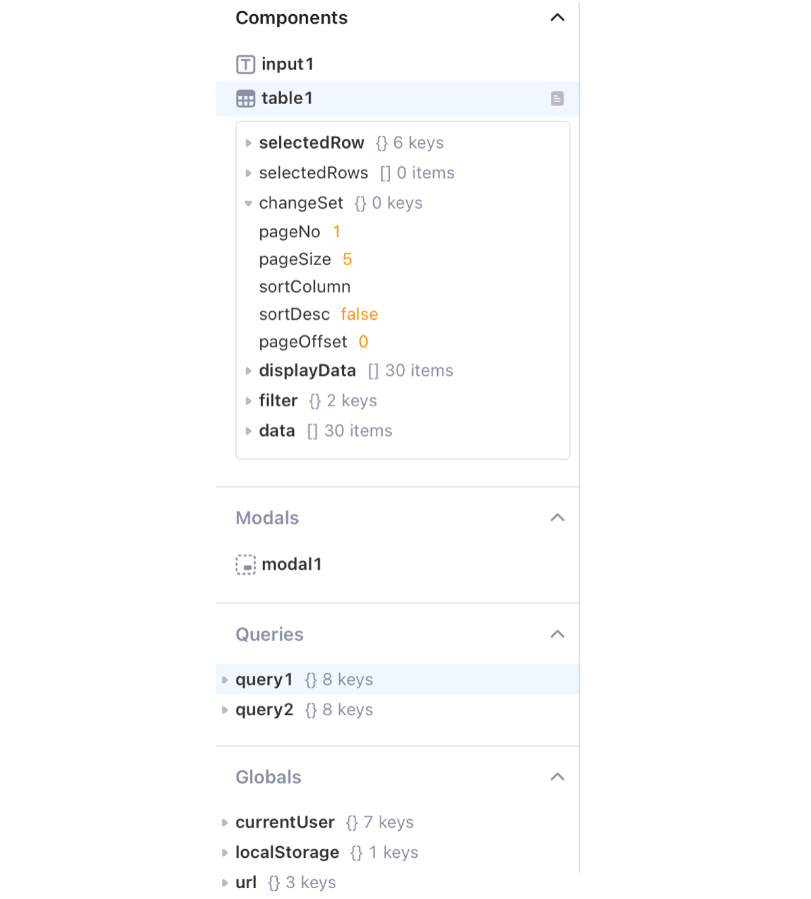
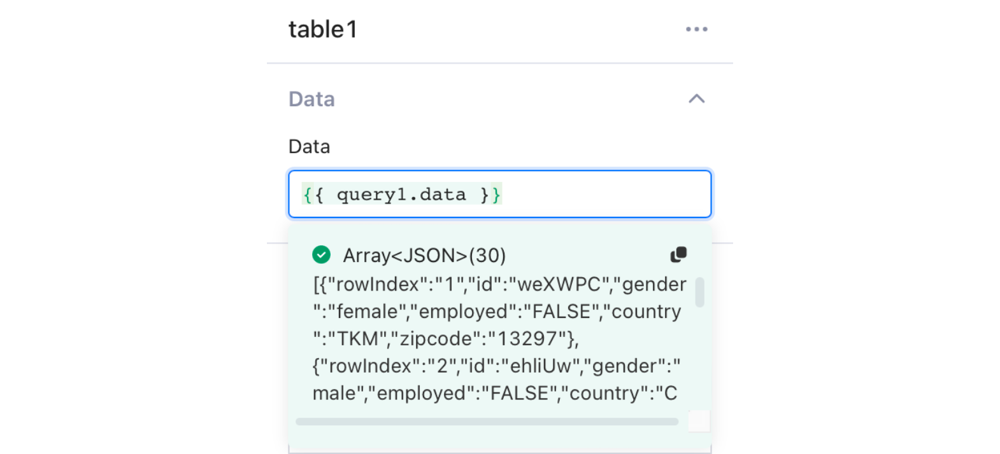

# Write JavaScript in \{{ \}}

When building apps in Openblocks, you can use JavaScript (JS) to access and transform data from objects, including components, queries, and global parameters. When writing JavaScript inside SQL editor, component property's input box, table column settings, etc., always remember to enclose all your JS code inside double curly braces, such as `{{'hello, ' + currentUser.name}}`.

## Access data

Objects have globally unique names, such as `input1`, `query1`, and `table1`. You can refer to the properties of the objects in your app by JS code.

### Access data in an object

Openblocks supports you accessing the data in an object using dot notation (`objectName.keyName`). For example,`{{userInfo.selectedRow.userName}}` accesses the `userName` value in the currently selected row of **Table** `userInfo`.

When writing JS in `{{ }}` to access values in an object, add a `.` after the object name to trigger an autosuggest menu in case you are not sure about objects' built-in properties or methods.

**Example**

This GIF shows how the dot notation triggers an autosuggest menu and displays the properties of `table1`.

<figure><figcaption></figcaption></figure>

### Access data in an array

You can access the values in an array by index. The index always starts at 0, so you can use `array[0]` to access the first element of the array.

**Example**

The **Data** property of **Table** component is an array of objects. This GIF shows how to access the value of `first_name` in the first element of the **data** array in `table1`.

<figure><figcaption></figcaption></figure>

## Transform data

You can leverage built-in JS functions and third-party libraries in `{{ }}` to transform data, such as `filter()`, `map()` and `reduce()` operations.

**Examples**

Lowercase a string.

```javascript
{{input1.value.toLowerCase()}}
```

Change date format.

```javascript
{{moment(table1.selectedRow.date_column).format('YYYY-MM-DD')}}
```

Return name from query results.

```javascript
{{query1.data.map(i => i.name)}}. 
```

## Restrictions

The JS code in `{{ }}` should be a single-line code, such as `.map()` or `.reduce()` combined with an arrow function or a ternary operator.

**Examples**

```javascript
{{query1.data.id.length}} // ✅ to reference a value
{{query1.data.map(row => row.id)}} // ✅ .map() + arrow function
{{ num1 > num2 ? num1 : num2 }} // ✅ ternary
```

The following JS code examples are illegal in `{{ }}`.

```javascript
{{ 
    // ❌ you can't write code like this in {{ }}
    const array = query1.data;
    const filterArray = array.filter(it => it.value > 10);
    return filterArray; 
}}
```

If you wish to orchestrate multiple lines of JavaScript, Openblocks supports you writing such code in [transformers](transformers.md).

```javascript
// codes inside a transformer
if (select.value === "1") {  
    return "Option 1";
}
if (select.value === "2") {
    return "Option 2";
}
return "Option 3"; 
```

## View data

Data from queries can be complicated and nested in real cases. Viewing data provides you with the detailed structure of data in objects and helps you understand your data better. Before accessing or transforming data, you may need to view the data and its structure first. Openblocks offers three ways to view data.

### View query result

After running a query inside the query editor by clicking the **Run** button**.** Query result is displayed in the format shown below.

<figure><figcaption></figcaption></figure>

### View data in Data Browser

Data browser located in the left pane displays all of the data inside your app. You can click on the node to expand and view the data structure.

<figure><figcaption></figcaption></figure>

### Real-time view

When setting up properties or writing JS code inside an editor, you can view the evaluated result in real-time in a box below your editor.

<figure><figcaption></figcaption></figure>
