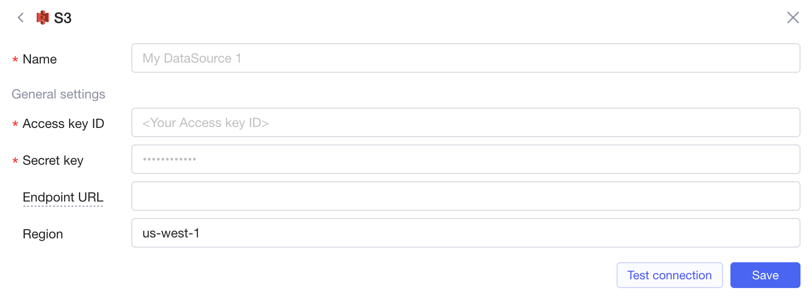
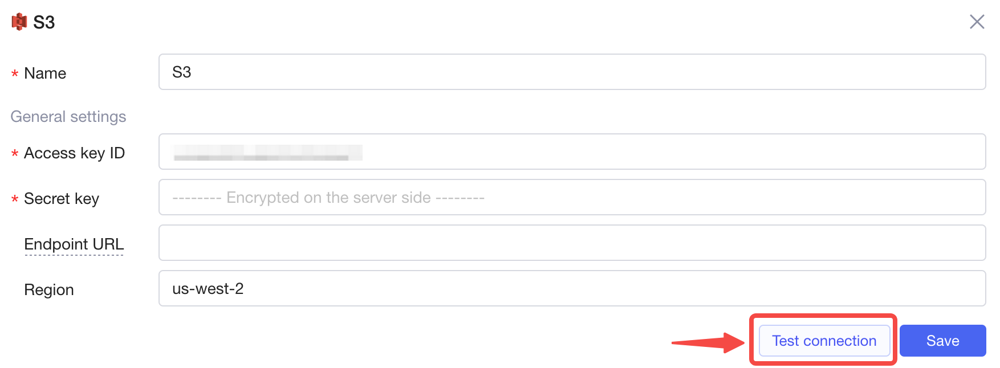
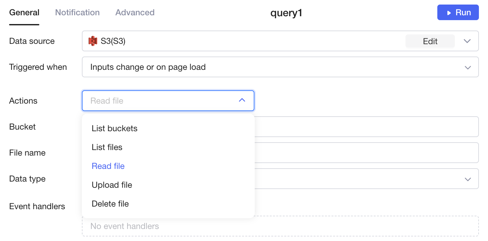

# Develop data source plugins

This document provides basic information and guides for developing data source plugins. Developers are highly welcomed to make contributions to [Openblocks](https://github.com/openblocks-dev/openblocks)--the open source project.

## Basics

A data source plugin is described by a **JavaScript Object** which mainly consists of following parts:

* Definition of the basic information of the plugin such as **name**, **icon**, **description**, etc.
* Definition of the **configuration form** of the data source.
* Definition of the **validation logic** for configuration.
* Definition of the **Action list** for data source queries and the configuration form for each Action.
* Definition of the **execution logic** for Actions.

Currently, all data source plugins are maintained in the `src/plugins` directory of the `node-service` project. Click to view [the project](https://github.com/openblocks-dev/openblocks/tree/develop/server/node-service), and you might take a quick look at the [S3 plugin](https://github.com/openblocks-dev/openblocks/tree/develop/server/node-service/src/plugins/s3).

## Overall definition of a plugin

The type `DataSourcePlugin` is defined as follows:

```typescript
interface DataSourcePlugin {
  id: string;
  name: string;
  description?: string;
  icon?: string;
  category: string;
  dataSourceConfig: DataSourceConfig;
  queryConfig: QueryConfig ｜ () => Promise<QueryConfig>;

  validateDataSourceConfig?: (
    dataSourceConfig: DataSourceConfigType,
    context: PluginContext
  ) => Promise<ValidateDataSourceConfigResult>;

  run: (
    actionData: ActionDataType,
    dataSourceConfig: DataSourceConfigType,
    context: PluginContext
  ) => Promise<any>;
}
```

* `id`: the unique identifier of the data source plugin, globally unique.
* `name`: the display name of the data source plugin.
* `icon`: the file name of the icon that represents the data source plugin. It must be stored in the `src/static/plugin-icons` directory.
* `category`: the category of the data source. Currently there are two categories: `database` and `api`.
* `dataSourceConfig`: the configuration form of the data source, see [Data source configuration form](develop-data-source-plugins.md#data-source-configuration-form).
* `queryConfig`: the query configuration, see [Data source queries](develop-data-source-plugins.md#data-source-queries).
* `validateDataSourceConfig` defines the validation logic for the data source configuration. See [Validate data source configuration](develop-data-source-plugins.md#validate-data-source-configuration).
* `run` defines the execution logic for data source queries.

## Data source configuration form

The configurations of a data source will be securely saved on the server-side. A configuration form can include the **connection information** of the data source as well as other **common configurations**.

<figure><figcaption></figcaption></figure>

The type `DataSourceConfig` is defined as follows:

```typescript
interface DataSourceConfig {
  type: "dataSource";
  params: readonly DataSourceParamConfig[];
  extra?: (data: DSC) => Promise<DataSourceExtraConfig>;
}
```

1. `type`: a fixed String "dataSource".
2.  `params`: various fields of a data source configuration form.\


    The type `CommonParamConfig` is defined as follows:

    ```typescript
    interface CommonParamConfig {
      type: string;
      defaultValue: V;
      options?: ParamOption[];
      rules?: ParamRule[];
      label?: string;
      tooltip?: string;
      placeholder?: string;
    }
    ```

    * `type`: the type of the configuration field which determines the form control used for inputting the field and its data type. See [Supported field types](develop-data-source-plugins.md#supported-field-types).
    *   `options`: For the "select" type, it defines the option list. The type `ParamOption` is defined as follows:

        ```typescript
        interface ParamOption {
          value: string;
          label: string;
        }
        ```
    * `label`: the label of the field.
    * `tooltip`: the hint text of the field, with Markdown syntax supported.
    * `placeholder`: the placeholder text of the form component of the field.
    * `defaultValue`: the default value.
    * `rules`: the validation rules of the field.\

3.  `extra`: additional data source data or parameter configurations. By using this parameter, more data source configuration fields and more data source data can be dynamically obtained based on the data source configurations that users fill out.\


    The result of executing `extra` functions is defined as follows:

    ```typescript
    interface DataSourceExtraConfig {
      data?: any;
      extraParams?: DataSourceParamConfig[];
    }
    ```

    * `data`: additional data source data that will be saved in the backend together with data source configurations that users fill out. Can be obtained when executing a query using the `extra` field of the data source data.
    * `extraParams`: additional configuration fields. For example, after a user inputing an OpenAPI spec URL, authentication-related configuration fields can be dynamically obtained for the user to fill in.

### Supported field types

| Field type  | Form component             | Data type | Description                                               |
| ----------- | -------------------------- | --------- | --------------------------------------------------------- |
| textInput   | single-line text input box | String    | <p><br></p>                                               |
| password    | password input box         | String    | Encrypted and stored on the server-side.                  |
| numberInput | numeric input box          | Number    | <p><br></p>                                               |
| select      | drop-down selection box    | String    | <p><br></p>                                               |
| checkbox    | checkbox                   | Boolean   | <p><br></p>                                               |
| groupTitle  | group title                | --        | Non-data fields. Displayed as the title of a field group. |

### Validate data source configuration

When the `validateDataSourceConfig` field is defined in the data source, a "**Test Connection**" button will appear at the bottom of the data source creation interface. When the user clicks it, this method is called to test whether the data source configuration filled by a user is correct or not.

<figure><figcaption></figcaption></figure>

The function defined in `validateDataSourceConfig` needs to return a **Promise** with a resolve value of a structured object as follows:

```typescript
interface ValidateDataSourceConfigResult {
  success: boolean;
  message?: string;
}
```

* When `success` is "True", it indicates that the validation has passed. When `success` is "False" or an Exception is thrown, it indicates that the validation has failed.
* `message`: the error message shown when the validation fails.

## Data source queries

The type `QueryConfig` is defined as follows:

```typescript
interface QueryConfig {
  type: "query";
  categories?: {
    label?: string;
    items?: ActionCategory[];
  };
  actions: {
    actionName: string;
    label: string;
    params: ActionParamConfig[];
  }[];
}
```

A data source query consists of multiple **Actions**. In actual use, after a user creates a query for the data source, they need to select a specific action to execute.

<figure><figcaption></figcaption></figure>

The `actions` field defines the list of query actions supported by the current data source. Each field is described as follows:

* `actionName`: the identifier of the action. Must be **unique** within the current data source definition scope.
* `label`: the name of the action displayed in Openblocks interface.
*   `params`: The field list of the action configuration form, and the type `CommonParamConfig` is defined as follows:

    ```typescript
    interface CommonParamConfig {
      type: string;
      options?: ParamOption[];
      defaultValue?: V;
      label?: string;
      tooltip?: string;
      placeholder?: string;
    }
    ```

    The utility of each field is the same as the data source parameters. About all supported field types of the configuration form of a query action, see [Supported field types](develop-data-source-plugins.md#supported-field-types-1) below.

### Supported field types

| Field type   | Form component             | Data type                                                                                                      | Description                                                                                                                                                                                                                                                                         |
| ------------ | -------------------------- | -------------------------------------------------------------------------------------------------------------- | ----------------------------------------------------------------------------------------------------------------------------------------------------------------------------------------------------------------------------------------------------------------------------------- |
| textInput    | Single-line code input box | String                                                                                                         | <p><br></p>                                                                                                                                                                                                                                                                         |
| numberInput  | Numeric code input box     | Number                                                                                                         | <p><br></p>                                                                                                                                                                                                                                                                         |
| booleanInput | Boolean code input box     | Boolean                                                                                                        | <p><br></p>                                                                                                                                                                                                                                                                         |
| select       | Drop-down selection box    | String                                                                                                         | Code input is not supported.                                                                                                                                                                                                                                                        |
| switch       | Switch                     | Boolean                                                                                                        | <p><br></p>                                                                                                                                                                                                                                                                         |
| file         | File                       | <p>String, or</p><p></p><p>{  </p><p>  data: string;</p><p>  name?: string;</p><p>  type?: string;</p><p>}</p> | <p>When it is a <strong>String</strong>, it represents the content of the file. When it is an <strong>Object</strong>, each field has the following meaning:</p><ul><li>data: File content</li><li>name: File name</li><li>type: MIME type of the file, such as image/png</li></ul> |
| jsonInput    | JSON data input box        | JSONValue                                                                                                      | <p><br></p>                                                                                                                                                                                                                                                                         |
| sqlInput     | SQL statement input box    | String                                                                                                         | <p><br></p>                                                                                                                                                                                                                                                                         |

### Execute query action

The necessary `run` method of a data source query defines the execution logic of a query action. The type of `run` method is defined as follows:

```typescript
(
  actionData: ActionDataType,
  dataSourceConfig: DataSourceConfigType,
  context: PluginContext
) => Promise<any>;
```

The meaning of each parameter is as follows:

*   `actionData`: The values of each configuration field, set by the user when executing current action. The type definition is as follows:

    ```typescript
    interface ActionDataType {
        actionName: string;
        [key: string]: any;
    }
    ```

    1. `actionName`: identifier of the current action being executed
    2. `[key: string]`: other action configuration parameters

The `run` method should return a **Promise**, with the resolved result being the current query execution result.

## I18n support

When a plugin needs internationalization (i18n) support, that is, to support multiple languages, the plugin definition object should be generated as a function, as defined below:

```typescript
interface PluginContext {
  languages: string[];
}

type DataSourcePluginFactory = (context: PluginContext) => DataSourcePlugin;
```

The `languages` field in the `context` parameter can be used to obtain information about the language of the current request, and can be directly used to initialize an `I18n` Object:

```typescript
const i18n = new I18n({ zh, en }, languages);

//  It can then be used directly where multilingual support is needed, such as:

{
    name: i18n.trans('name')
}
```

## Auto-generate plugin code based on Open API

If the data source you're going to develop as a plugin provides an [Open API Spec](https://en.wikipedia.org/wiki/OpenAPI\_Specification) definition file, then its plugin code can be quickly generated.

Below is an example of generating Jira plugin code.

```bash
yarn genOpenApiPlugin --name Jira --url https://developer.atlassian.com/cloud/jira/platform/swagger-v3.v3.json
```

Sometimes, due to network issues, the spec file cannot be downloaded correctly. In this case, it can be manually downloaded to the file `src/plugins/<plugin id>/<plugin id>.spec.yaml(json)`.

### Optimize plugin code

Due to various reasons, the generated plugin code needs to be correctly validated, mainly in the following aspects:

1. Check whether the data source has reasonable API authentication configuration.
   * If not, it is often because it is not defined in the current spec, and the spec file needs to be manually rewritten and then regenerated.
2. Check whether the current data source's API URL is correct.
   * If incorrect, it can be handled in two ways:
     * If the API URL of current data source is not fixed, such as for data sources that support self-hosting, a field similar to `API URL` needs to be added to the data source configuration. The specific field label depends on the different data sources.
     * If the API URL of the current data source is fixed, the value of the `Server URL` field can be hardcoded in the generated data source plugin code.
3. Check whether the generated **Category** and **Actions** are reasonably displayed.
   * If unreasonable, adjust the `parseOptions` configuration in the generated code.

## Testing

Necessary testing should be done before publishing the plugin. Testing a data source plugin requires a backend environment. You can start a local environment by following the documentation [Start a local backend server](https://github.com/openblocks-dev/openblocks/tree/develop/client#readme) and test the data source plugin in following aspects:

1. Make sure the data source plugin has been added to the plugin list in the file `src/plugins/index.ts`.
2. Start the node-service server in the `node-service` directory by executing `yarn dev`.
3.  Execute the following command to enter the image command-line tool and modify the backend configuration.

    
    ```bash
    # Enter the image command-line tool
    docker exec -it openblocks bash

    # Enter the mongo command-line tool
    mongo
    use openblocks;

    # Insert a service configuration
    db.serverConfig.insert({key: "deployment.js-executor.host", value: "http://<IP-ADDR>:6060/"})
    ```
    

You can then use the data source plugin just developed in this environment.

## What's next

Congrats! After testing the data source plugin, you can submit a [Pull Request](https://github.com/openblocks-dev/openblocks/pulls) now.
