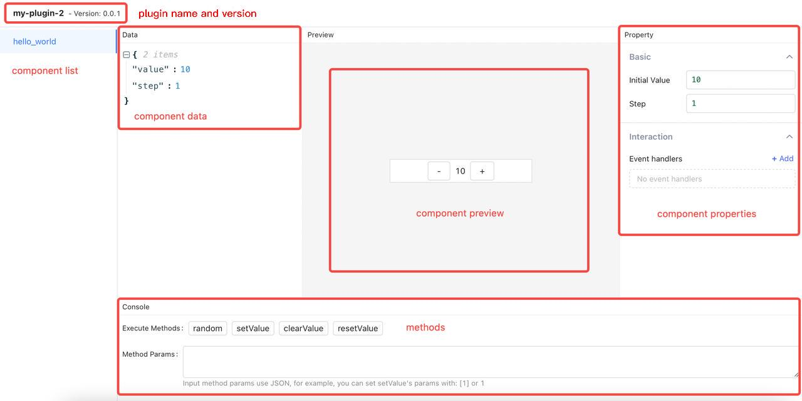
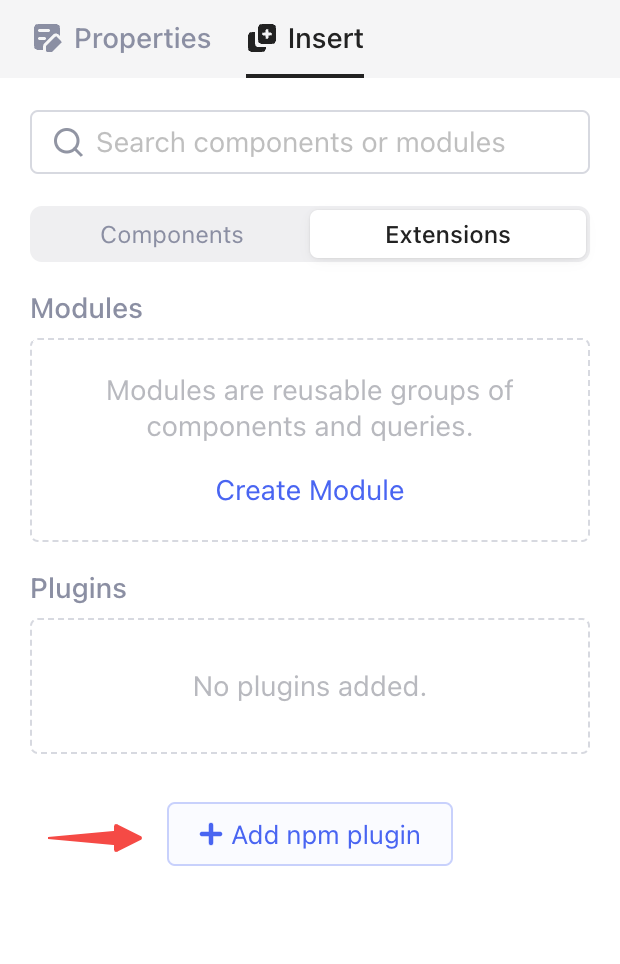
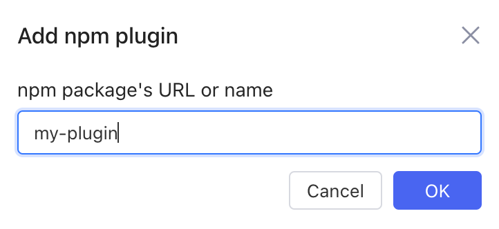

# Develop UI component plugins

With Openblocks plugins, you can develop customized components that are consistent with native components for your specific scenarios.

## Initialization

Execute the following `yarn start` file:

```bash
# Project initiation
yarn create openblocks-plugin my-plugin

# Go to the project root
cd my-plugin

# Start the development environment
yarn start
```

## Component development environment

After executing `yarn start`, the browser is automatically opened and you enter the component development environment.

<figure><figcaption></figcaption></figure>

## Plugin configurations

In `openblocks` field in `package.json` file, you need to define the component properties. For example, the following is the explanation of several fields:

* `comps` defines UI components contained in the plugin. For each component, the key name of the object is the unique identity, and the value is metadata.
* `comps[someCompKey].name` defines the component name shown in the **Insert** tab.
* `comps[someCompKey].icon` defines the component icon shown on the canvas. Use a relative path to where `package.json` file is located.
* `comps[someCompKey].layoutInfo` defines the component layout:
  * w: width of the component. Counted by the number of grid cells (range: 1 - 24).
  * h: height of the component. Counted by the number of grid cells (range: >= 1).

```bash
  "openblocks": {
    "description": "",
    "comps": {
      "hello_world": {
        "name": "Hello World",
        "icon": "./icons/hello_world.png",
        "layoutInfo": {
          "w": 12,
          "h": 5
        }
      },
      "counter": {
        "name": "Counter",
        "icon": "./icons/hello_world.png"
      }
    }
  }
```

## Export components

To export all the components, use `src/index.ts`, for example:

```bash
import HelloWorldComp from "./HelloWorldComp";

export default {
  hello_world: HelloWorldComp,
};
```

The default exported object `key` needs to be consistent with the `key` configured in `comps` in `package.json` file.

## Publish plugins

When you finish developing and testing the plugin, you can publish it into the npm registry. Login in to the npm registry locally, and then execute the following command:

```
yarn build --publish
```

If you do not specify the parameter `--publish`, the `tar` file will be saved in the root folder.

## Import plugins

In the Openblocks app, click **Insert** > **Extensions** > **Add npm plugin** in the right pane. 

Input your npm package's URL or name, and then you can use your customized components.

```bash
my-plugin

# or

https://www.npmjs.com/package/my-plugin
```

<figure><figcaption></figcaption></figure>

## Code demo

For code demo, refer to Openblocks [Github](https://github.com/openblocks-dev/openblocks/tree/develop/client/packages/openblocks-plugin-demo).
