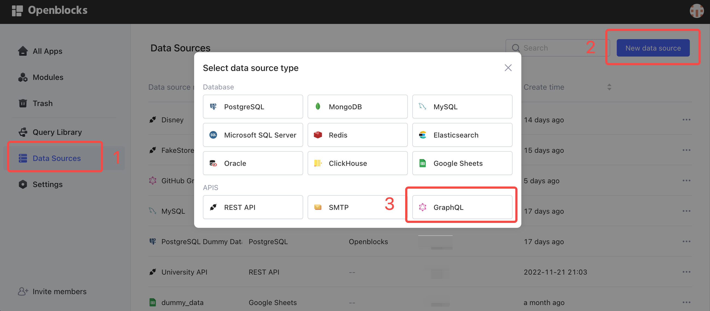
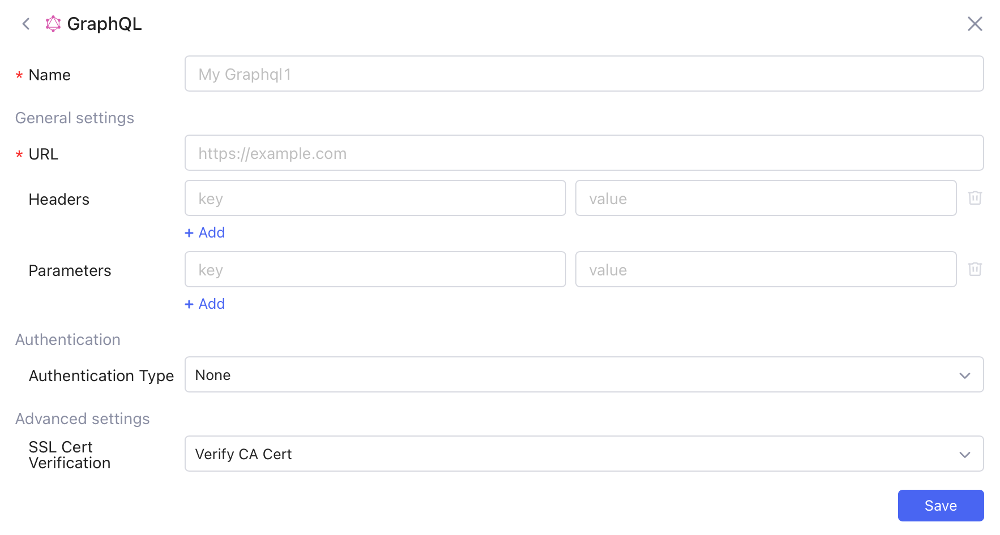
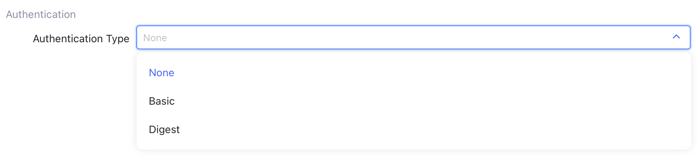
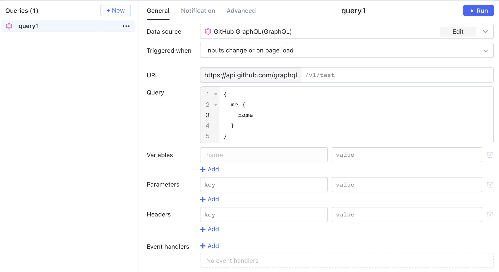
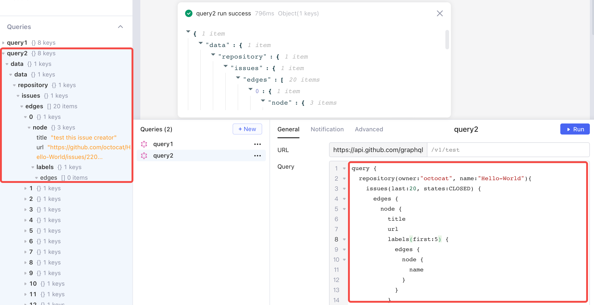
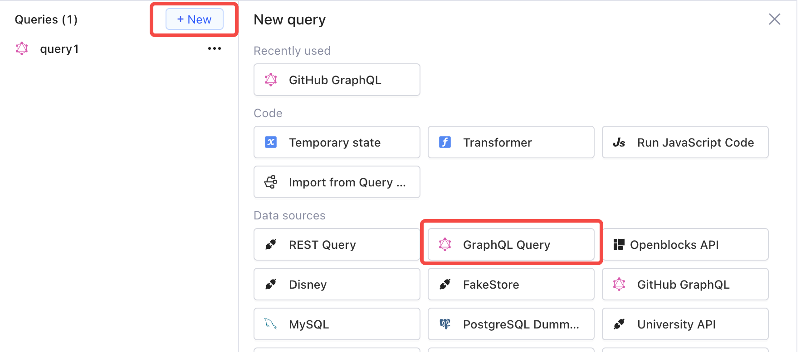
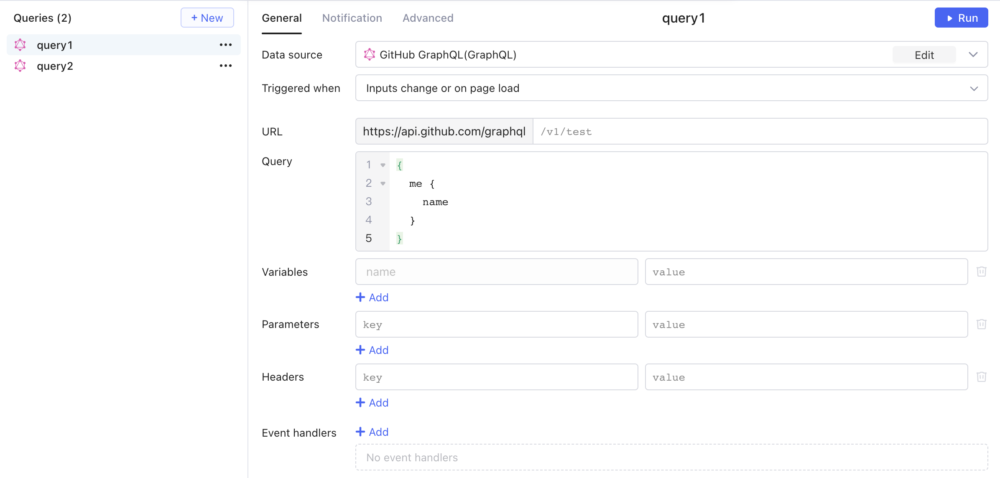

# GraphQL

GraphQL query language allows the client to specify the structure of the requested data, and returns data from the server using the same structure. Such design ensures that only required data is retrieved, thus improving query efficiency.

## Connect GraphQL API to Openblocks

Follow these steps to connect to GraphQL APIs.

1. Click **Data Sources** on the Openblocks homepage.
2. Click **New data source** on the upper right. This permission is restricted to workspace admins and developers.
3.  Select **APIs** > **GraphQL**.&#x20;

    <figure><figcaption></figcaption></figure>
4. Configure general settings. At a minimum, input **Name** and the base **URL** of the API to connect to. **Headers** and **Parameters** are optional.
5. Configure **Authentication Type**.
6.  Click **Save**.&#x20;

    <figure><figcaption></figcaption></figure>

You can also connect to a new GraphQL API data source when creating or editing queries in query library or query editor.

## Authentication type

By default, the authentication type is **None**. You can configure it as **Basic** or **Digest**, which require Username and Password. If you need other authentication methods, contact our customer service on the [homepage](https://openblocks.dev).

<figure><figcaption></figcaption></figure>

The following is an example of connecting to [GitHub GraphQL API](https://docs.github.com/en/graphql). Set the authentication type to **None**. Then, input the required information into **Headers** to complete the authentication. The key is "Authorization" and the value is `"Bearer" + white space + YOUR_ACCESS_TOKEN`. See [Creating a personal access token](https://docs.github.com/en/authentication/keeping-your-account-and-data-secure/creating-a-personal-access-token) for detailed information.

<figure><figcaption></figcaption></figure>

## SSL Cert Verification

For detailed information, see [SSL Cert Verification](rest-apis.md#ssl-cert-verification).

## Forward cookies

For detailed information, see [Forward cookies](rest-apis.md#forward-cookies).

## Create a GraphQL query

You can create GraphQL queries in two ways:

* add a new data source and then create a query
* create a query directly

Note that without creating a new data source, the GraphQL data source is not stored in your **Data Sources** and thus cannot be accessed to build other queries.

### Create a query with a new data source

Follow the steps to add a new GraphQL data source first and then create a query.

1. Connect GraphQL API to access to.
2. In the query editor, click **+ New**.
3. Select the added API in **Data source**.
4. Write a query.
5.  Click ▶ **Run**.&#x20;

    <figure><figcaption></figcaption></figure>

For details about using GraphQL, reference [Introduction to GraphQL](https://graphql.org/learn/).

The following GraphQL query searches the latest 20 closed issues in the repository `octocat/Hello-World`, and returns the title, URL, and the first 5 labels of each issue.

<figure><figcaption></figcaption></figure>

### Create a query with predefined data source

Follow the steps to create a GraphQL query directly.

1. In the query editor, click **+ New**.
2.  Select **GraphQL Query** in Data sources. Openblocks offers this built-in plain data source so that you can quickly create GraphQL queries without adding a new data source first.

    <figure><figcaption></figcaption></figure>
3.  Enter URL, Query, Variables, Parameters, and fill in other fields if needed.&#x20;

    <figure><figcaption></figcaption></figure>
4. Click ▶ **Run**.

