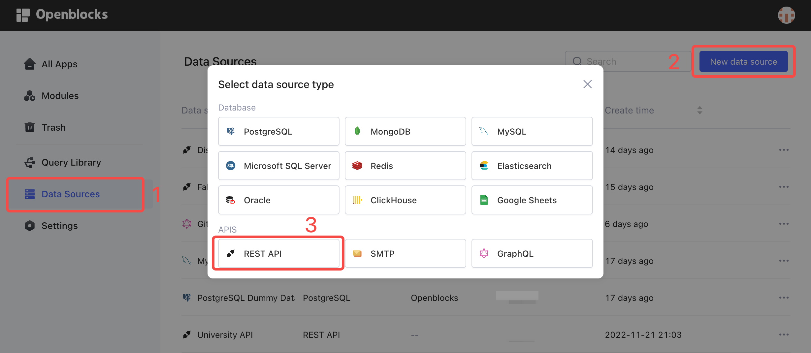
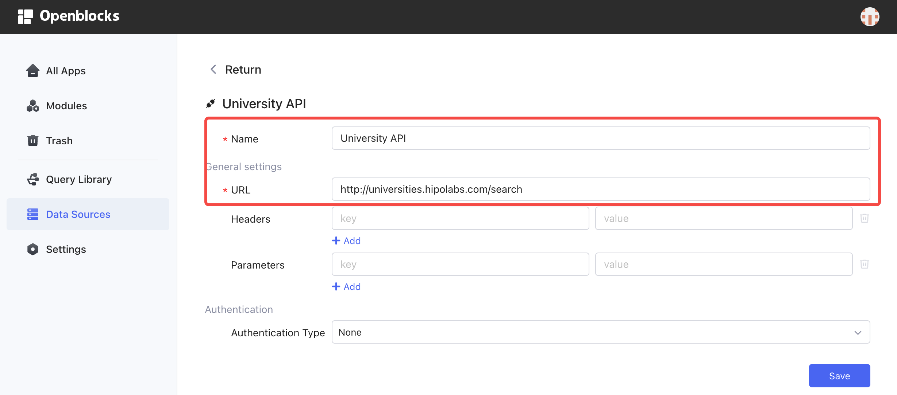
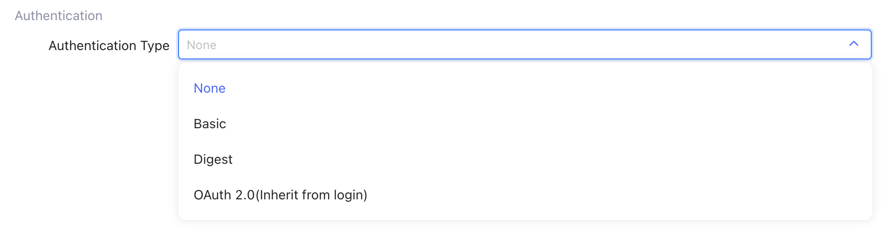
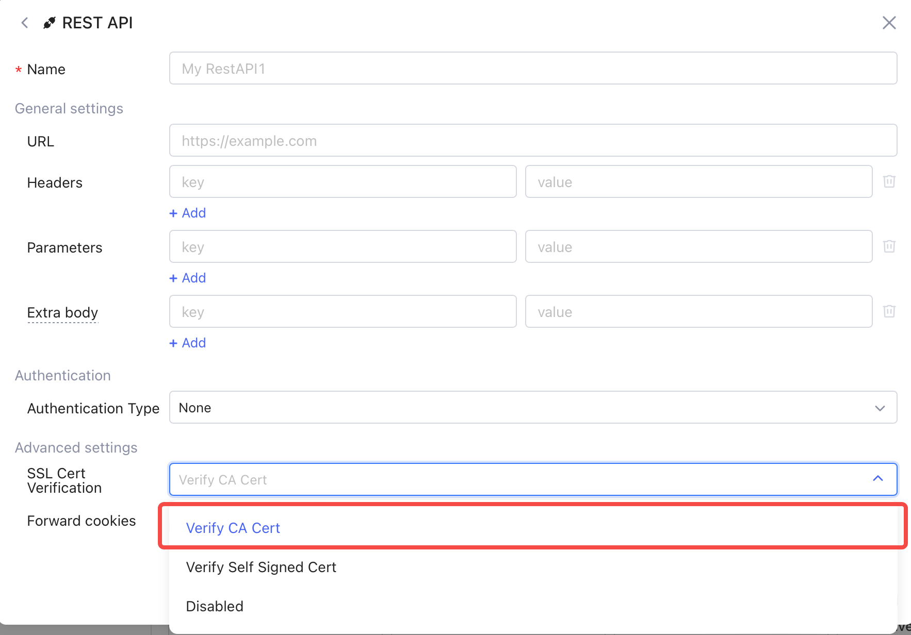
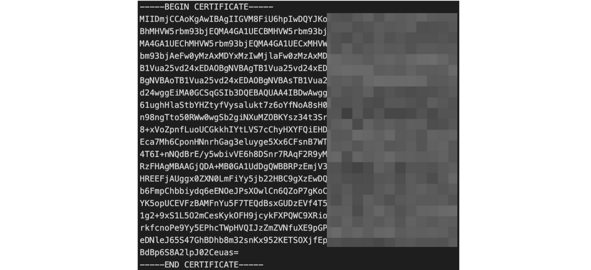
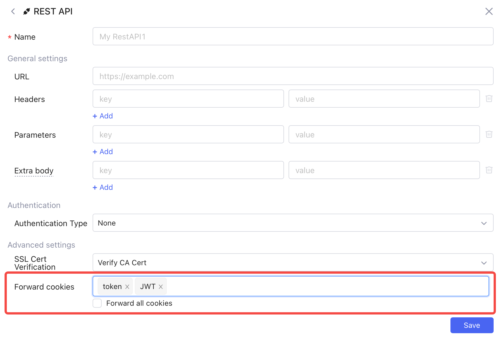
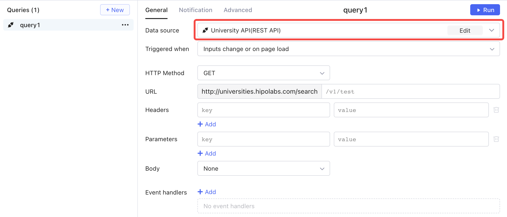
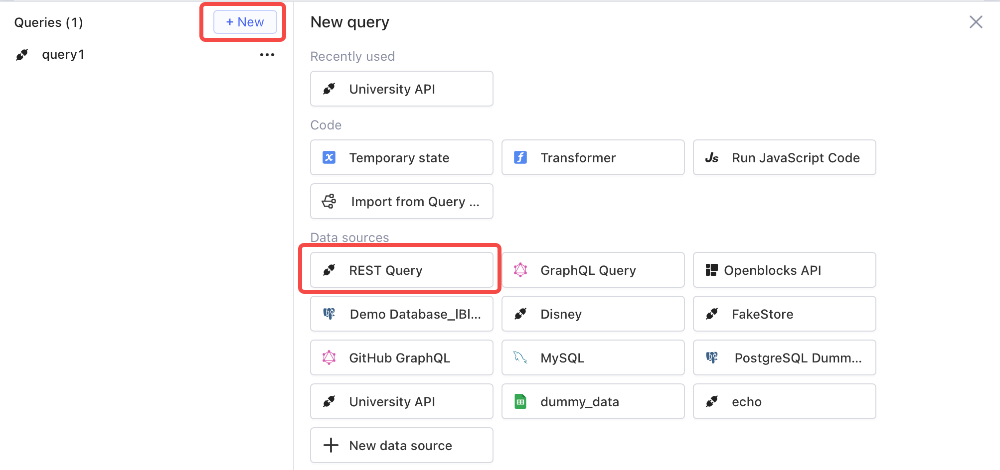
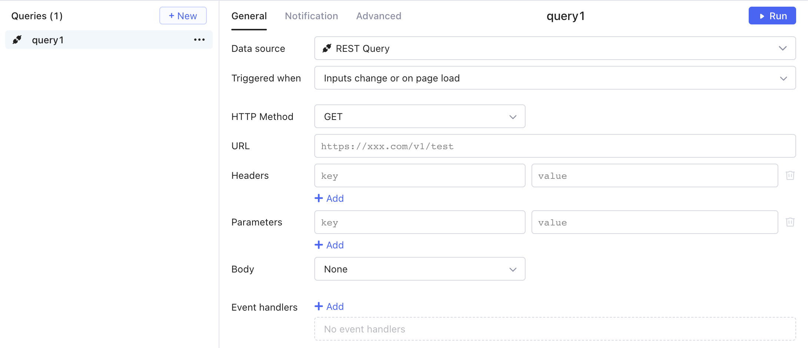

# REST API

## Connect REST API to Openblocks

Follow these steps to connect to REST APIs.

1. Click **Data Sources** on Openblocks homepage.
2. Click **New Data Source** on the upper right. This permission is restricted to workspace admins and developers.
3.  Select **APIs** > **REST API**.

    <figure><figcaption></figcaption></figure>
4. Configure general settings. At a minimum, input **Name** and the base **URL** of the API to connect to. **Headers** and **Parameters** are optional. These are all common parameters that consist of URL query prefixes.
5. Configure **Authentication Type**.
6.  Click **Save**.

    <figure><figcaption></figcaption></figure>

You can also connect to a new REST API data source when creating or editing queries in query library or query editor.

## Authentication type

The default authentication type is **None**. Other options are **Basic** and **Digest**, which require configuration of **Username** and **Password**.

<figure><figcaption></figcaption></figure>

If you need other customized authentication methods, contact our customer service on the [homepage](https://openblocks.dev).

## SSL Cert Verification

In the advanced settings tab, you can configure SSL Cert Verification for your data sources. Three options are available: CA (Certificate Authority) Certificate, Self Signed Certificate, or Disabled. For security reasons, Openblocks accepts APIs with CA certificates by default. For APIs without CA certificates, you can either select "Verify Self Signed Cert" and enter the self-signed certificate or disable the SSL Cert verification.

<figure><figcaption></figcaption></figure>

Note that for self-signed certificate, the information should be provided in .[PEM](https://en.wikipedia.org/wiki/Privacy-Enhanced\_Mail) (Privacy-Enhanced Mail) format. This certificate will be encrypted and stored securely in Openblocks.

<figure><figcaption></figcaption></figure>

## Forward cookies

If you are self-hosting Openblocks in your own domain, you can make REST API requests with cookies to existing services under that domain. You can either toggle the option "Forward all cookies" or specify certain cookies to forward in the text box. This feature can be helpful in cases where you use cookies to share common context (like identity info in JWT format) across different services.

<figure><figcaption></figcaption></figure>

## Create a REST API query

You can create REST API queries in two ways:

* add a new data source and then create a query
* create a query directly

Note that without creating a new data source, the REST API data source is not stored in your **Data Sources** and thus cannot be accessed to build other queries.

### Create a query with a new data source

Follow the steps to add a new REST API data source first and then create a query.

1. Connect REST API to access to.
2. In the query editor, click **+ New**.
3.  Select the added API in **Data source**.&#x20;

    <figure><figcaption></figcaption></figure>

4. Enter URL, Headers, Parameters, and fill in other fields if needed.
5. Click ▶ **Run**.

### Create a REST API query with predefined data source

Follow the steps to create a REST API query directly.

1. In the query editor, click **+ New**.
2.  Select **REST Query** in Data Sources. Openblocks offers this built-in plain data source so that you can quickly create REST API queries without adding a new data source first.&#x20;

    <figure><figcaption></figcaption></figure>
3.  Enter URL, Query, Variables, Parameters, and fill in other fields if needed.

    <figure><figcaption></figcaption></figure>

4. Click ▶ **Run**.
