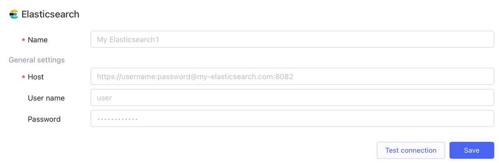

# Elasticsearch

Elasticsearch is a highly scalable and distributed search and analytics engine designed to perform fast and complex searches on large volumes of data.

## Prerequisites

* Get Microsoft SQL Server database connection parameters from the database owner.
* Refer to [IP allowlist](../configure-ip-allowlists.md) to add IP addresses of Openblocks to your allowlist (if needed).

## Connect to Elasticsearch data source

Follow the steps below:

1. Create a new data source in two ways. Note that this permission is restricted to workspace admins and developers.
   *   Navigate to the **Data Sources** tab on [Openblocks Homepage](https://openblocks.dev) and click **New data source**.&#x20;

       <figure><figcaption></figcaption></figure>
   *   When creating a new query in the app editor, click **+ New** > **+ New data source**.&#x20;

       <figure><figcaption></figcaption></figure>
2.  Select **Database** > **Elasticsearch** as the data source type.&#x20;

    <figure><figcaption></figcaption></figure>
3.  Set its name and configure general settings, including host, port, and database name. You can also set the user name and a password.&#x20;

    <figure><figcaption></figcaption></figure>
4. (Optional) Click **Test connection** to check whether the new data source is successfully connected.
5. Click **Save**, and it will be saved to your data source library.
