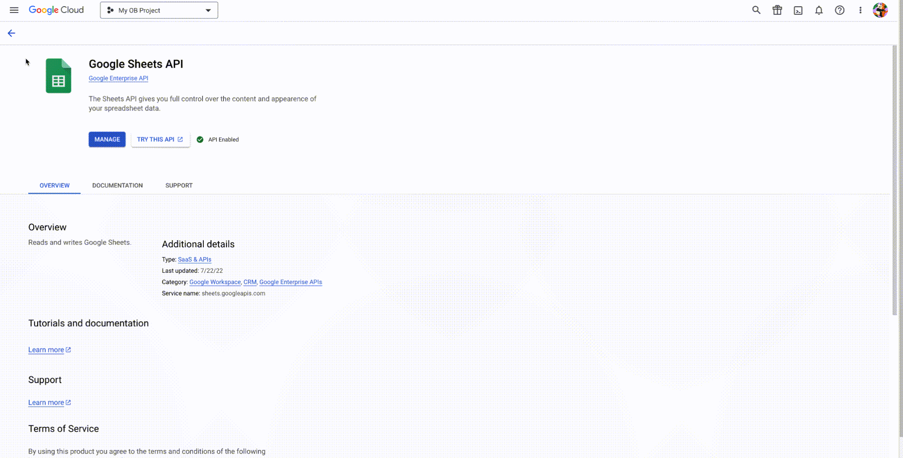
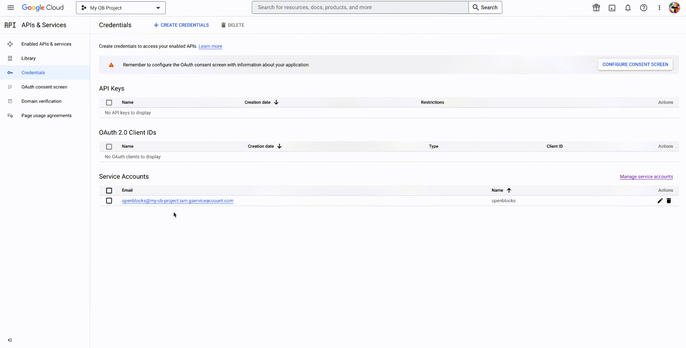
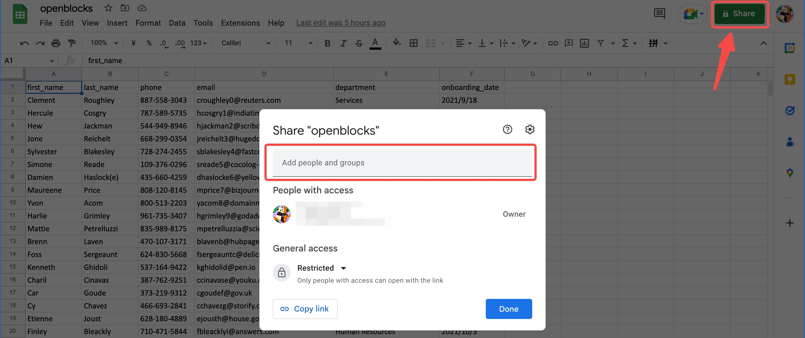
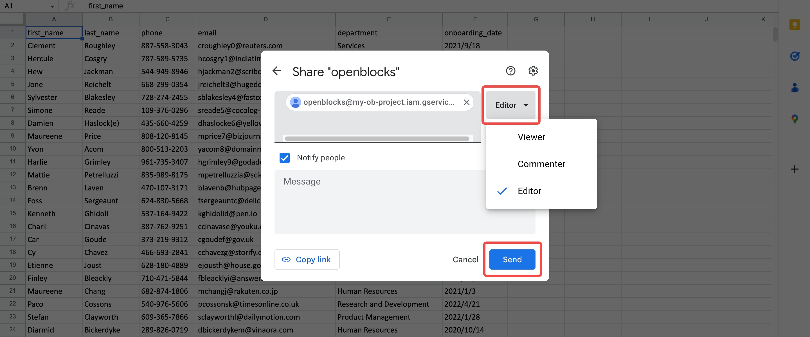

# Google Sheets

## Authentication

Follow the steps below to create a service account for your Google Cloud project and share your Google sheet through the **** service account key.

### Create a service account key

Follow the steps below:

1. Enable the [Google Sheets API](https://console.cloud.google.com/apis/library/sheets.googleapis.com) of your Google Cloud project.
2. Select **APIs & Services** > **Credentials** from the left panel.
3.  Click **+ CREAT CREDENTIALS** > **Service account** to create a new service account.

    <figure><figcaption></figcaption></figure>
4.  Get a service account key:

    1. Click the **Email** of the service account.
    2. Click **KEYS** > **ADD KEY** > **Create new key**.
    3. Select **JSON** as the key type.&#x20;
    4. Click **CREATE** to download it.

    <figure><figcaption></figcaption></figure>


Now the service account key, in a JSON format, is downloaded to your device. Make sure to keep it somewhere safe.


### Share your Google sheet

Navigate back to to [Google Sheets](https://docs.google.com/spreadsheets), and follow the steps below to share your sheet through the **** service account key.

1. Open the JSON file of the key.
2.  Copy the value of `client_email`, which is an identity used for access management of your sheet.

    <figure><figcaption></figcaption></figure>
3.  Click **Share** at the top right and paste the copied `client_email` value to add a member with access.

    <figure><figcaption></figcaption></figure>
4.  Select **Editor** as the role and click **Send**.

    <figure><figcaption></figcaption></figure>


When you see the notification **Access updated**, you have authorized this service account to edit your sheet.


## Connect Google Sheets to Openblocks

Follow the steps below:

1. Click **Data Sources** on Openblocks homepage.
2. Click **New Data Source** on the top right. Note that this permission is restricted to workspace admins and developers.
3.  Select **Database** > **Google Sheets** as the type.

    <figure><figcaption></figcaption></figure>
4.  Set its name and paste the whole content in the JSON flie of the key to **Service Account**.

    <figure><figcaption></figcaption></figure>
5. Click **Save**, and you can check it in your data source library later.
6.  To access and manipulate data in your app, you can fill in the **Spreadsheet** id and **Sheet Name** in a query editor as follows.

    <figure><figcaption></figcaption></figure>

    <figure><figcaption></figcaption></figure>

    &#x20;The available methods are **Read Data**, **Append Row**, **Update Row**, and **Clear Row**.
