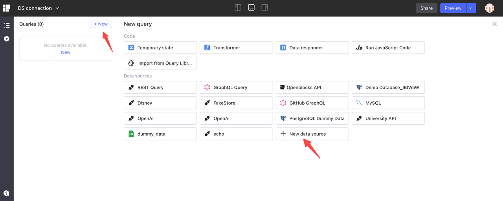
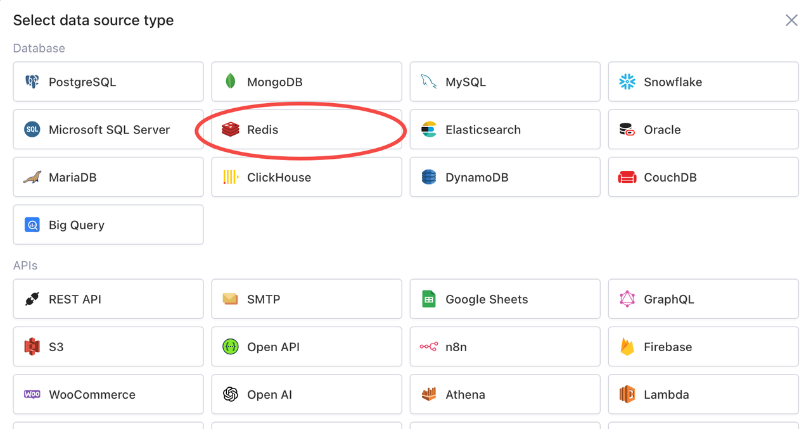
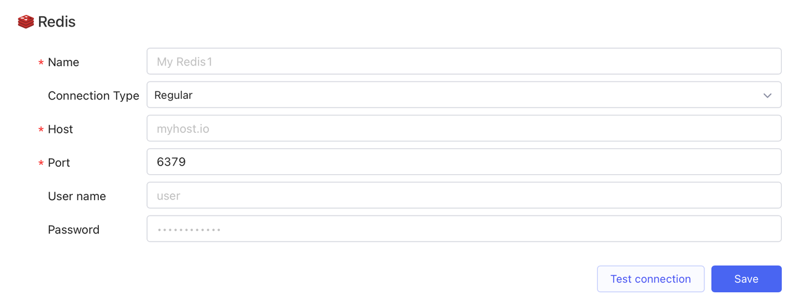
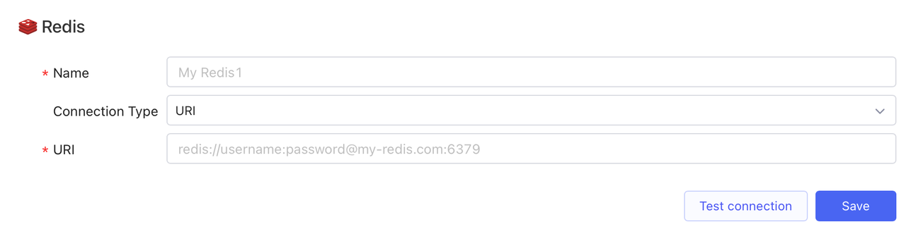

# Redis

Redis (Remote Dictionary Server) is an open-source in-memory data structure store. Due to the nature of being fast, scalable, and highly available, Redis is a popular choice for applications that require real-time data processing, high throughput, and low latency.

## Prerequisites

* Get Redis database connection parameters from the database owner.
* Refer to [IP allowlist](../configure-ip-allowlists.md) to add IP addresses of Openblocks to your allowlist (if needed).

## Connect to Redis data source

Follow the steps below:

1. Create a new data source in two ways. Note that this permission is restricted to workspace admins and developers.
   *   Navigate to the **Data Sources** tab on [Openblocks Homepage](https://openblocks.dev) and click **New data source**.&#x20;

       <figure><figcaption></figcaption></figure>
   *   When creating a new query in the app editor, click **+ New** > **+ New data source**.&#x20;

       <figure><figcaption></figcaption></figure>
2.  Select **Database** > **Redis** as the data source type.&#x20;

    <figure><figcaption></figcaption></figure>
3. Set its name and configure the parameters according to your **Connection Type**:
   *   **Regular**: Host, port, database name (required); user name, password (optional)&#x20;

       <figure><figcaption></figcaption></figure>
   * **URI**: URI 
4. (Optional) Click **Test connection** to check whether the new data source is successfully connected.
5. Click **Save**, and it will be saved to your data source library.
