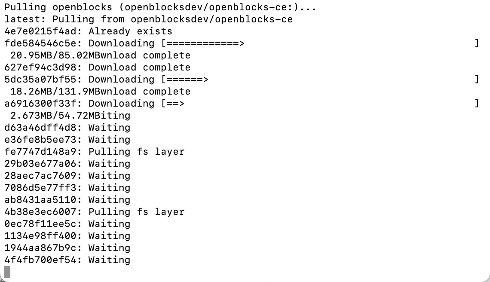
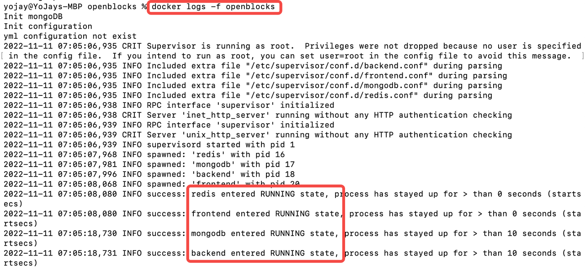
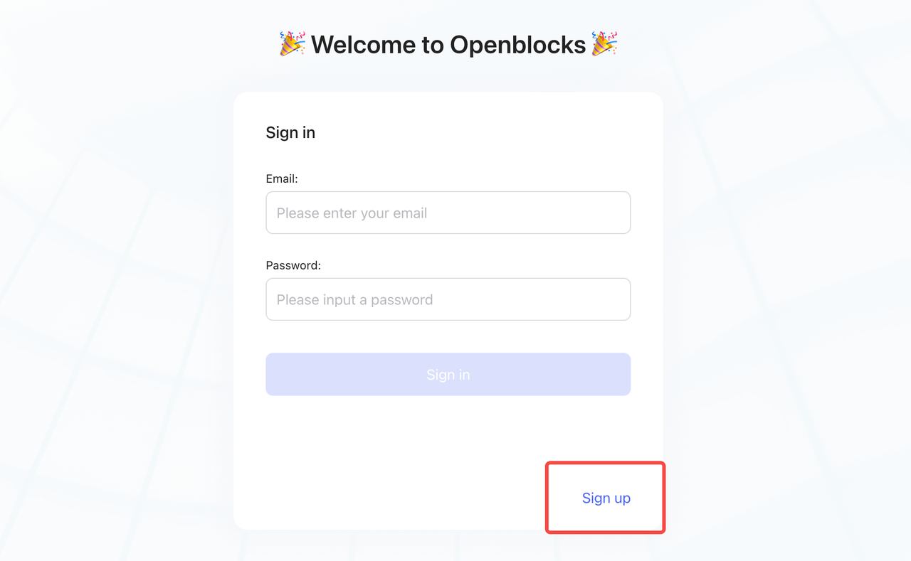

# Self-hosting

## Prerequisites

* [Docker](https://docs.docker.com/get-docker/) (version 20.10.7 or above)
* [Docker-Compose](https://docs.docker.com/compose/install/) (version 1.29.2 or above)


System minimum requirements: 2-core CPU and 4 GB RAM.

Windows users are recommended to use PowerShell for running commands below.


In your working directory, run the following commands to make a directory named `openblocks` to store the data of Openblocks:

```powershell
mkdir openblocks
cd openblocks
```

## Docker-Compose (Recommend)

### Deploy

Follow the steps below:

1. Download the configuration file by clicking [docker-compose.yml](https://cdn-files.openblocks.dev/docker-compose.yml) or running the curl command: `curl https://cdn-files.openblocks.dev/docker-compose.yml -o $PWD/docker-compose.yml`
2.  Start the Docker container by running this command: `docker-compose up -d` ;\
    The docker image, about 400 MB, is downloaded during the initial start-up.

    <figure><figcaption></figcaption></figure>

    After downloading, it usually takes less than 30 seconds to start the service.
3.  Check the logs by running this command: `docker logs -f openblocks` ;\
    When you see `frontend`, `backend`, `redis`, and `mongo` `entered the RUNNING state`, the Openblocks service has officially started:\


    <figure><figcaption></figcaption></figure>

### Update

Run the following commands to update to the latest Openblocks image:

```powershell
docker-compose pull
docker-compose rm -fsv openblocks
docker-compose up -d
```

## Docker

### Deploy

Run this command to deploy Openblocks on premise:


```powershell
docker run -d --name openblocks -p 3000:3000 -v "$PWD/stacks:/openblocks-stacks" openblocksdev/openblocks-ce
```


### Update

Run the following commands to update to the latest Openblocks image:


```powershell
docker pull openblocksdev/openblocks-ce
docker rm -fv openblocks
docker run -d --name openblocks -p 3000:3000 -v "$PWD/stacks:/openblocks-stacks" openblocksdev/openblocks-ce
```


## Sign up

Visit **http://localhost:3000** and click **Sign up**. Openblocks will automatically create a workspace for you, then you can start building your apps and invite members to your workspace.

<figure><figcaption></figcaption></figure>
