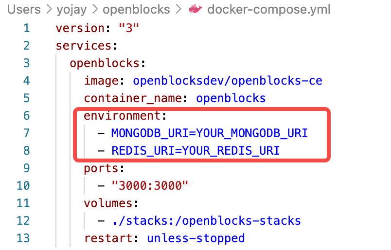
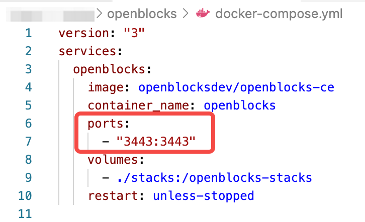

# Self-hosting

## Prerequisites

* [Docker](https://docs.docker.com/get-docker/) (version 20.10.7 or above)
* [Docker-Compose](https://docs.docker.com/compose/install/) (version 1.29.2 or above)


Recommended system spec: 1-core CPU and 2 GB RAM.

Windows users are recommended to use PowerShell for running commands below.


In your working directory, run the following commands to make a directory named `openblocks` to store the data of Openblocks:

```powershell
mkdir openblocks
cd openblocks
```

## Deploy



Follow the steps below:

1. Download the configuration file by clicking [docker-compose.yml](https://cdn-files.openblocks.dev/docker-compose.yml) or running the curl command: `curl https://cdn-files.openblocks.dev/docker-compose.yml -o $PWD/docker-compose.yml`\

2.  Start the Docker container by running this command: `docker-compose up -d`\
    ``\
    ``The docker image, about 400 MB, is downloaded during the initial start-up.

    <figure><figcaption></figcaption></figure>

    After downloading, it usually takes less than 30 seconds to start the service.\

3.  Check the logs by running this command: `docker logs -f openblocks`\
    ``\
    ``When you see `frontend`, `backend`, `redis`, and `mongo` `entered the RUNNING state`, the Openblocks service has officially started:\


    <figure><figcaption></figcaption></figure>



Run the command below:


```bash
docker run -d --name openblocks -p 3000:3000 -v "$PWD/stacks:/openblocks-stacks" openblocksdev/openblocks-ce
```




## Customize deployment configurations

This section shows how to customize deployment configurations. If you have already started a container, you need to restart the container for the new configurations to take effect. Following are the ways to **restart** your container:



One single command:

```
docker-compose up
```

It picks up configuration changes by stopping containers already in service and recreating new ones.



Run the following commands to stop, remove the container already in service, and start up a new one using the newly customized deployment command.

```docker
docker stop openblocks
docker rm openblocks
# run your new docker run command
```



### Use your own MongoDB and Redis

By default Openblocks uses the built-in MongoDB and Redis installed inside the container, and you can replace them with your own MongoDB and Redis clusters.



Add environment variables `MONGODB_URI` and `REDIS_URI` in `docker-compose.yml` downloaded in your working directory.\




Add environment variables `MONGODB_URI` and `REDIS_URI` to the deployment command, as shown below:


```docker
docker run -d --name openblocks -e MONGODB_URI=YOUR_MONGODB_URI REDIS_URI=YOUR_REDIS_URI -p 3000:3000 -v "$PWD/stacks:/openblocks-stacks openblocksdev/openblocks-ce
```




### Run as non-root user

By default the supervisor will run under the user `uid=9001`. You can specify the uid by adding a docker environment variable `LOCAL_USER_ID` and setting its value to a **Number**, such as `10010`.



Add an environment variable `LOCAL_USER_ID` in `docker-compose.yml` downloaded in your working directory.\




Add an environment variable `LOCAL_USER_ID` to the deployment command, as shown below:


```docker
docker run -d --name openblocks -e LOCAL_USER_ID=10010 -p 3000:3000 -v "$PWD/stacks:/openblocks-stacks" openblocksdev/openblocks-ce
```




### Install SSL certificate

With an SSL certificate, you can securely visit self-hosted Openblocks with HTTPS protocol. Here are the steps to install your SSL certificate before starting a container:



1. Copy `fullchain.pem` and `privkey.pem` to the `$PWD/stacks/ssl` directory.
2. In `$PWD/docker-compose.yml`, change the value of `ports` to `"3443:3443"`.\
   



1. Copy `fullchain.pem` and `privkey.pem` to the `$PWD/stacks/ssl` directory.
2. Change the `ports` in the deployment command to `3443:3443`, as shown below:


```docker
docker run -d --name openblocks -p 3443:3443 -v "$PWD/stacks:/openblocks-stacks" openblocksdev/openblocks-ce
```





In cases where you have certificates with names: `server.crt` and `server.key`, you need to rename them first as follows:\
`server.crt` => `fullchain.pem`\
`server.key` => `privkey.pem`


## Update



Run the following commands to update to the latest Openblocks image:

```docker
docker-compose pull
docker-compose rm -fsv openblocks
docker-compose up -d
```



Run the following commands to update to the latest Openblocks image:


```docker
docker pull openblocksdev/openblocks-ce
docker rm -fv openblocks
docker run -d --name openblocks -p 3000:3000 -v "$PWD/stacks:/openblocks-stacks" openblocksdev/openblocks-ce
```




## Sign up

Visit **http://localhost:3000** and click **Sign up**. Openblocks will automatically create a workspace for you, then you can start building your apps and invite members to your workspace.

<figure><figcaption></figcaption></figure>
