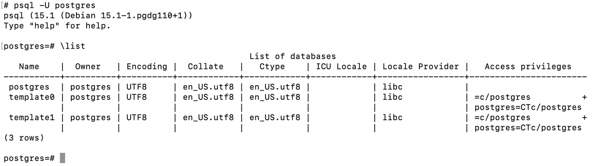
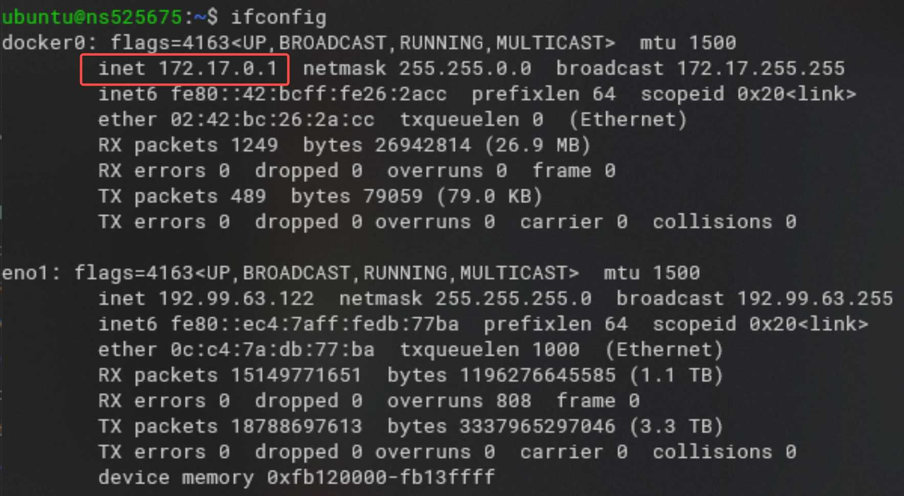
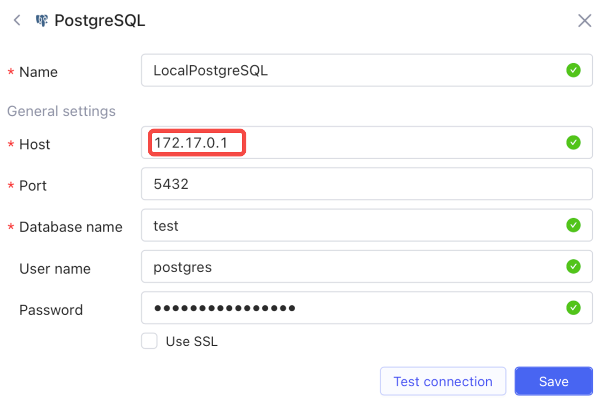
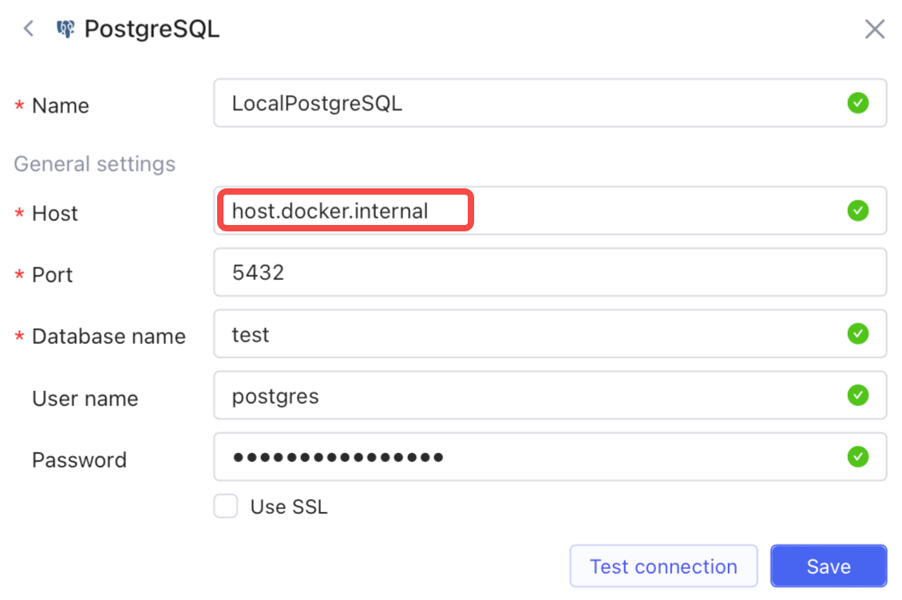

# Access local database or API

By default, docker-hosted instances uses a [bridge network](https://docs.docker.com/network/bridge/), which does not support access to service on the host via `127.0.0.1` or `localhost`. Here we take PostgreSQL as an example and show you how to access local API or database in different operating systems (OS) for docker-hosted Openblocks.

## Preparation

Assume that a Postgres service is ready on your local host with port `5432`. Confirm that access to the Postgres service functions well.

<figure><figcaption></figcaption></figure>

## How to access local database or API



1.  Enter `ifconfig docker0` in the terminal, and verify the IP configuration of Docker's virtual bridge (VB).

    <figure><figcaption></figcaption></figure>

    Having set up Docker, the OS would automatically create `docker0` with the IP address `172.17.0.1` (by default), through which the Docker service communicates with the host.
2.  Enter the same IP address into Openblocks to configure the Postgres data source (`172.17.0.1` in this example, but use the actual IP address displayed on your terminal in real case).


    <figure><figcaption></figcaption></figure>


On some OS (such as Ubuntu), port access might be blocked by the firewall. To solve that, configure in the following steps:

1. Stop the firewall from blocking access from <mark style="background-color:yellow;">`docker0`</mark> by typing in the terminal:\ <mark style="background-color:blue;"></mark><mark style="background-color:yellow;">`iptables -A INPUT -p tcp -i docker0 --dport YOUR_DB_PORT -j ACCEPT`</mark>\
   `Note: In this case`Here we use Postgres port <mark style="background-color:yellow;">`5432`</mark> for <mark style="background-color:yellow;">`YOUR_DB_PORT`</mark>, and you should replace it with your own.
2. Save the firewall configuration by typing in the terminal:\
   <mark style="background-color:yellow;">`iptables-save > /etc/iptables.up.rules`</mark>




On Windows and masOS, Docker does not create the virtual bridge `docker0`. Then the following DNS is helpful to resolve the host IP:

```
host.docker.internal
```

In Openblocks, configure the Postgres data source as the following figure shows:


<figure><figcaption></figcaption></figure>


