# AWS AMI

Openblocks provides an Amazon Machine Image (AMI) for your self-hosting on [Amazon Web Services (AWS)](https://aws.amazon.com/).

## Deploy

1. Sign in to [Amazon Web Services (AWS)](https://aws.amazon.com/) or [Create and activate an AWS account](https://aws.amazon.com/premiumsupport/knowledge-center/create-and-activate-aws-account/?nc1=h\_ls) first.
2.  Follow the steps in [Create a key pair using Amazon EC2](https://docs.aws.amazon.com/AWSEC2/latest/UserGuide/create-key-pairs.html#having-ec2-create-your-key-pair) to generate an SSH key pair.

    <figure>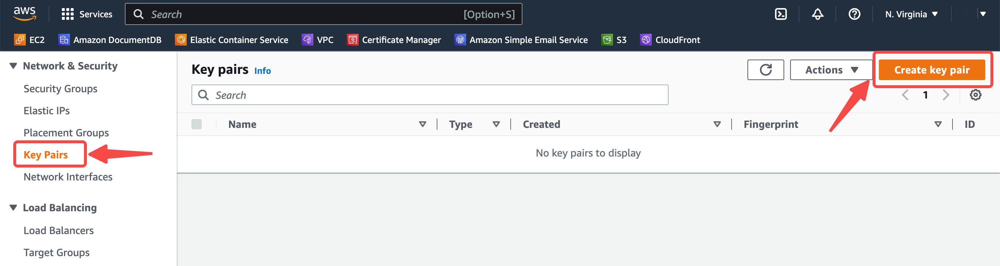<figcaption></figcaption></figure>
3.  Follow the steps in [Create a security group](https://docs.aws.amazon.com/AWSEC2/latest/UserGuide/working-with-security-groups.html#creating-security-group) to create a new AWS security group. While creating, add an inbound rule that sets port **3000** to be accessible from **anywhere**, as shown below.

    <figure>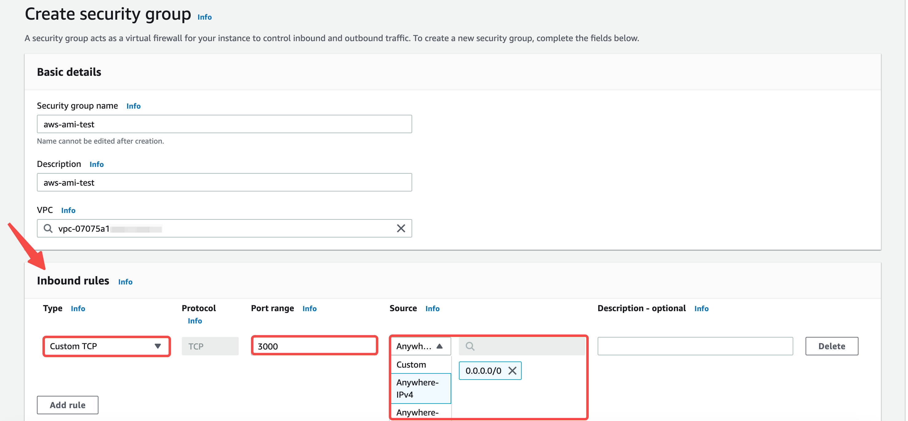<figcaption></figcaption></figure>
4.  Click **Images** -> **AMI Catalog** on the left sidebar. Type in **Openblocks** to search in **AWS Marketplace AMIs**. **Select** the Openblocks image from results, then click the **Launch Instance with AMI** button to proceed.

    <figure>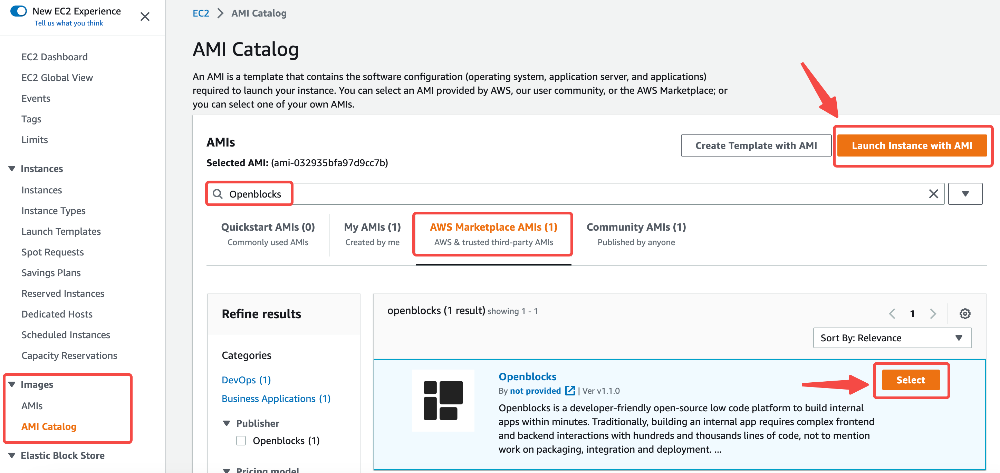<figcaption></figcaption></figure>
5.  Configure the following settings:

    1. Choose your desired **Instance type**. We'd recommend a system spec with <mark style="background-color:yellow;">**1 core CPU and 2 GB RAM**</mark> or the above.
    2. Select the **key pair** created in step 2.
    3. **Enable** auto-assigning public IP.
    4. Select the **security group** created in step 3.

    <figure>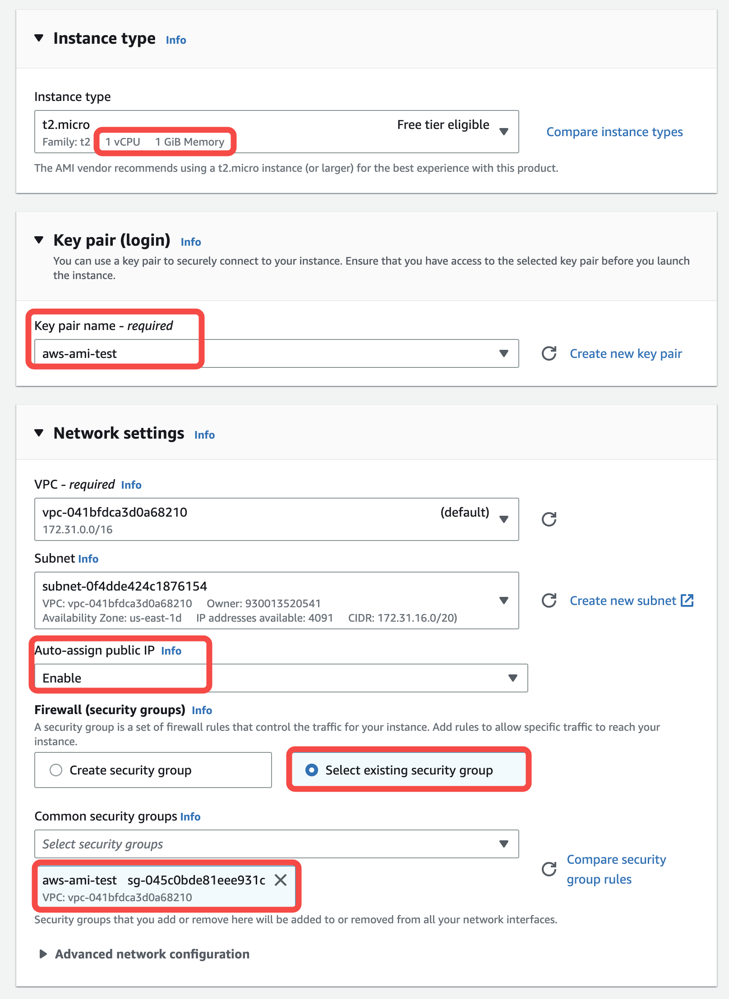<figcaption></figcaption></figure>
6.  You can check the settings again and click the **Lauch instance** button to proceed.

    <figure>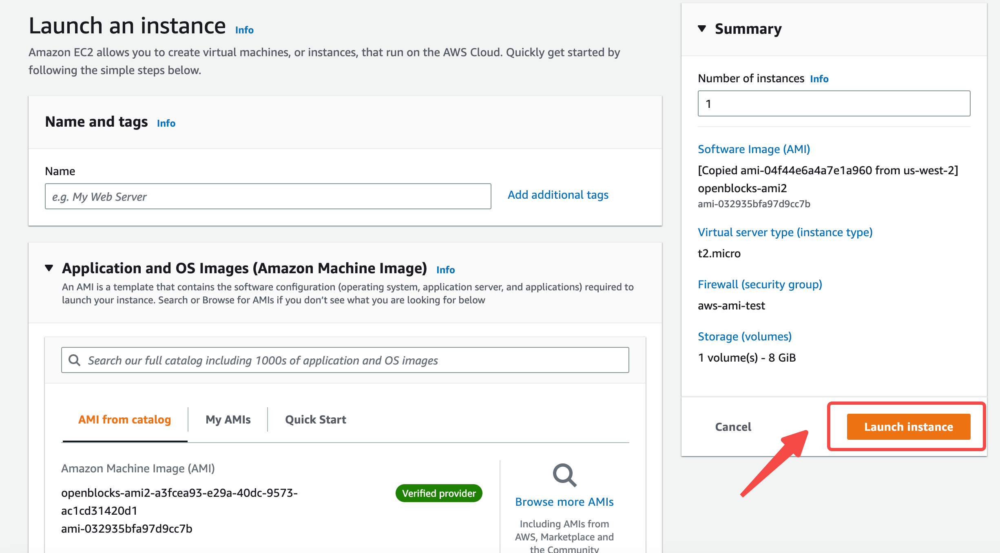<figcaption></figcaption></figure>

It usually takes a few minutes to start the instance.

<figure>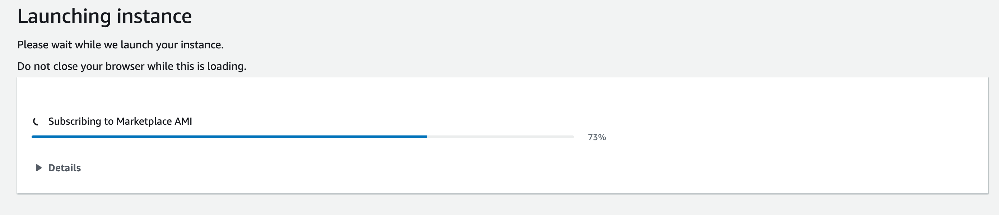<figcaption></figcaption></figure>

After deployment, you can view the instance details on the **Instances** page and get the **public IPv4 address**.

<figure>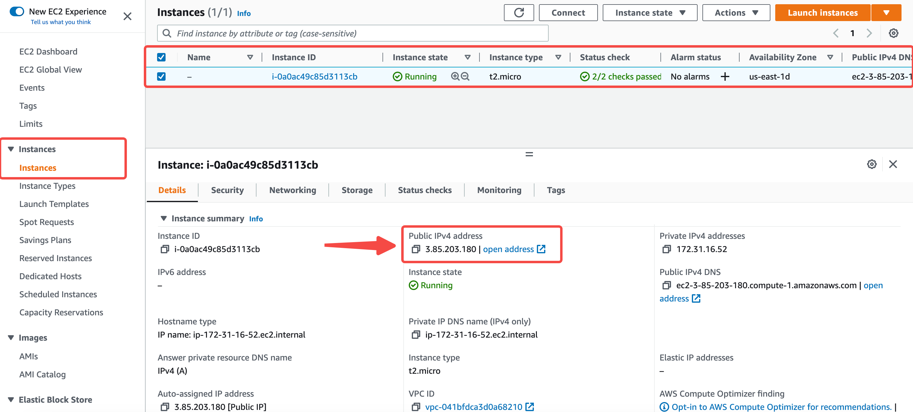<figcaption></figcaption></figure>

Your new Openblocks instance should be available at **http://public\_ipv4\_address:3000**.&#x20;

In the welcome page, click **Sign up** to get started. Openblocks will automatically create a workspace for you. Then you can start building your apps and invite members to your workspace.

<figure>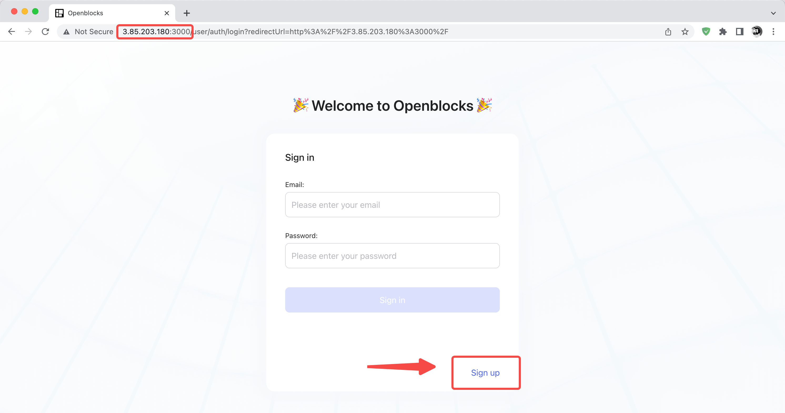<figcaption></figcaption></figure>

## Connect to instance

You can connect to your instance to update the image or customize deployment configurations.

Click **Connect** on the **Instances** page. AWS provides four connection options.

<figure>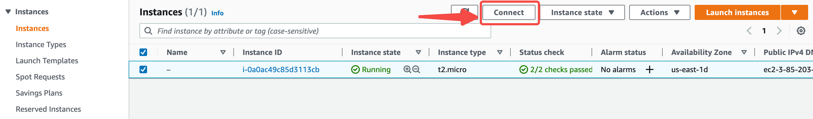<figcaption></figcaption></figure>

<figure>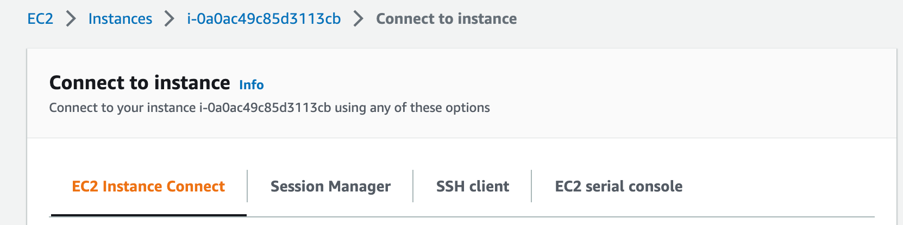<figcaption></figcaption></figure>


For detailed information, see [Connect to your Linux instance](https://docs.aws.amazon.com/AWSEC2/latest/UserGuide/AccessingInstances.html).


For example, you can connect to your instance using an SSH client. Locate your private key file and get your public IPv4 DNS. Then run the following command:

```bash
ssh -i "your_private_key.pem" ubuntu@your_public_IPv4_DNS
```

<figure>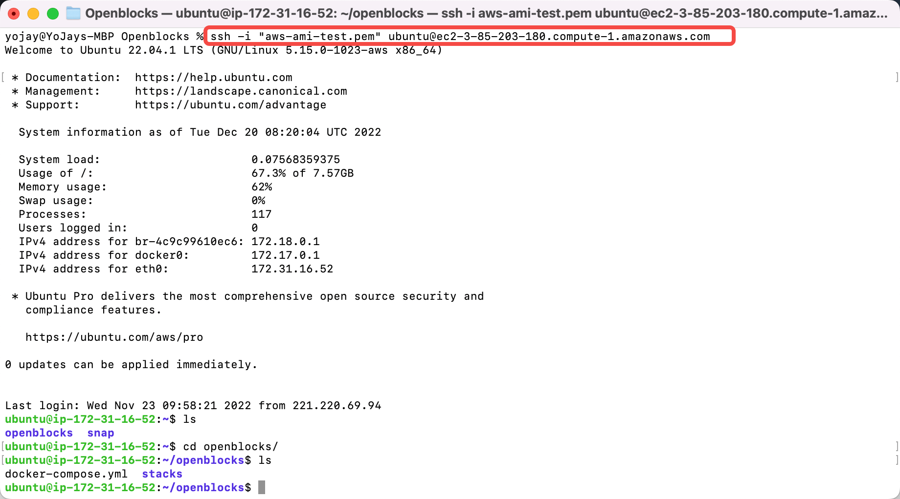<figcaption></figcaption></figure>

### Update

For information about how to update the Openblocks image to the latest version, see [Update](./#update).

### Customize configurations

| Location                                                     | Usage                                               |
| ------------------------------------------------------------ | --------------------------------------------------- |
| <p><code>~/openblocks/docker-compose.yml</code><br></p>      | Setting up Docker ports, volumes, environments etc. |
| `~/openblocks/stacks/configuration/application-selfhost.yml` | Setting up Openblocks server configurations         |

For information about how to customize deployment configurations, see [Customize configurations](./#customize-configurations).
