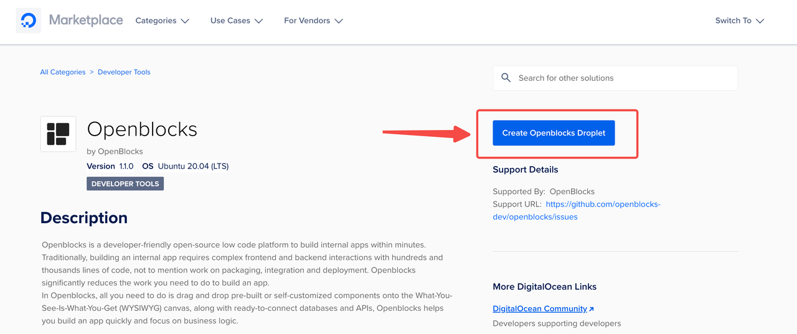
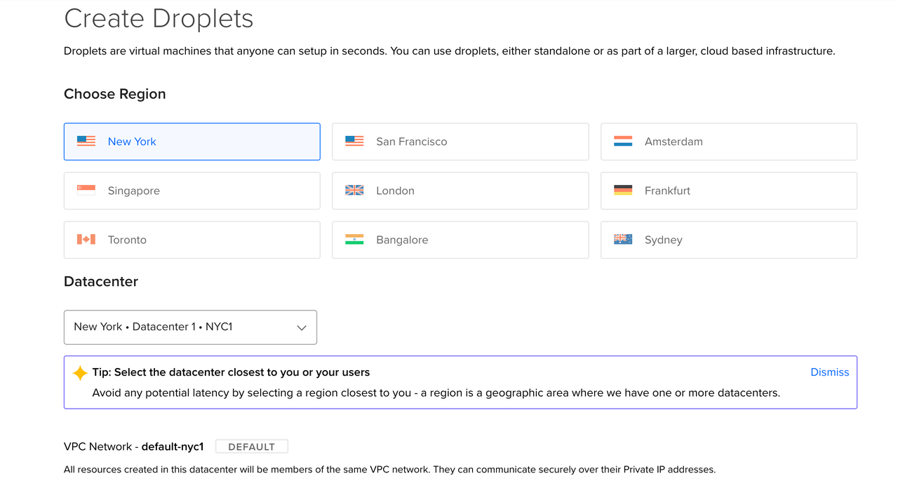
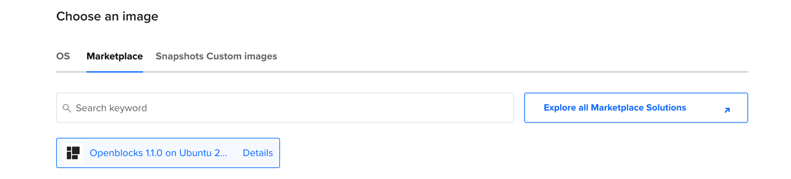
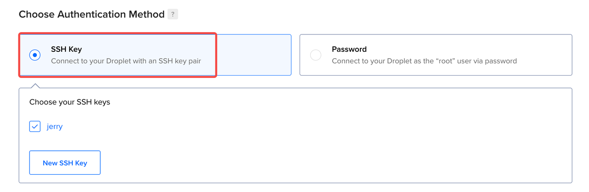
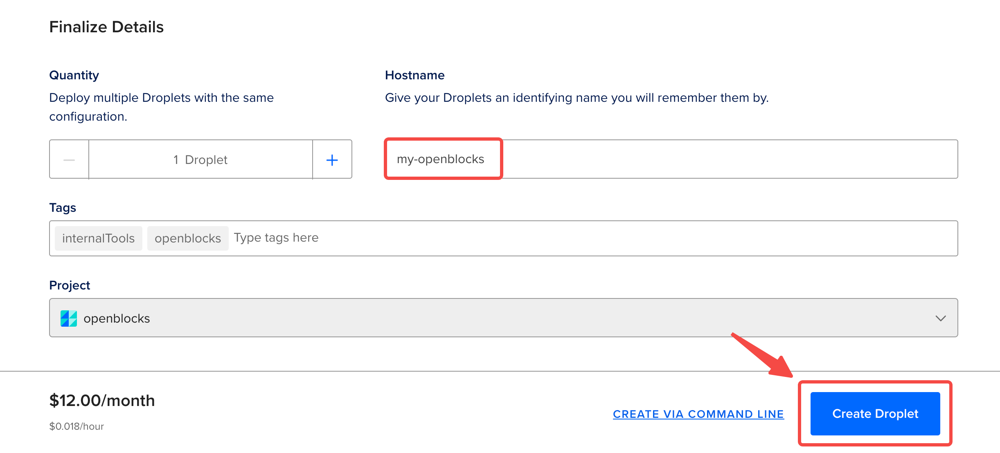
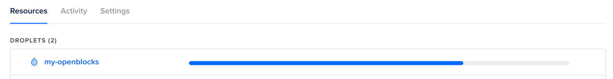
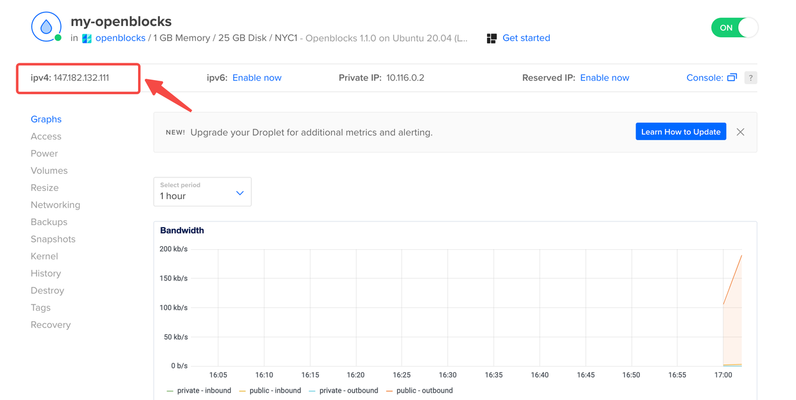
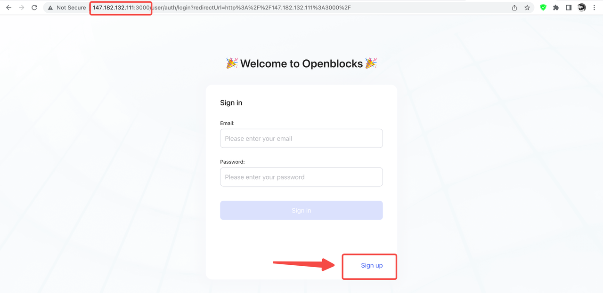
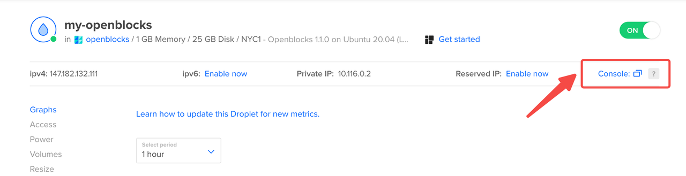
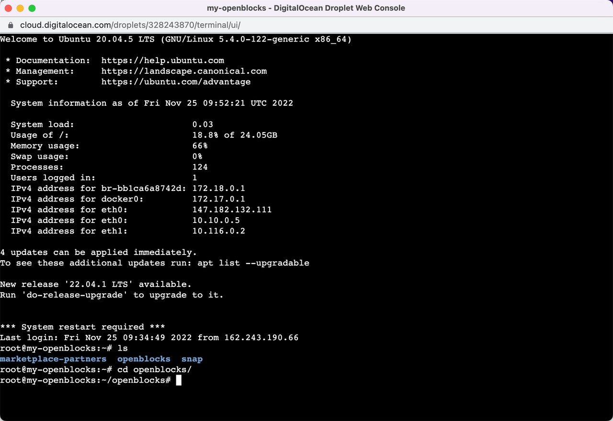

# DigitalOcean

You can deploy Openblocks on DigitalOcean using our [Openblocks docker image](https://marketplace.digitalocean.com/apps/openblocks) from the DigitalOcean Marketplace. Based on the pre-built image, you can create a DigitalOcean droplet as your cloud-based infrastructure and set up an Openblocks instance in seconds. [Create a DigitalOcean account](https://cloud.digitalocean.com/registrations/new) or [Log in](https://cloud.digitalocean.com/login) to get started.

## Deploy

1. Search **Openblocks** in DigitalOcean Marketplace or visit [Openblocks page](https://marketplace.digitalocean.com/apps/openblocks) directly.
2.  Click **Create Openblocks Droplet** to enter the configuring page.

    <figure><figcaption></figcaption></figure>
3.  Choose the region and datacenter. The closest one to you and your users is recommended.

    <figure><figcaption></figcaption></figure>
4.  The Openblocks image should already be listed as shown below, so you don't need to choose here.

    <figure><figcaption></figcaption></figure>
5.  Choose a plan and size for your Droplet, which determines its RAM, disk space, and vCPUs as well as its price. We'd recommend a system spec with **1 core CPU and 2 GB RAM** or the above.

    <figure><figcaption></figcaption></figure>

    Note that the **Basic** shared CPU with **Regular with SSD (1 GB CPU / 25GB SSD Disk / 1000GB transfer)** CPU option is more than capable of hosting an Openblocks instance.
6.  Choose an [SSH key](https://docs.digitalocean.com/products/droplets/how-to/add-ssh-keys/) if you've added one, or create a root password for the Droplet.

    <figure><figcaption></figcaption></figure>
7.  Set the droplet name, add tags, and click **Create Droplet** to finish the deployment.

    <figure><figcaption></figcaption></figure>

    It usually takes around a minute to start the droplet.

    <figure><figcaption></figcaption></figure>


For more help, see [Droplets | DigitalOcean Documentation](https://docs.digitalocean.com/products/droplets/).


After deployment, your new Openblocks instance should be available at **http://your\_droplet\_public\_ipv4:3000**.

<figure><figcaption></figcaption></figure>

In the welcome page, Click **Sign up** to get started. Openblocks will automatically create a workspace for you. Then you can start building your apps and invite members to your workspace.

<figure><figcaption></figcaption></figure>

## Droplet Web Console

You can use Droplet Web Console to connect to your instance to update the image or customize deployment configurations.&#x20;

Find the deployed droplet in your [DigitalOcean projects](https://cloud.digitalocean.com/) and redirect to its details page. Click **Console** on the right to enter the Droplet Web Console.

<figure><figcaption></figcaption></figure>

<figure><figcaption></figcaption></figure>

### Update

For information about how to update the Openblocks image to the latest version, see [Update](./#update).

### Customize configurations

| Location                                                     | Usage                                               |
| ------------------------------------------------------------ | --------------------------------------------------- |
| 
<code>~/openblocks/docker-compose.yml</code> 
      | Setting up Docker ports, volumes, environments etc. |
| `~/openblocks/stacks/configuration/application-selfhost.yml` | Setting up Openblocks server configurations         |

For information about how to customize deployment configurations, see [Customize configurations](./#customize-configurations).
