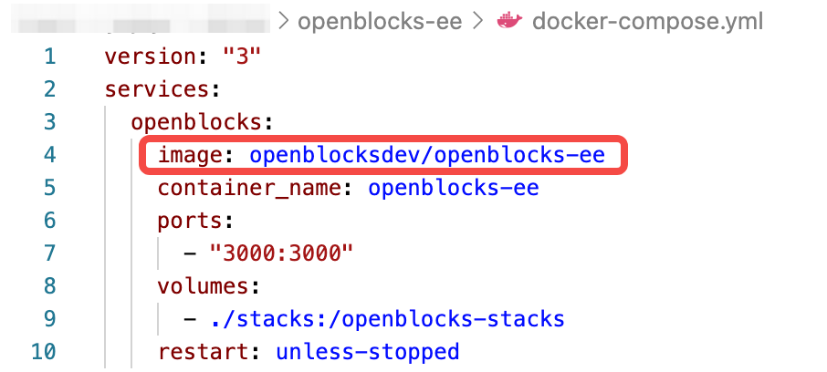
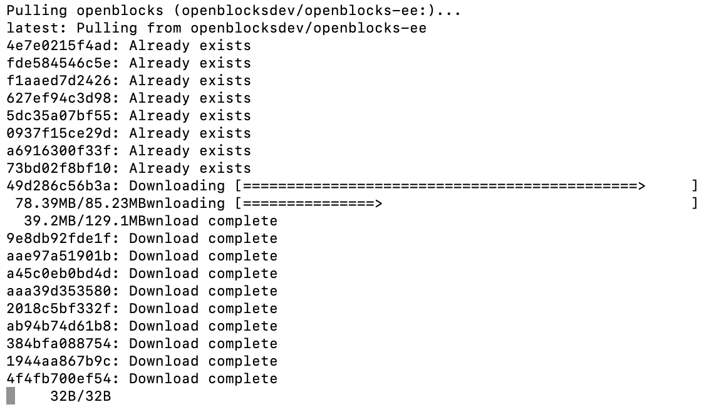
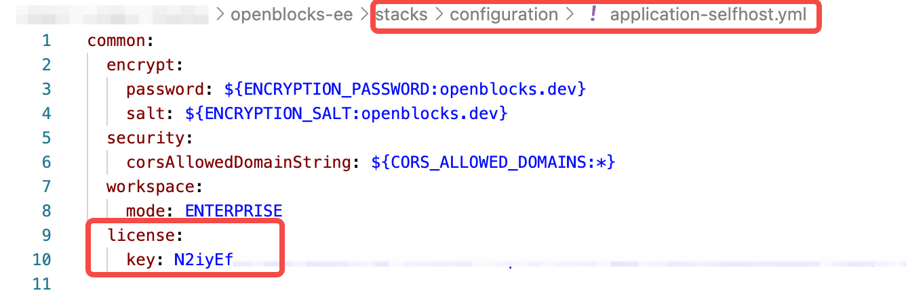
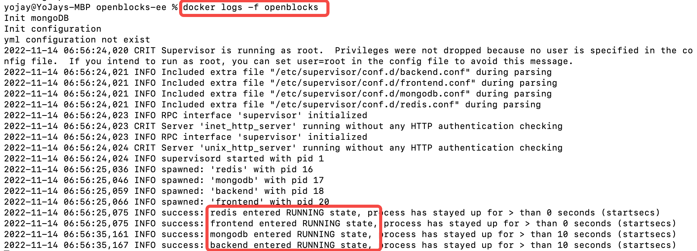
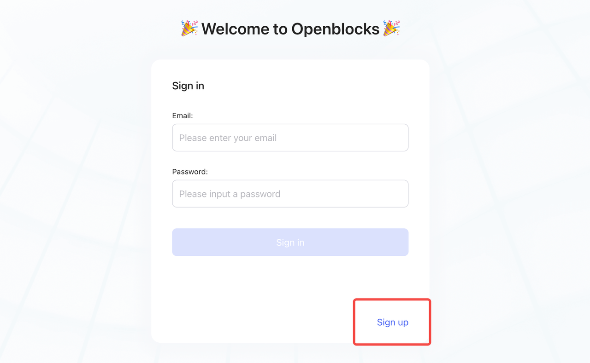

# Enterprise Edition

In this article, you will be guided through self-hosting **Openblocks Enterprise Edition (EE)** using Docker or Docker Compose:

* If you're new to Openblocks, we highly recommend you deploy with the [all-in-one image](enterprise-edition.md#all-in-one-image-all-services-in-one-container).
* For current users of **Openblocks Community Edition (CE)**, please follow instructions in [Upgrade to Enterprise Edition](enterprise-edition.md#upgrade-to-enterprise-edition) section.


A **License Key** is necessary to deploy or upgrade to Enterprise Edition. Feel free to contact our team at <mark style="color:blue;">fan@openblocks.dev</mark> or on [Discord](https://discord.com/invite/z5W2YHXdtt) if needed.

The lack of License Key will not hinder the process of starting and maintaining Openblocks EE services but display the paid features as disabled.


## Premium features

* Enterprise ID providers: Google, GitHub, Azure AD, Okta, Keycloak, CAS, LDAP, JWT and more
* White labeling ([Custom branding](../workspace-management/customize-branding.md))
* Air-gapped deployment
* Audit logs
* Priority support

## All-in-one image: all services in one container

For easy setup and deployment, we provide an all-in-one image which bundles frontend, backend and data persistence services altogether in one single container.

### Prerequisites

* [Docker](https://docs.docker.com/get-docker/) (version 20.10.7 or above)
* [Docker-Compose](https://docs.docker.com/compose/install/) (version 1.29.2 or above)


Recommended system spec: 1-core CPU and 2 GB RAM.

Windows users are recommended to use PowerShell for running terminal commands below.


In your working directory, run the following commands to make a directory named `openblocks` to store the data of Openblocks:

```bash
mkdir openblocks
cd openblocks
```

### Deploy



Follow the steps below:

1.  Download the configuration file by clicking [docker-compose.yml](https://cdn-files.openblocks.dev/docker-compose.yml) or running the curl command:&#x20;

    
    ```bash
    curl https://cdn-files.openblocks.dev/docker-compose.yml -o $PWD/docker-compose.yml
    ```
    
2. Edit the yaml file just downloaded:
   * `image`: should be modified to `openblocksdev/openblocks-ee`.
   *   `contanier_name`: should be changed only when you run into container-naming conflicts. If changed, please remember to also replace default container name `openblocks` with the new one in commands like `docker logs`, `docker-compose rm`, `docker restart`, and so on.&#x20;

       <figure><figcaption></figcaption></figure>
3.  Start the Docker container by running this command:

    ```bash
    docker-compose up -d
    ```

    \
    The docker image will be pulled from docker hub during the initial start-up.\


    <figure><figcaption></figcaption></figure>
4.  Fill in your License Key in `stacks/configuration/application-selfhost.yml`, as shown below. Note that the `key:` should always be followed by a **space**, then the license key.&#x20;

    <figure><figcaption></figcaption></figure>
5.  Restart the container using this command:

    ```bash
    docker restart openblocks
    ```
6.  Check the logs by running this command:

    ```bash
    docker logs -f openblocks
    ```


    When you see **frontend**, **backend**, **redis**, and **mongo** **entered the RUNNING state**, the Openblocks service has officially started.\


    <figure><figcaption></figcaption></figure>
7.  Visit [**http://localhost:3000**](http://localhost:3000) and click **Sign up**. Openblocks will automatically create a workspace for you, then you can start building your apps and invite members to your workspace.

    <figure><figcaption></figcaption></figure>



1.  Run the command below to pull `openblocks-ee` image and start the container `openblocks`:

    
    ```bash
    docker run -d --name openblocks -p 3000:3000 -v "$PWD/stacks:/openblocks-stacks" openblocksdev/openblocks-ee
    ```
    
2. Fill in your License Key in `stacks/configuration/application-selfhost.yml`. Note that the `key:` should always be followed by a **space**, then the license key.&#x20;
3.  Restart the container using this command:

    
    ```bash
    docker restart openblocks
    ```
    



### Update



Run the following commands to update to the latest Openblocks image:

```bash
docker-compose pull
docker-compose rm -fsv openblocks
docker-compose up -d
```



Run the following commands to update to the latest Openblocks image:


```bash
docker pull openblocksdev/openblocks-ee
docker rm -fv openblocks
docker run -d --name openblocks -p 3000:3000 -v "$PWD/stacks:/openblocks-stacks" openblocksdev/openblocks-ee
```




## Customize configurations

You can customize deployment configurations by setting environment variables. For detailed information, see [Customize configurations](./#customize-configurations).

## Upgrade to Enterprise Edition

If you have been using Openblocks Community Edition and want to upgrade to Enterprise Edition, follow the steps below to start Openblocks(EE) containers **based on your current data** stored in MongoDB.


Feel free to contact us at <mark style="color:blue;">fan@openblocks.dev</mark> or on [Discord](https://discord.com/invite/z5W2YHXdtt) when you encounter any problem.




1. Edit the Dockerfile [docker-compose.yml](https://cdn-files.openblocks.dev/docker-compose.yml) in your working directory:
   *   For developers self-hosting with the all-in-one image: the `image` field of `openblocks` service should be modified to `openblocksdev/openblocks-ee`.&#x20;

       <figure><figcaption></figcaption></figure>
2. Pull the latest all-in-one image of Enterprise Edition using the modified Dockerfile.

```bash
docker-compose pull
```

3. Stop and remove the Openblocks CE service container.

```bash
docker-compose rm -fsv YOUR_CE_CONTAINER_NAME
```

4. Run the Openblocks EE container in the background (the Detached mode).

```bash
docker-compose up -d
```

5.  Fill in your License Key in `stacks/configuration/application-selfhost.yml`. Note that the `key:` should always be followed by a **space**, then the license key.


    <figure><figcaption></figcaption></figure>
6. Restart the Openblocks EE container.

```bash
docker restart YOUR_EE_CONTAINER_NAME
```

7. Check the log of the container, and wait for **frontend**, **backend**, **redis**, and **mongo** services to have **entered the RUNNING state**.

```bash
docker logs -f YOUR_EE_CONTAINER_NAME
```



Before starting, make sure you have redirected to the working directory where your current data is stored.

1. Pull the latest all-in-one image of Enterprise Edition.

```bash
docker pull openblocksdev/openblocks-ee
```

2. Stop and remove the Openblocks CE service container.

```bash
docker rm -fv YOUR_CE_CONTAINER_NAME
```

3. Run the Openblocks EE container in the background (the Detached mode).


```bash
docker run -d --name YOUR_EE_CONTAINER_NAME -p 3000:3000 -v "$PWD/stacks:/openblocks-stacks" openblocksdev/openblocks-ee
```


4.  Fill in your License Key in `stacks/configuration/application-selfhost.yml`. Note that the `key:` should always be followed by a **space**, then the license key.


    <figure><figcaption></figcaption></figure>
5. Restart the Openblocks EE container.

```bash
docker restart YOUR_EE_CONTAINER_NAME
```

6. Check the log of the container, and wait for **frontend**, **backend**, **redis**, and **mongo** services to have **entered the RUNNING state**.

```bash
docker logs -f YOUR_EE_CONTAINER_NAME
```


