# Heroku

## Deploy

1. [Sign up](https://signup.heroku.com/) for a new Heroku account, or [log in](https://id.heroku.com/login) to get started.
2. Click to start Heroku [one-click deployment](https://heroku.com/deploy?template=https://github.com/openblocks-dev/openblocks).
3.  Set the **App name** which will be part of the app URL later, and choose a region.

    <figure>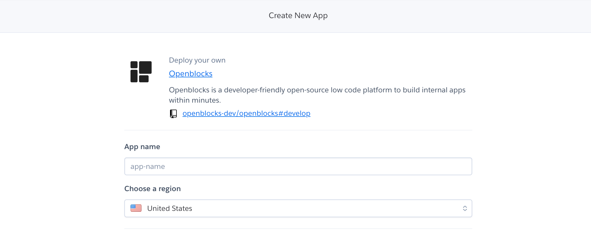<figcaption></figcaption></figure>
4.  (Not required) Fill in the **Config Vars** according to descriptions. These are all optional variables used for environment-specific configuration. You can skip this step and [manage environment variables](heroku.md#manage-environment-variables) later.

    <figure>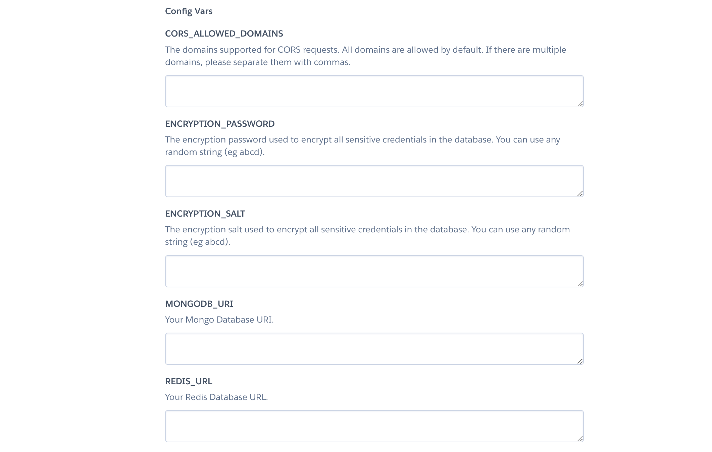<figcaption></figcaption></figure>
5. Click the **Deploy app** button.

It usually takes around three minutes to start the app.

<figure>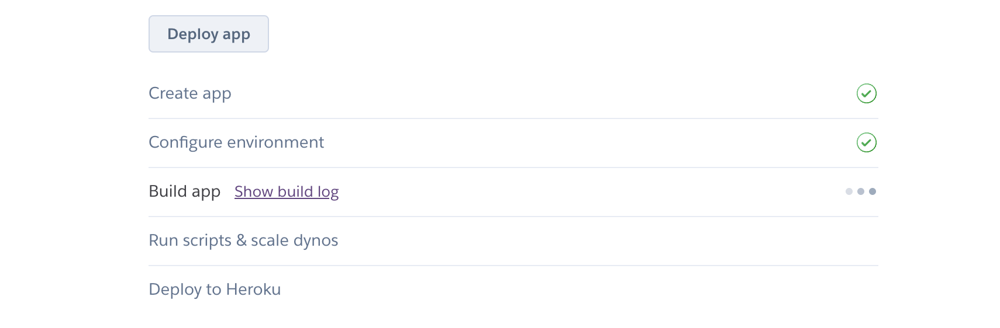<figcaption></figcaption></figure>

Click the **View** button to open the new app, which should be available at **https://your\_app\_name.herokuapp.com/**.

<figure>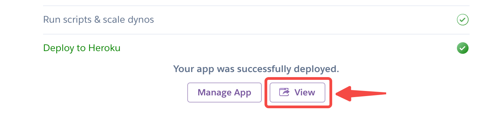<figcaption></figcaption></figure>

In the welcome page, Click **Sign up** to get started. Openblocks will automatically create a workspace for you. Then you can start building your apps and invite members to your workspace.

<figure>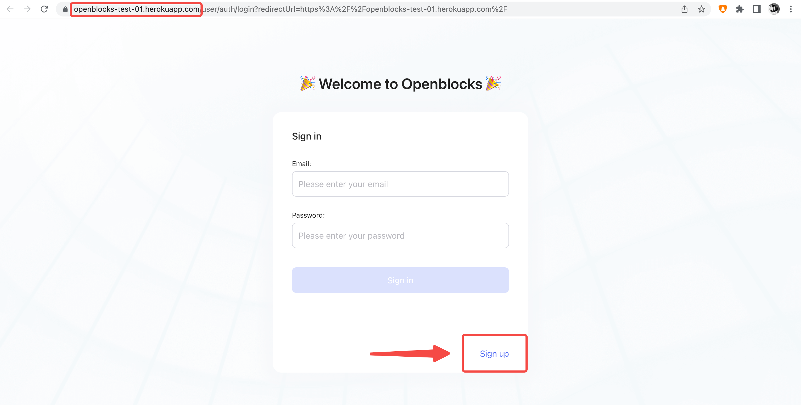<figcaption></figcaption></figure>

## Configure app settings

On [Heroku Dashboard](https://dashboard.heroku.com/apps), go to the **Settings** tab at the top to configure app settings.

<figure>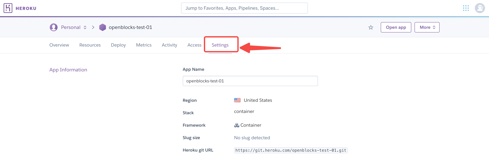<figcaption></figcaption></figure>

### Manage environment variables

You can manage environment variables of your app in the **Config Vars** section.

<figure>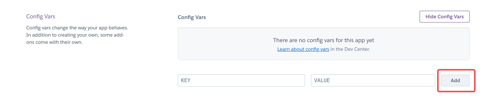<figcaption></figcaption></figure>


For more help, see [Managing config vars](https://devcenter.heroku.com/articles/config-vars#managing-config-vars).


### Install SSL Certificates

You can configure SSL Certificates of your app in the **SSL Certificates** section. Heroku provides [Automated Certificate Management (ACM)](https://devcenter.heroku.com/articles/automated-certificate-management) and [Manual Certificate](https://devcenter.heroku.com/articles/ssl#manually-uploading-certificates-and-intermediaries) options.

<figure>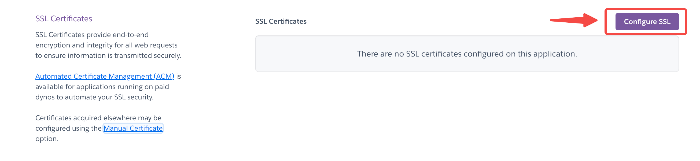<figcaption></figcaption></figure>

Choose **Manual Certificate**, and you can install your SSL Certificates. Public certificate file usually ends in `.pem` or `.crt`.\
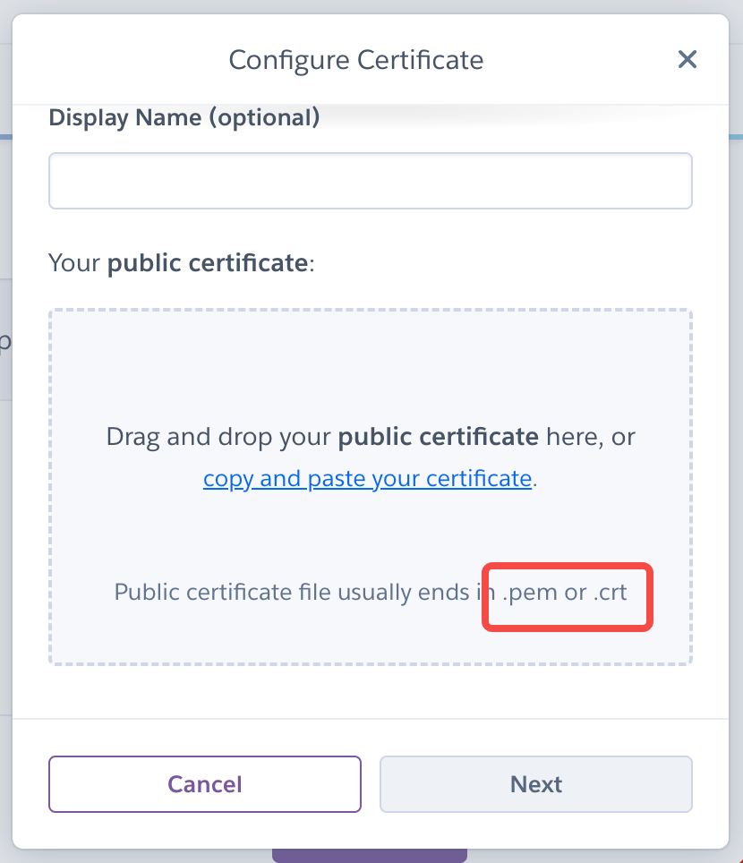

### Customize domain names

1.  Click the **Add domain** button in the **Domains** section.

    <figure>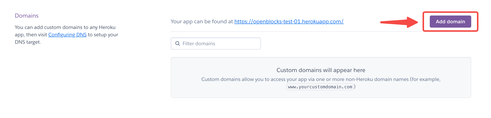<figcaption></figcaption></figure>
2. Fill in your **Domain name** and click **Next**.\
   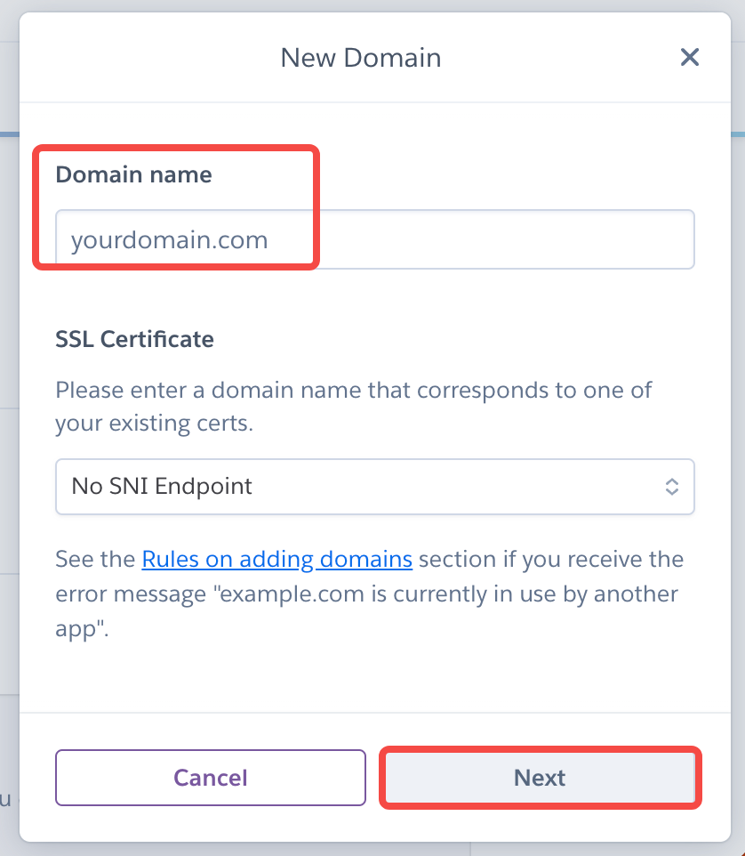
3. Copy and paste the **DNS Target** provided by Heroku to complete the domain setup.


For more help, see [Custom Domain Names for Apps](https://devcenter.heroku.com/articles/custom-domains).


## Update using Heroku CLI

You can use [Heroku CLI](https://devcenter.heroku.com/categories/command-line) to update your Docker image to the latest version. The basic logic behind the following steps is to pull the newest code from GitHub repository, build an image locally using Docker engine, and deploy the updated image using Heroku CLI. Before you start, make sure you have [Heroku CLI](https://devcenter.heroku.com/categories/command-line) and [Docker](https://www.docker.com/) installations locally(required).

1\.  Get the latest code by cloning the `openblocks-dev/openblocks` repository from GitHub.

```bash
git clone https://github.com/openblocks-dev/openblocks.git
```

2\.  Move to the `heroku` folder.

```bash
cd openblocks/deploy/heroku
```

3\.  Log in to Heroku CLI.

```bash
heroku login
```

4\.  Make sure you have a Docker engine running locally. Then log in to Container Registry.

```bash
heroku container:login
```

5\.  Get the app name of your Heroku account.

```bash
heroku apps
```

6\.  Build the image and push it to Container Registry.

```bash
heroku container:push web -a your_app_name
```

7\.  Release the image to your app.

```bash
heroku container:release web -a your_app_name
```

It might take a few minutes to build the new image and push it to Heroku. Then you can open the app in your browser to check if it is running.

```bash
heroku open -a your_app_name
```
