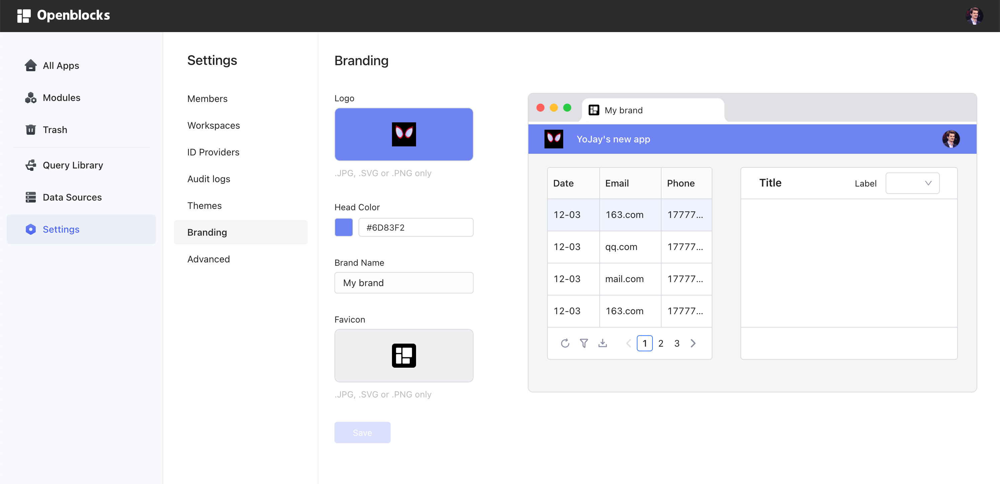
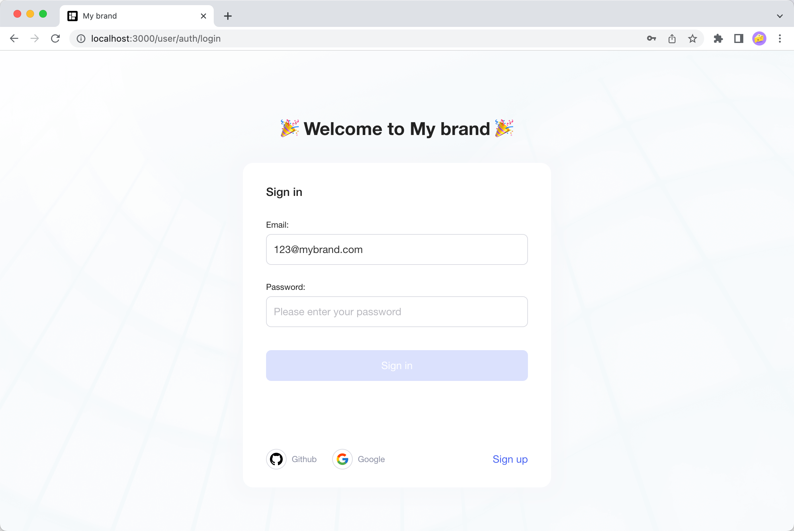
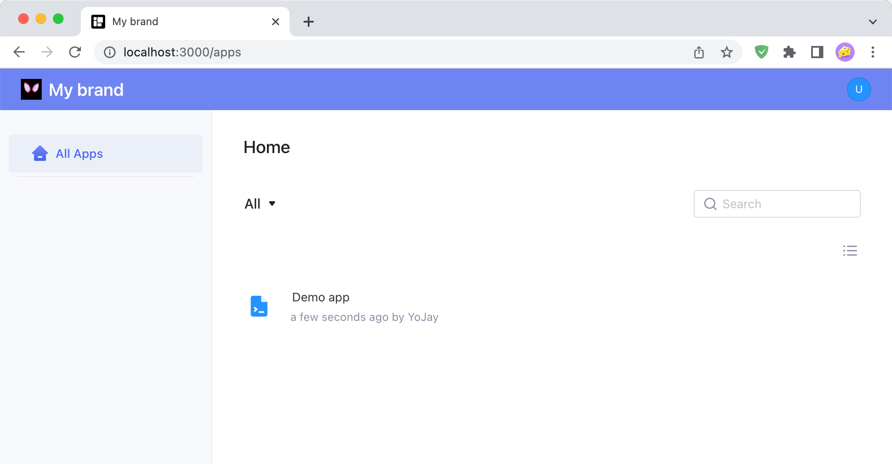
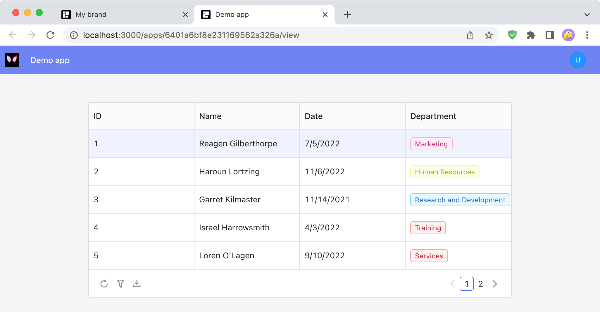
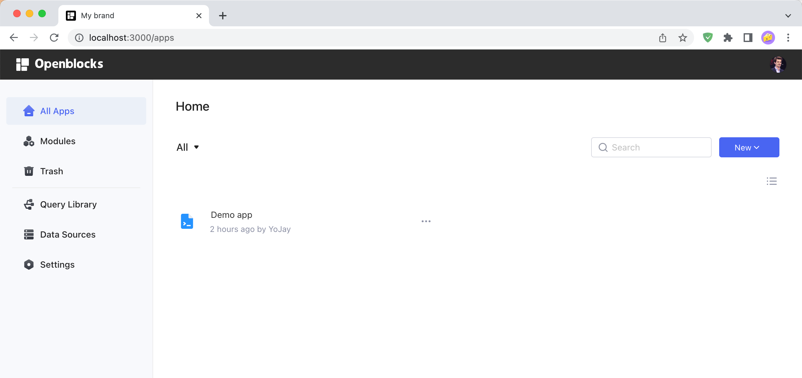

# Custom branding

Openblocks provides a white-labelling feature that allows you to customize your workspace's **branding**, including logo, favicon, brand name and color. You can easily configure branding to match your company's branding and benefit from consistent experiences with your company's existing internal tools.


Custom branding is a **premium feature** of self-hosted [Enterprise Edition](../self-hosting/enterprise-edition.md) of Openblocks. Feel free to contact our team if needed.


## Branding settings

Only **workspace admins** have the permission to customize branding. Navigate to [Openblocks homepage](https://cloud.openblocks.dev/), select ⚙️ **Settings** tab **** in **** the left pane and click **Branding**. You can edit the settings on the left and preview the actual effects on the right.

<figure><figcaption></figcaption></figure>

The customizable branding settings are listed as follows:

* Logo: click the **Logo** box to upload your logo, which is shown at the top bar. The file browser will pop up and you can select an image file. Openblocks supports `.jpg`, `.svg`, and `.png` files.
* Head color: click the palette in the **Head Color** section to select the background color of the top bar. You can also directly type a CSS color into the box.
* Brand name: enter your **Brand Name** in the input box and it will show on the **login page** and as the browser tab title.
* Favicon: click the **Favicon** box to upload your website icon, which is shown in the browser tab.


Click the **Save** button and the settings will immediately take effect.


### Example&#x20;

The following pictures show what workspace **members** and **end users** will see on the login page, homepage, and application pages after branding is successfully customized (take the brand name "My brand" for example).

<figure><figcaption>
the login page
</figcaption></figure>

<figure><figcaption>
the homepage
</figcaption></figure>

<figure><figcaption>
application pages
</figcaption></figure>

Note that workspace **developers** and **admins** still see "Openblocks" branding on the homepage and application pages.

<figure><figcaption></figcaption></figure>

## Further support

If the current branding feature doesn't meet your requirements, please do not hesitate to contact us. Openblocks team is ready to help with your needs.
