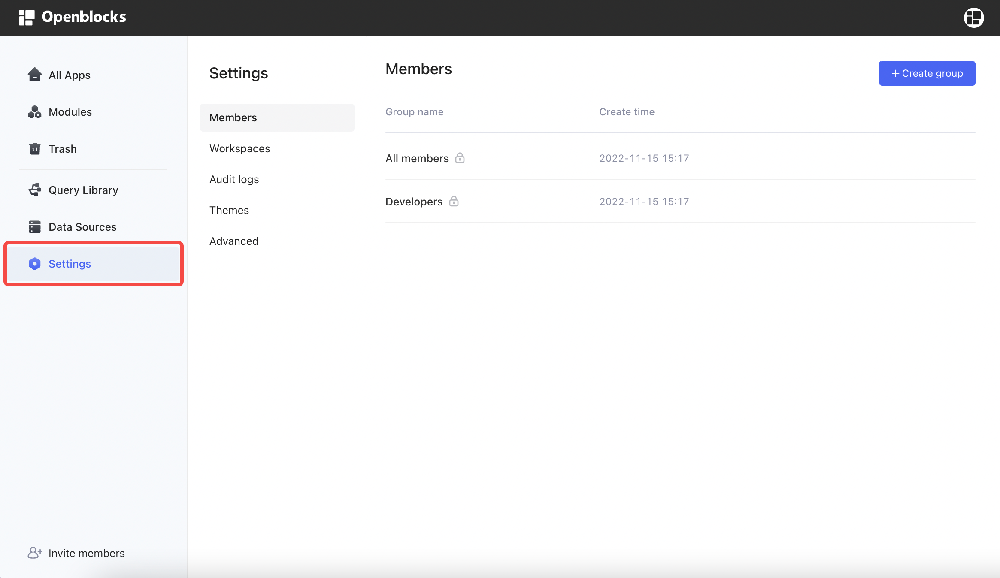
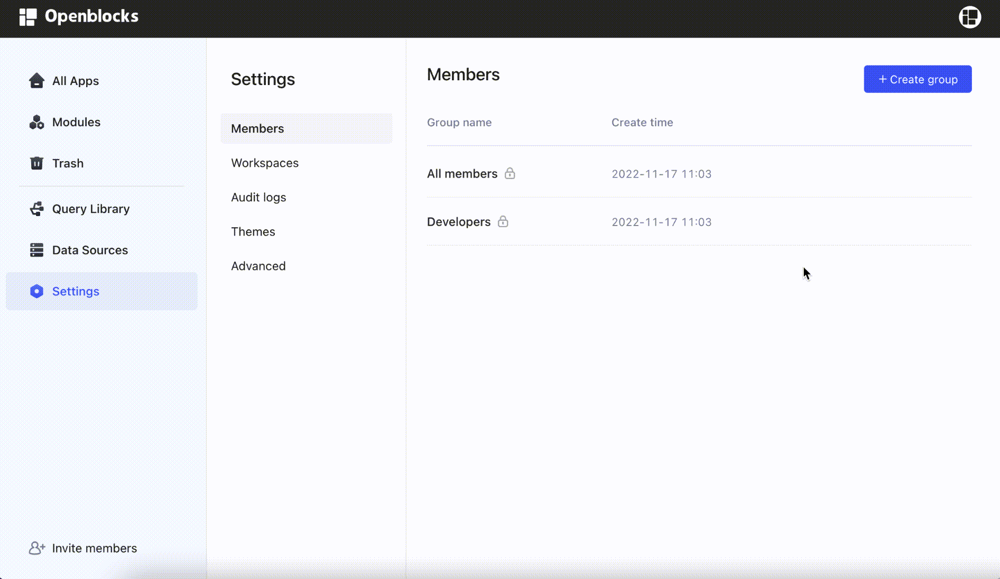
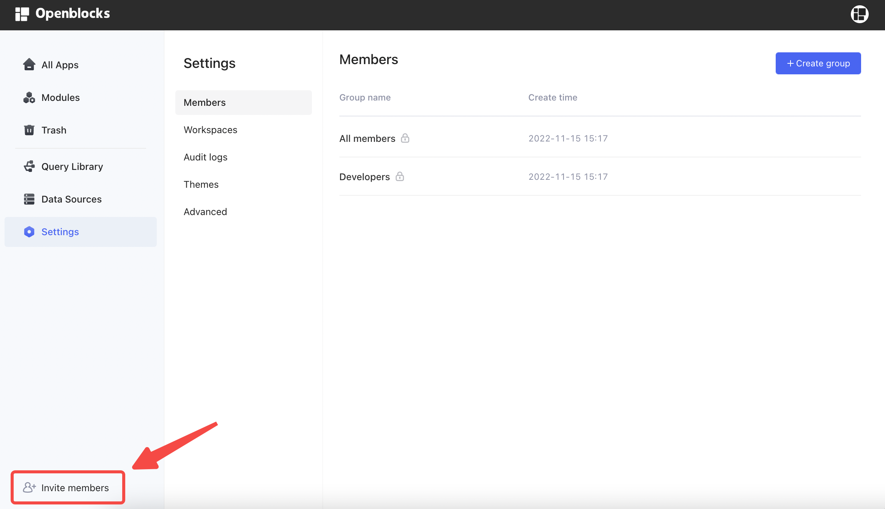
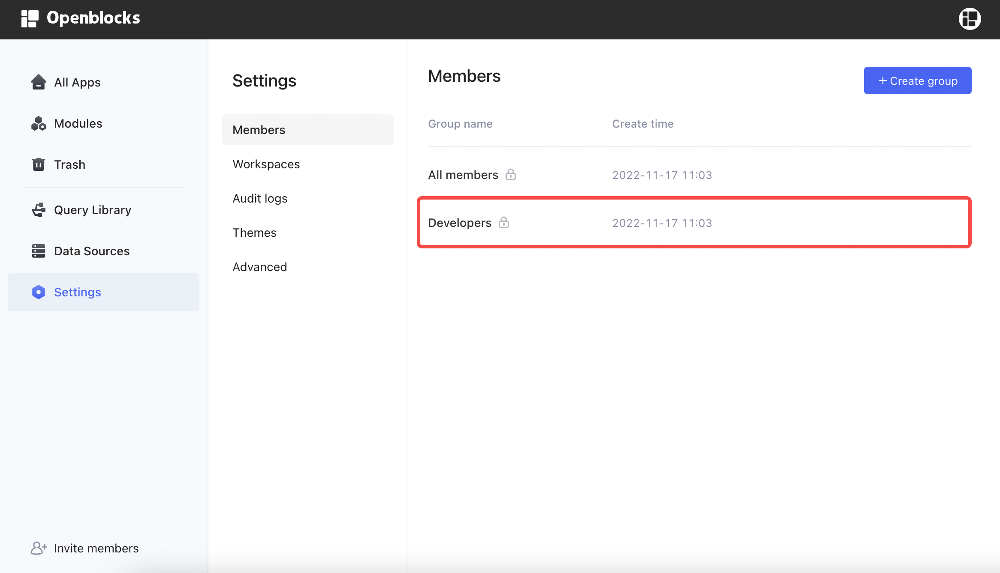
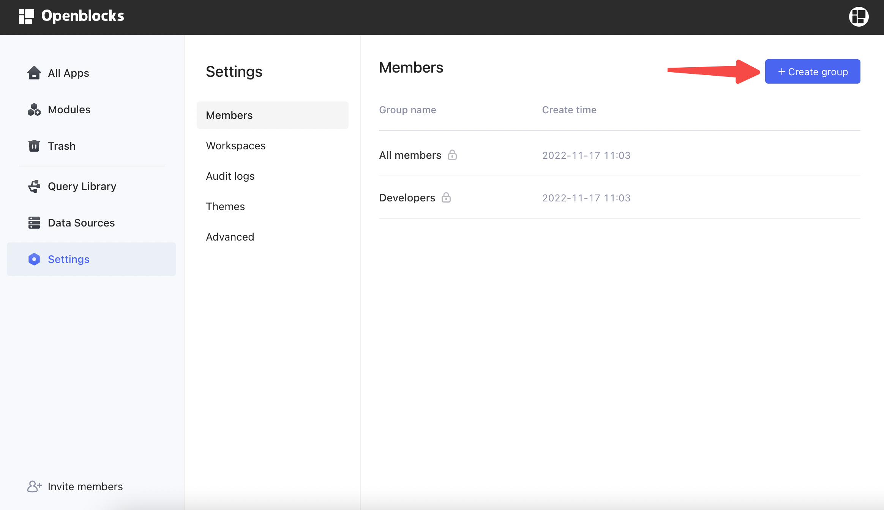
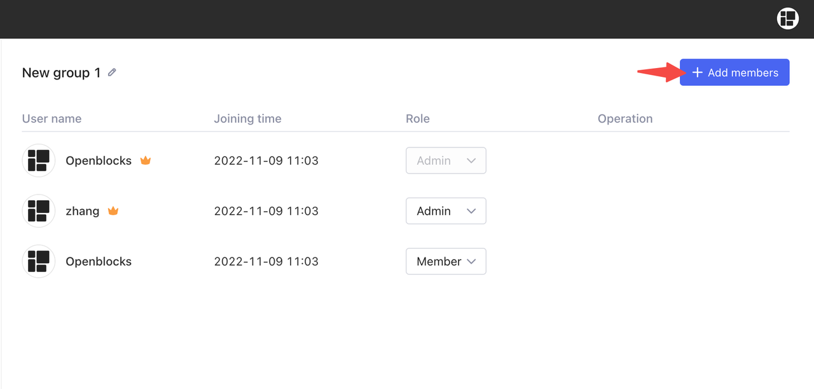

# Members and groups

In Openblocks, you can organize the members of your workspace using different groups, and assign roles to groups to manage [permissions for resources](permissions-for-resources.md). You can find members and groups settings in **Settings** on Openblocks homepage.

<figure><figcaption></figcaption></figure>

## Manage workspace members

### Invite new members

In the **Members** tab, there are two pre-built groups by default: **All members** and **Developers**. You can invite members to your workspace by managing **All members** group. Open the group and click **Invite members**, then you can copy the invitation link.

<figure><figcaption></figcaption></figure>

You can also find the short cut to  **Invite members** on the bottom left on Openblocks homepage.&#x20;

<figure><figcaption></figcaption></figure>


Permission to invite new members is restricted to workspace **admins** and **developers group**.


### Workspace roles and permissions

Set an **Admin** or **Member** role for each workspace member. Role permissions are listed in the table below.

| Role   | Workspace and group level permissions                                                                                                                                                                                                                                                                             |
| ------ | ----------------------------------------------------------------------------------------------------------------------------------------------------------------------------------------------------------------------------------------------------------------------------------------------------------------- |
| Admin  | 
Workspace
<ul><li>Modify workspace information (name, logo, etc.)</li><li>Delete workspace</li><li>Manage workspace members and set their roles</li><li>View workspace members</li></ul>
Groups
<ul><li>Create groups</li><li>Delete groups</li><li>Manage group members and set their roles</li></ul> |
| Member | None                                                                                                                                                                                                                                                                                                              |

Note that the workspace creator is automatically granted with admin permissions. For more information about permissions of apps, modules, and data sources, see [permissions-for-resources.md](permissions-for-resources.md "mention").

## Manage groups

Group-based management helps to organize members from different functional departments in your workspace. You can create groups in **Members** tab.

### Developers group

Openblocks creates a **Developers** group by default and it cannot be deleted, and workspace admins can add members into it. The members of it can create new resources including apps, modules, navigations, folders, and data sources, and can manage query library. Workspace admins can add members to the developers group.

<figure><figcaption></figcaption></figure>

### Create groups and add members

In the **Members** tab, workspace admins can click **+ Create group** to add a new group. The group creator naturally works as a group admin.

<figure><figcaption></figcaption></figure>

Group admins can add members into groups.

<figure><figcaption></figcaption></figure>

### Group roles and permissions

Set an **Admin** or **Member** role for each group member. The permissions are listed in the table below.

| Role   | Permissions                                                                                                                           |
| ------ | ------------------------------------------------------------------------------------------------------------------------------------- |
| Admin  | <ul><li>Change group name</li><li>Delete groups</li><li>Manage group members and set their roles</li><li>View group members</li></ul> |
| Member | View group members                                                                                                                    |
