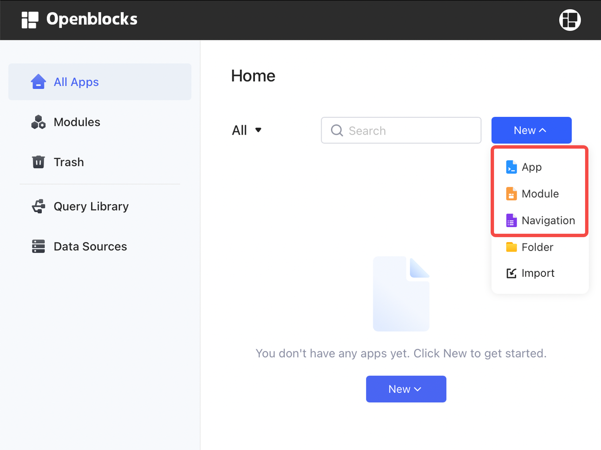
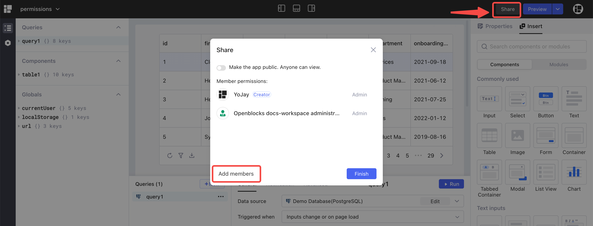
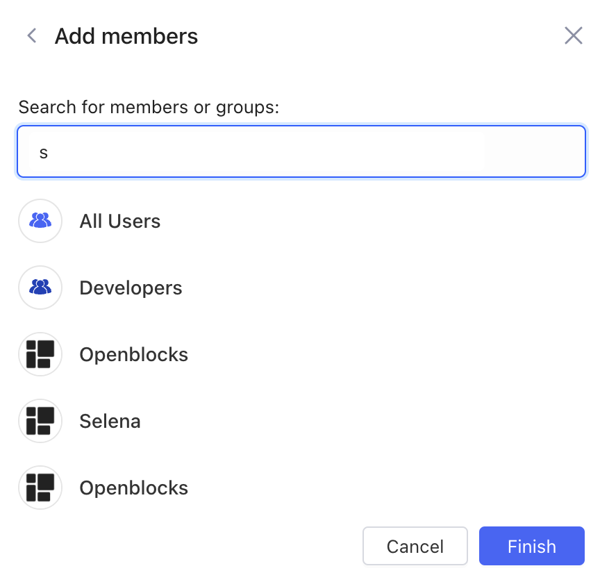
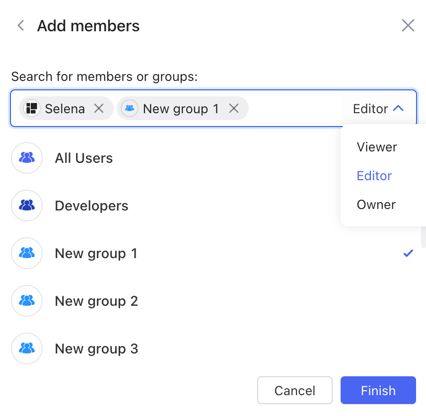

# Permissions for resources

Openblocks implements [Role-based Access Control](https://en.wikipedia.org/wiki/Role-based\_access\_control) (RBAC) by assigning a set of permissions to different roles. These permissions determine the actions users can take on resources, including apps, modules, navigations, folders, query library, and data sources.&#x20;

Only workspace admins and members of **Developers** group are allowed to create resources. For workspace admins, they are in fact the owner of all resources.

## Apps, modules, **navigations**

The permissions for these three resources are the same.

<figure><figcaption></figcaption></figure>

### Share and set roles

The owners of apps, modules and navigations can add members and assign different roles to them. When editing a web app, a module or a navigation, click **Share** at the top right, then click **Add members**.

<figure><figcaption></figcaption></figure>

Choose members and groups from the list and set roles for them.

The available roles and their corresponding permissions are listed in the table below.

| Role                     | Permissions                                                                                                                                |
| ------------------------ | ------------------------------------------------------------------------------------------------------------------------------------------ |
| <ul><li>Viewer</li></ul> | <ul><li>View and use the app, module and navigation</li></ul>                                                                              |
| <ul><li>Editor</li></ul> | <ul><li>View and use the app, module and navigation</li><li>Rename</li><li>Edit</li><li>Publish</li><li>Duplicate</li><li>Export</li></ul> |
| <ul><li>Owner</li></ul>  | <ul><li>All permissions of <strong></strong> Editor</li><li>Delete the app or module</li><li>Set roles for members</li></ul>               |

### Make public

If you want to make an app or a module or a navigation public to all users (including anonymous users), you can toggle on **Make the app public** in **Share** settings.

.png>)

## Folder

Folders help you sort out the apps, modules, and navigations in the workspace. Only workspace **admins** and members of **Developers** group have the following permissions for folders:

* Create
* Rename
* Delete
* Move the apps, modules and navigations into or out of folders

## Data sources

Only workspace admins and developers can view the **Data Sources** page and create new data sources.

For each data source, workspace admins and the creator can change its **Access Control**. Go to Openblocks homepage > **Data Sources**, and click `···` > **Access Control**.

<figure><figcaption></figcaption></figure>

In **Access Control** settings, add members or groups from the workspace, and then choose their roles (**Can use** or **Can manage**).

&#x20;

The permissions of these two roles are listed in the following table:

| Role                         | Permissions                                                                                                                                                                           |
| ---------------------------- | ------------------------------------------------------------------------------------------------------------------------------------------------------------------------------------- |
| <ul><li>Can use</li></ul>    | <ul><li>Use data source when editing an app/module/navigation/library query</li></ul>                                                                                                 |
| <ul><li>Can manage</li></ul> | <ul><li>Use data source when editing an app/module/navigation/library query</li><li>Edit data source</li><li>Delete data source</li><li>Manage data source permission roles</li></ul> |

## Query library

Workspace admins and members of developers group can create query library in Openblocks. And they have read, write, use and delete permissions for queries if they can use the query's corresponding data source.
